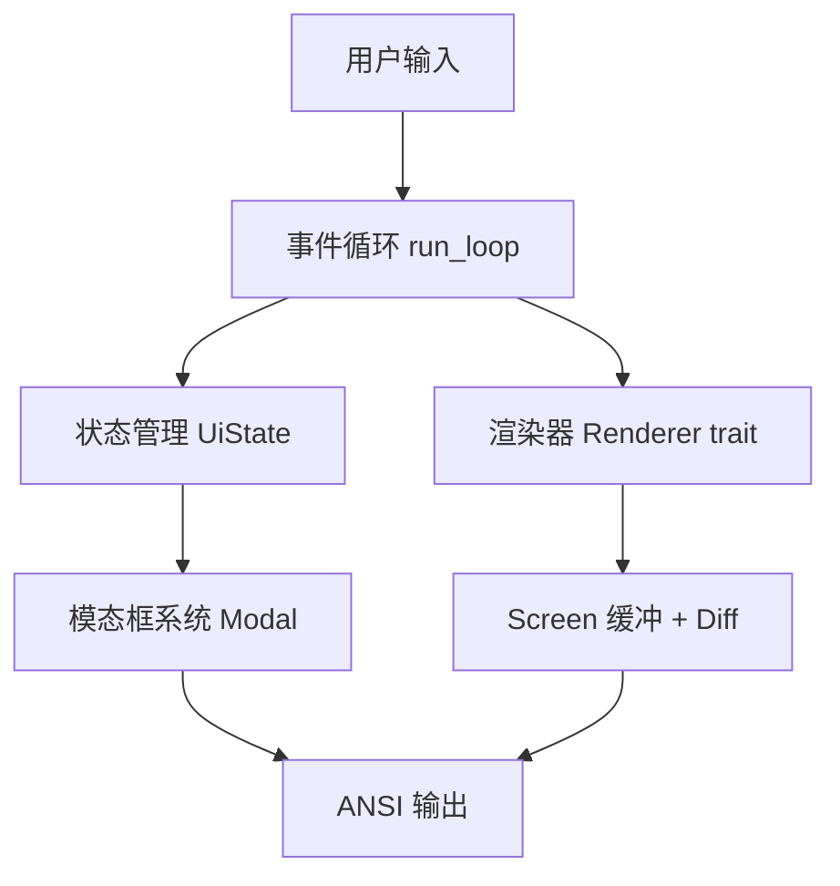

以下是整理后的 **atomcode-tuix 事件循环与 TUI 渲染机制详解** 文档。已优化排版、代码高亮及表格结构，以提升阅读体验。

---

# atomcode-tuix 事件循环与 TUI 渲染机制详解

## 一、整体架构概览

### 1.1 核心组件
*   **位置**: `/workspace/crates/atomcode-tuix/src/event_loop/mod.rs` (20,474 行)
*   **渲染器**: `/workspace/crates/atomcode-tuix/src/render/` (约 25K 行)
*   **模态框系统**: `/workspace/crates/atomcode-tuix/src/modals/` (14+ 种模态框)

### 1.2 三层架构


---

## 二、事件循环机制 (Event Loop)

### 2.1 入口点 `run_loop()` (第 6645 行起)

**初始化阶段:**
1.  创建 `App` 结构体 (含 `buf`, `state`, `menu`, `active_modal`)
2.  渲染欢迎界面 + 初始提示符
3.  处理启动通知 (升级成功、离线模式、插件信任等)
4.  设置键盘增强检测提示
5.  绑定会话 ID 到遥测
6.  可选：自动继续上次会话 (`-c` 标志)
7.  可选：显示首次启动引导向导 (`OnboardingWizard`)

**异步通道设置:**
```rust
// Spinner tick 通道 (100ms)
let (spin_tx, mut spin_rx) = tokio::sync::mpsc::channel::<()>(1);

// 延迟渲染 tick (5ms / 50fps)
let mut deferred_render_tick = tokio::time::interval(Duration::from_millis(5));

// 配置轮询 tick (500ms)
let mut config_poll_tick = tokio::time::interval(Duration::from_millis(500));

// 信号处理 (Unix: SIGTSTP/SIGCONT; Windows: Ctrl+C)
```

### 2.2 主循环结构 (`tokio::select!`)

采用 `biased` 模式，优先级从高到低：

| 优先级 | 事件类型 | 说明 |
| :--- | :--- | :--- |
| **1** | **延迟渲染 (Deferred Render)** | `_ = deferred_render_tick.tick()`<br>5ms 间隔 (50fps)，处理节流窗口的尾部渲染，防止输入突发后的视觉滞后 |
| **2** | **配置轮询** | `_ = config_poll_tick.tick()`<br>检查 provider/model 变化、外部配置文件修改、认证状态变化。<br>仅在 Idle 状态且无模态框时触发重绘 |
| **3** | **Spinner 动画** | `Some(()) = spin_rx.recv()`<br>100ms 刷新一次。<br>条件守卫：仅 `Streaming` 状态且无捕获型模态框时绘制 |
| **4** | **固定间隔循环** | `_ = async { sleep_until(next_fire_at) }`<br>`/loop` 命令驱动，避免慢负载导致积压 |
| **5** | **终端输入** | `maybe = ctx.input_rx.recv()`<br>调用 `handle_input(&mut app, &mut ctx, renderer, ev)?` |
| **6-10** | **其他异步事件** | Wake 信号 (版本检查/OAuth)、OAuth 轮询结果、`/upgrade` 下载进度、`/plugin` 异步任务结果、Agent 运行时事件 (最高优先级的业务事件)、Askpass 密码请求、Unix 信号 / Windows Ctrl+C |

### 2.3 输入处理 `handle_input()` (第 8997 行起)

**输入类型:**
```rust
enum InputEvent {
    Key(KeyEvent),        // 按键
    Paste(String),        // 括号粘贴
    Resize(u16, u16),     // 窗口大小变化
    MouseScroll(i16),     // 鼠标滚动
    Eof,                  // EOF
}
```

**处理流程:**

1.  **Resize 事件合并 (第 9039 行):**
    *   从 `input_rx` 中 drain 所有连续的 Resize 事件。
    *   只保留最新尺寸，中间状态丢弃。
    *   非 Resize 事件缓存后处理。
    *   *目的*: 解决 gnome-terminal/alacritty/iTerm2 拖动时 30+ 事件/秒的闪烁问题。

2.  **模态框优先路由:**
    ```rust
    // 捕获型模态框 (如密码输入) 接收 ALL 按键，无视 phase
    if active_modal.captures_all_keys() {
        modal.handle_key(...)
        return;
    }

    // 普通模态框仅在 Idle 时接收
    if phase == Idle && active_modal.is_some() {
        modal.handle_key(...)
        return;
    }
    ```

3.  **Ctrl+C 全局退出 (第 9268 行):**
    *   任何模态框都无法拦截。
    *   关闭模态框 + 触发 shutdown watchdog。

4.  **Idle 状态处理:**
    *   命令 palette (`/` 开头)
    *   历史导航 (`↑`/`↓`)
    *   文本编辑 (Backspace/Delete/Ctrl+W 等)
    *   Submit (Enter)

5.  **Streaming 状态处理:**
    *   允许 type-ahead 输入 (队列缓冲)
    *   `Ctrl+O` 跳过当前工具批准
    *   `Ctrl+C` 取消当前 turn

6.  **粘贴处理 (第 9088 行) - 三级图像粘贴降级链:**
    1.  `arboard` 直接读取 RGBA (截图/Preview Copy)
    2.  文件路径识别 (iTerm2 temp file / Finder drag)
    3.  macOS `NSPasteboard public.file-url` (Finder Cmd+C)
    4.  文本粘贴 fallback

### 2.4 边界情况处理

#### 2.4.1 窗口调整 (Resize)
*   **问题**: 拖动窗口时每秒 30+ `SIGWINCH`。
*   **解决**:
    *   合并 burst 事件，只处理最终尺寸。
    *   不立即 `clear_screen()` (会丢失 `body_log`)。
    *   重新计算模态框位置。

#### 2.4.2 Unix 信号 (SIGTSTP/SIGCONT)
```rust
// Suspend (Ctrl+Z)
_ = sigtstp.recv() => {
    renderer.shutdown();  // 禁用 raw mode
    libc::raise(SIGSTOP); // 真正挂起
}

// Resume
_ = sigcont.recv() => {
    enable_raw_mode();
    on_resume();
    redraw();
}
```

#### 2.4.3 Windows Ctrl+C 双重路径
*   **键盘路径**: `crossterm KeyEvent` → `handle_input` → 二次确认。
*   **OS 路径**: `tokio::signal::windows::ctrl_c()` → 单次退出。
*   **原因**: legacy conhost 可能吞掉 `Ctrl+C` keystroke。

#### 2.4.4 Spinner 帧率控制
*   后台 task 每 100ms `try_send(())` 到 bounded channel (cap=1)。
*   满容量时静默丢弃，防止事件堆积。
*   event loop 在 `select!` 中与 agent events 公平竞争。

#### 2.4.5 Type-Ahead 队列
*   Streaming 状态下的输入进入 FIFO 队列。
*   `TurnFinished` 时授权 drain 一个条目。
*   Provider 切换期间暂停 drain (避免用错模型)。

#### 2.4.6 配置热重载
*   500ms 轮询 `~/.atomcode/config.toml`。
*   检测 mtime 变化 → 重新加载。
*   仅在 Idle boundary 应用变更。

#### 2.4.7 孤儿模态框清理
```rust
// Turn 结束但密码模态框仍在上 = 孤儿 (sudo 超时/完成)
dismiss_orphan_capturing_modal(&mut app, ...);
```

---

## 三、渲染机制 (Rendering System)

### 3.1 Renderer Trait (第 296 行起)
```rust
pub trait Renderer: Send {
    fn render(&mut self, line: UiLine);
    fn flush(&mut self);
    fn shutdown(&mut self);
    fn reset(&mut self);          // 清除缓存状态 + 清屏
    fn clear_screen(&mut self);   // 仅物理清屏
    fn begin_sync(&mut self);     // DECSET 2026 开始
    fn end_sync(&mut self);       // DECSET 2026 结束
    fn flush_deferred(&mut self); // 刷新节流内容
    fn suspend_for_external(&mut self);  // 交给外部进程
    fn resume_from_external(&mut self);  // 收回控制权
}
```

### 3.2 三种渲染器实现

#### 3.2.1 RetainedRenderer (`retained.rs` - 18,508 行)
*   **特点**: 保留模式，类似 React/Virtual DOM。
*   **机制**: 维护两个 Screen 缓冲: `cells` (当前帧) 和 `prev_cells` (上一帧)。每帧完全重绘所有 widget，通过 diff 计算最小 ANSI 更新。

**Screen 结构 (`screen.rs`):**
```rust
pub struct Screen {
    cells: Vec<Vec<Cell>>,      // 当前帧
    prev_cells: Vec<Vec<Cell>>, // 上一帧
    width: u16,
    height: u16,
    cursor: Option<(u16, u16)>, // 目标光标位置
    physical_dirty: bool,       // 物理终端脏标记
    jediterm: bool,             // IntelliJ 兼容模式
    sync_suppressed: bool,      // 抑制 DECSET 2026
}
```

**Diff 算法 (`diff.rs`):**
*   逐单元格比较 `prev_cells` vs `cells`。
*   生成 patch 序列: `(row, col, Cell)`。
*   **优化策略**:
    *   连续相同属性的字符合并为单个 SGR 序列。
    *   跳过未变化的单元格。
    *   使用 DECSET 2026 同步输出 (防闪烁)。

**渲染流程:**
```rust
fn render_diff(&mut self) -> Vec<u8> {
    // 1. 冷启动: 物理脏时每行 CUP+EL
    if physical_dirty {
        for row in 1..=height {
            write!("\x1b[{};1H\x1b[K", row);
        }
    }
    
    // 2. 计算 diff patches
    let patches = diff_cell_frames(&prev_cells, &cells);
    
    // 3. 隐藏光标 + DECSET 2026h
    out.push_str("\x1b[?25l\x1b[?2026h");
    
    // 4. 序列化 patches
    serialize_patches(&patches);
    
    // 5. 恢复光标位置
    write!("\x1b[{};{}H", cursor_row, cursor_col);
    
    // 6. 恢复光标可见性 + DECSET 2026l
    out.push_str("\x1b[?25h\x1b[?2026l");
    
    // 7. 交换缓冲
    swap(&mut cells, &mut prev_cells);
    clear(); // 清空新 scratch
}
```

**边界处理:**
*   **JediTerm 兼容**: 启用 per-row tight repaint (`serialize_frames_tight`)，每行一个 `CUP+EL` + 连续写入，避免 per-cell-CUP 导致的字体回退伪影。
*   **宽字符支持**: CJK/emoji 占 2 列，需插入 `Cell::continuation()`。
*   **输入框高度限制**: `MAX_INPUT_ROWS = 6`，超过则内部滚动。

#### 3.2.2 PlainRenderer (`plain.rs` - 1,080 行)
*   **特点**: 简单 ANSI 流式输出。
*   **适用**: CI/pipe/非 TTY 场景。
*   **限制**: 无缓冲，不支持模态框覆盖层。

#### 3.2.3 WorkerRenderer (`worker.rs` - 591 行)
*   **特点**: 后台渲染线程。
*   **机制**: 通过 channel 将 `UiLine` 发送到 worker 线程，主线程不被渲染阻塞。
*   **适用**: 高负载场景。

### 3.3 UiLine 语义行类型 (第 38 行起)

**永久行 (进入 scrollback):**
*   `Welcome { model, working_dir }`
*   `User(String)` / `UserWithAttachments { text, attachments }`
*   `AssistantText(String)` / `ReasoningText(String)`
*   `ToolCall { name, detail }` / `ToolCallInFlight { id, name, detail, hint }`
*   `ToolResult { success, summary, diff_stats }`
*   `DiffBlock(Vec<DiffEntry>)` / `EditDiffBlock(...)`
*   `Error(String)` / `Warning(String)` / `Muted(String)`
*   `CompactionMark(String)`
*   `TurnComplete` / `TurnCancelled`
*   `CommandOutput(String)`
*   `ImageAttachment(usize)`

**瞬态行 (不进入 scrollback):**
*   `Spinner { frame, label }`
*   `InputPrompt { buf, cursor_byte, menu, status, attachments }`
*   `StreamingBox { buf, cursor_byte, frame, label, status, menu, attachments }`
*   `ClearTransient`

**覆盖层:**
*   `DiffPanel { title, rows, footer, win_width, win_height }`
*   `ModalOverlayClear`

### 3.4 输入提示符渲染

**InputPrompt 结构:**
```rust
InputPrompt {
    buf: String,              // 输入缓冲区内容
    cursor_byte: usize,       // 字节偏移 (非字符!)
    menu: Option<MenuPayload>,// 命令 palette
    status: StatusLine,       // 状态行 (model/context/rate limit)
    attachments: Vec<usize>,  // 图片附件预览
}
```

*   **多行处理**: 根据终端宽度自动换行，`MAX_INPUT_ROWS = 6` 限制显示行数，超出部分内部滚动 (光标保持在可视区)。提交时发送完整 `buf` (包括不可见部分)。
*   **命令 Palette**:
    ```rust
    MenuPayload {
        items: Vec<MenuItem>,
        selected: usize,
        filter: String,
    }
    ```
    绘制在输入框上方，支持模糊搜索，`↑`/`↓` 导航，`Enter` 选择，`Esc` 关闭。

### 3.5 Spinner 动画机制

**帧序列:**
```rust
const SPINNER_FRAMES: &[&str] = if unicode {
    &["◐", "◓", "◑", "◒"]  // 几何图形 (4 帧)
} else {
    &["|", "/", "-", "\\"]  // ASCII fallback
};
```

**渲染位置:**
*   **Idle**: 不显示
*   **Streaming**: `StreamingBox` 顶部单独一行
*   **Approval**: 集成到批准提示中

**更新逻辑 (`draw_spinner_now`):**
```rust
fn draw_spinner_now(state, buf, ctx, renderer, queue_len, menu_selected) {
    let frame = SPINNER_FRAMES[state.spinner_frame];
    let elapsed = state.streaming_start.elapsed().as_secs();
    let label = format!("{} · {}s", activity_text, elapsed);
    
    renderer.render(UiLine::StreamingBox {
        buf: buf.text.clone(),
        cursor_byte: buf.cursor,
        frame,
        label,
        status: build_status_line(state, ctx),
        menu: menu_selected.map(|_| build_menu(buf)),
        attachments: compute_attachments(state, &buf.text),
    });
}
```

### 3.6 主题与颜色系统

**主题检测 (`theme.rs`):**
```rust
pub fn is_light_for_render() -> bool {
    // 检测 COLORTERM=truecolor + 环境变量
    // 或解析终端响应 (XTGETTCOL)
    // fallback: 假设深色主题
}
```

**颜色角色 (`Role` enum):**
```rust
pub enum Role {
    Default,      // 默认文本
    Muted,        // 灰色 (思考内容/元信息)
    Brand,        // 品牌色 (cyan/magenta)
    Add,          // 绿色 (diff 新增)
    Remove,       // 红色 (diff 删除)
    Warning,      // 黄色
    Error,        // 红色
    Highlight,    // 高亮 (session picker 选中)
}
```

**256 色硬编码:**
*   活跃 Tab: `fg=231` (白) / `fg=16` (黑) — 取决于主题
*   非活跃 Tab: `fg=245` (中灰)
*   *目的*: 绕过 Solarized 等非常规调色板的 ANSI 重映射。

---

## 四、模态框系统 (Modal System)

### 4.1 Modal Trait (`modals/mod.rs`)
```rust
pub trait Modal: Send {
    fn handle_key(...) -> Result<ModalAction>;
    fn draw(&self, buf, state, ctx, renderer);
    fn handle_paste(...) -> Result<ModalAction> { /* default: insert */ }
    fn captures_all_keys(&self) -> bool { /* default: false */ }
    fn on_plugin_event(&mut self, _ev) { /* default: ignore */ }
    fn poll_background(&mut self) -> bool { /* default: false */ }
    fn close_requested(&self) -> bool { /* default: false */ }
}

pub enum ModalAction {
    Continue,  // 保持激活
    Close,     // 关闭模态框
}
```

### 4.2 模态框类型

| 模态框 | 用途 | 捕获型 |
| :--- | :--- | :---: |
| `ModelPicker` | `/model` 选择模型 | 否 |
| `ProviderWizard` | `/provider` 配置向导 | 否 |
| `SessionPicker` | `/resume` 会话选择 | 否 |
| `PasswordModal` | askpass 密码输入 | **是** |
| `OnboardingWizard` | 首次启动引导 | 否 |
| `PluginManager` | `/plugin` 管理 | 否 |
| `FileViewer` | `/view` 文件查看 | 否 |
| `DiffViewer` | `/diff` 差异查看 | 否 |
| `DirPicker` | 目录选择 | 否 |
| `LanguagePicker` | 语言选择 | 否 |
| `ProxyPicker` | 代理配置 | 否 |
| `UsageMonitor` | `/usage` 用量监控 | 否 |

### 4.3 捕获型模态框 (PasswordModal)

**特殊性:**
*   在 `Streaming` 状态安装 (工具执行中)。
*   `captures_all_keys() = true`。
*   拦截 ALL 按键，防止泄漏到 type-ahead buffer。
*   `Ctrl+C` 取消整个 turn (而非仅模态框)。

**实现 (`password.rs`):**
```rust
struct PasswordModal {
    prompt: String,
    input: String,
    reply: oneshot::Sender<String>,
}

fn handle_key(...) {
    match code {
        Enter => {
            reply.send(input);
            return Ok(ModalAction::Close);
        }
        Esc | CtrlC => {
            // 取消密码输入
            return Ok(ModalAction::Close);
        }
        Char(c) => input.push(c),
        Backspace => input.pop(),
        _ => {}
    }
    draw();
    Ok(ModalAction::Continue)
}
```

---

## 五、关键边界情况与解决方案

### 5.1 终端兼容性

*   **Kitty 键盘协议协商**:
    ```rust
    // lib.rs 初始化时发送
    write!("\x1b[>0u");  // 查询增强键盘
    read_response();     // 解析 CSI u 能力

    if !enhanced {
        env::set("ATOMCODE_KBD_NOT_ENHANCED", "1");
        // 启动时显示 \\ 换行提示
    }
    ```
*   **Windows Conhost 降级**: 检测 `legacy_conhost = true`，禁用 alt-screen，使用 plain renderer，显示滚动提示，移除 wheel 捕获。
*   **JediTerm (IntelliJ) 兼容**: 检测 `TERM_PROGRAM = IntelliJ IDEA`，启用 `screen.jediterm = true`，使用 per-row tight repaint 替代 per-cell-CUP，避免字体回退导致的 stale-tail ghosting。

### 5.2 性能优化

*   **输入节流 (Input Throttle)**:
    ```rust
    // render/mod.rs
    const THROTTLE_WINDOW = Duration::from_millis(20);

    fn render(&mut self, line: UiLine) {
        if should_throttle(&line) {
            deferred_queue.push((now, line));
        } else {
            render_immediate(line);
        }
    }

    // event loop 5ms tick
    deferred_render_tick.tick() => {
        renderer.flush_deferred();
    }
    ```
*   **Resize 事件合并**: 批量处理 Resize 事件，最后统一调用 `renderer.on_resize` 和 `handle_input`。
*   **Diff 批量化**: 避免 N 次 `DiffLine` 触发 N 次 footer 重绘，改为单次 `erase_footer` + N 写入 + 单次 `redraw_footer`。

### 5.3 内存边界

*   **Scrollback 限制**:
    ```rust
    pub const MAX_SCROLLBACK_ROWS: usize = 5000;

    fn push_body_line(&mut self, line) {
        body_lines.push(line);
        while body_lines.len() > MAX_SCROLLBACK_ROWS {
            body_lines.remove(0);
            adjust_message_marks();
        }
    }
    ```
*   **助手文本行缓冲**:
    ```rust
    const ASSISTANT_LINE_BUF_MAX: usize = 1 << 20; // 1MB

    fn flush_assistant_lines(&mut self) {
        if line_buf.len() > ASSISTANT_LINE_BUF_MAX {
            truncate(); // 防止无限增长
        }
    }
    ```

### 5.4 并发安全

*   **RAII 终端保护**:
    ```rust
    struct TerminalGuard {
        original_mode: TermMode,
    }

    impl Drop for TerminalGuard {
        fn drop(&mut self) {
            disable_raw_mode();
            disable_bracketed_paste();
            show_cursor();
        }
    }

    // panic hook
    std::panic::set_hook(Box::new(|info| {
        eprintln!("{}", info);
        TerminalGuard::cleanup(); // 确保恢复
        process::exit(1);
    }));
    ```
*   **跨进程配置观察**: 500ms poll 检查 config 文件 mtime 变化，仅在 idle 且无 modal 时重绘。

### 5.5 图像粘贴三路降级
```rust
fn try_paste_clipboard_image() -> Option<(ImagePart, u64)> {
    // Tier 1: arboard get_image (RGBA bytes)
    if let Ok(img) = clipboard.get_image() {
        return encode_rgba(img);
    }
    
    // Tier 2: file:// URL from text clipboard
    if let Ok(text) = clipboard.get_text() {
        if let Some(path) = parse_file_url(&text) {
            return load_image_path(&path);
        }
    }
    
    // Tier 3: macOS NSPasteboardTypeFileURL
    #[cfg(target_os = "macos")]
    if let Some(path) = read_macos_clipboard_file_url() {
        return load_image_path(&path);
    }
    
    None
}
```

---

## 六、状态机流转

### 6.1 UiPhase 枚举
```rust
pub enum UiPhase {
    Idle,       // 等待用户输入
    Streaming,  // LLM 流式输出中
    Approval,   // 等待用户批准工具执行
}
```

### 6.2 状态转换
*   `Idle` --[Submit]--> `Streaming`
*   `Streaming` --[ToolCall]--> `Approval`
*   `Approval` --[Approve]--> `Streaming`
*   `Approval` --[Reject]--> `Idle`
*   `Streaming` --[TurnFinished]--> `Idle`
*   `Streaming` --[Cancel]--> `Idle`

### 6.3 各状态的输入行为

| 操作 | Idle | Streaming | Approval |
| :--- | :---: | :---: | :---: |
| **文本输入** | ✓ (直接) | ✓ (type-ahead) | ✗ |
| **Enter** | Submit | 换行/提交 | Approve |
| **↑/↓** | 历史导航 | 历史导航 | ✗ |
| **Ctrl+C** | 退出确认 | 取消 turn | 取消 turn |
| **Ctrl+O** | ✗ | 跳过工具 | ✗ |
| **Esc** | 清空输入 | ✗ | Reject |
| **/ 命令** | 打开 palette | 打开 palette | ✗ |

---

## 七、总结

该项目实现了工业级 TUI 框架，核心亮点：

1.  **事件驱动架构**: `tokio async/await` + `biased select!` 保证关键事件优先级。
2.  **保留模式渲染**: Virtual DOM 式 diff 最小化 ANSI 输出。
3.  **完善的边界处理**: resize 合并/信号处理/终端降级/并发安全。
4.  **模态框系统**: 统一 trait 抽象，支持捕获型/普通型。
5.  **性能优化**: 输入节流/diff 批量化/spinner 帧率控制。
6.  **跨平台兼容**: Kitty 协议/Windows conhost/JediTerm/macOS AppKit。
7.  **可访问性**: 主题自适应/宽字符支持/降级策略。

代码组织清晰，注释详尽，是 Rust TUI 开发的高质量参考实现。