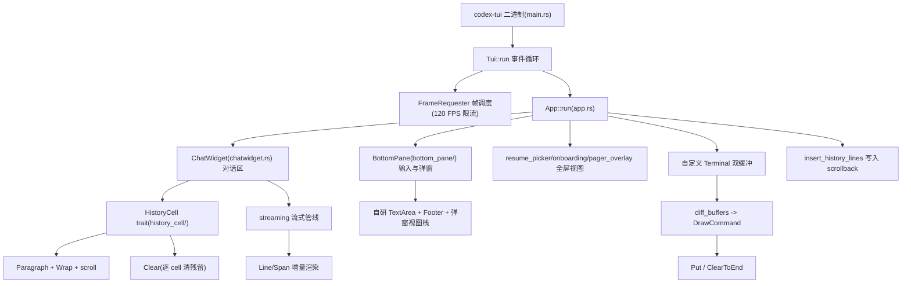

# Codex ratatui 实现功能分析

> 分析对象：OpenAI Codex 仓库（https://github.com/openai/codex）
> 克隆位置：`/workspace/codex`（commit `30d9923`）
> ratatui 相关源码：`codex-rs/tui/`、`codex-rs/ansi-escape/`、`codex-rs/cloud-tasks/`
> 文档生成日期：2026-08-06

## 1. 概述

Codex 的终端交互界面（crate `codex-tui`）整体构建在 **ratatui 0.30.2** 之上，使用 ratatui 作为终端渲染与 UI 组件的基本原语。整个 `codex-rs` 工作区中有 157 个 `.rs` 文件直接引用 ratatui，其中绝大部分位于 `codex-rs/tui`。

Codex TUI 对 ratatui 的用法与常见全屏 TUI 应用差异明显，核心思路是：

- **把 ratatui 当作"差异渲染引擎"而非"整帧刷新器"**：派生自定义 `Terminal`，用双缓冲 + `Buffer` 差异比较把每帧输出降到最小；
- **聊天历史滚出视口**：通过终端转义序列（scroll region + 反向索引）把内容直接写进终端 scrollback，让用户可以用终端原生的滚动/选择/复制能力，而不是像典型 TUI 那样把所有内容锁在 alternate screen 中；
- **组件**：大量使用 ratatui 的低层原语（`Paragraph`、`Line`、`Span`、`Style`、`Layout`、`Constraint`、`Clear`、`Buffer`、`Rect`），而**刻意不使用**其高层数据组件（全库未出现 `widgets::Chart`、`Gauge`、`BarChart`、`Canvas`、`Scrollbar` 等），复杂交互（输入框、选择器、图表、弹窗栈）全部自行实现。

### 技术栈

- **ratatui 0.30.2**（`default-features = false`），工作区级 feature：`crossterm`、`layout-cache`、`underline-color`
- **tui crate 额外启用**（`tui/Cargo.toml:82-87`）：`scrolling-regions`、`unstable-backend-writer`、`unstable-rendered-line-info`、`unstable-widget-ref`
- **ratatui-macros 0.7.2**（`tui/Cargo.toml:88`）
- **ansi-to-tui**：`ansi-escape` crate 用它把 ANSI 转义序列解析为 ratatui `Text`/`Line`
- 终端后端为 crossterm（ratatui 的 `crossterm` feature）

### ratatui 在代码库中的角色分层



## 2. 终端管理与渲染引擎

### 2.1 终端初始化与模式管理（`tui/src/tui.rs`）

`Tui` 结构（tui.rs）持有 `Terminal`、`FrameRequester`、`SuspendContext`、`last_known_screen_size` 等，负责终端生命周期：

- **`set_modes()`**（tui.rs:217 附近）：依次执行
  - `enable_raw_mode()`：进入 raw mode；
  - `EnableBracketedPaste`：括号粘贴，区分粘贴文本与键盘输入；
  - `keyboard_modes::enable_keyboard_enhancement()`：启用键盘增强（kitty keyboard protocol），使修饰键组合（如 `Ctrl+Enter`）可被区分（composer 依赖它识别新行输入）；
  - `EnableFocusChange`（Unix）/ `DisableFocusChange`（Windows）：终端焦点事件；
  - Windows 下额外 `ensure_virtual_terminal_processing()` 与 `windows_console::set_input_record_mode()`。
- **`restore_after_exit()`**（tui.rs:354 附近）：按反序恢复 raw mode、禁用括号粘贴、`LeaveAlternateScreen`、恢复光标样式，保证退出后终端不被破坏。
- **`set_panic_hook()`**（tui.rs:540 附近）：panic 时也调用 `restore_after_exit()` 兜底。
- **`leave_alt_screen()`**（tui.rs:803 附近）：退出 alternate screen 时额外执行 `DisableAlternateScroll` 并恢复保存的视口。
- **挂起/恢复**：`job_control.rs` 提供 `SuspendContext`，支持 `Ctrl-Z` 挂起（记录光标 y 坐标，恢复后重绘）。

### 2.2 自定义 Terminal：双缓冲差异绘制（`tui/src/custom_terminal.rs`）

从 `ratatui::Terminal` 派生自定义 `Terminal<B>`：

- 持有 **`buffers: [Buffer; 2]`** 双缓冲（custom_terminal.rs:126-145），`current` 索引翻转（`swap_buffers()` :550）。
- **`flush()`**（:286）：对 prev/current 两个 `Buffer` 逐格比较生成差异命令，同时维护 `last_known_cursor_pos`，把输出量压到最小。
- 差异原语 `enum DrawCommand { Put, ClearToEnd }`（:568）：逐格写入 vs 行尾一次清除（整行尾部清除合并成一条转义序列）。
- **`diff_buffers(a, b)`**（:573）：生成差异命令列表；测试覆盖宽字符、`ClearToEnd` 起点、强制宽度格等边界（:989-1095）。

### 2.3 事件循环与帧调度（`tui/` 子目录）

- **`event_stream.rs`**：`EventBroker` 持有共享 crossterm 事件流，支持"丢弃整个流并重建"以释放 stdin；`TuiEventStream` 把 crossterm 事件映射为 `TuiEvent` 并请求绘制。
- **`frame_requester.rs`**：`FrameRequester`（:31）持有 `broadcast::Sender<()>`；`schedule_frame()`/`schedule_frame_in(dur)`（:49/:54）投递延时请求；内部 `FrameScheduler`（:76，actor 模式 + mpsc）把多个请求合并为一次广播 `Draw` 通知。动画与后台任务持 clone 即可触发重绘。
- **`frame_rate_limiter.rs`**：`MIN_FRAME_INTERVAL = 8_333_334ns`（:13），即上限 120 FPS；`clamp_deadline` 保证两次绘制间隔不小于该值。
- **`keyboard_modes.rs`**（502 行）：键盘增强模式的启停与探测。
- **主循环**：`App::run()`（app.rs:774）从 `tui.event_stream()` 取 `TuiEvent`；绘制入口 `render_chat_widget_frame`（app.rs:1392）；resize 走 `draw_with_resize_reflow`（tui.rs:1060），需要时重排 viewport 与 scrollback。

### 2.4 历史滚动写入 scrollback（`tui/src/insert_history.rs`）

这是 Codex TUI 最独特的机制：当聊天历史滚动出可视视口时，不留在 ratatui 缓冲区里，而是直接写入终端 scrollback：

- **`HistoryLineWrapPolicy::{PreWrap, Terminal}`**（:44）：PreWrap 在应用侧折行（纯 URL 行保持整行交给终端软换行）；Terminal 让终端自己折。
- **`InsertHistoryMode::{Standard, ZellijRaw}`**（:55）：Zellij 终端不走 scroll region，改为原样写出并预留空行（:164-193）。
- **Standard 模式**（:194-246）：视口不在屏底时先用 `SetScrollRegion` + 反向索引（`\x1bM`）下移腾出空间，把 scroll region 限定在屏顶到视口顶之间，`MoveTo` 到末尾逐行写 `\r\n` + 内容，最后 `ResetScrollRegion` 并把光标恢复到 `last_known_cursor_pos`——对光标位置无副作用。
- **`write_history_line`**（:283）：多行宽行先 `SavePosition`/`MoveDown`/`Clear(UntilNewLine)`/`RestorePosition` 清理续行区。

### 2.5 终端能力探测（`tui/src/terminal_probe.rs`）

在 crossterm 事件流暂停期间以 100ms 短超时查询：

- OSC 10/11 读取终端默认前景/背景色（`DefaultColors`），结果回写到渲染样式（`set_default_colors_from_startup_probe`，tui.rs:528/535；Windows 走 `probe_windows_default_colors()` :518）；
- 键盘增强能力探测；
- `resize_reflow_cap.rs`：按终端类型设定 resize 重排行数上限——VS Code=1000（:19）、Windows Terminal=9001（:20）、WezTerm=3500（:21）、Alacritty=10000（:22）。

## 3. 布局系统

### 3.1 ratatui 布局原语的使用

ratatui 的 `Layout`/`Constraint`/`Rect` 用于少量关键切分：

- 底部面板 composer 区 + 弹窗区：`Layout::vertical([Constraint::Min(3), popup_constraint])`（chat_composer.rs:960）；
- skills 开关视图：`Constraint::Fill(1), Constraint::Length(1)`（skills_toggle_view.rs:322）；
- 历史搜索、登录视图（onboarding/auth.rs:623-625）；
- `resume_picker.rs:2022-2034`：全屏 `Layout::vertical([Length(1)×4, Min, Length(4)])`；
- `cloud-tasks/src/ui.rs:28-57`：`Layout::Vertical [Min(1), Length(2)]` 切任务列表与两行 footer。

### 3.2 自研 FlexRenderable 布局引擎（`render/renderable.rs`）

对话区与底部面板的主要布局**不直接用 ratatui Layout**，而是用自研的 `FlexRenderable`（`render/renderable.rs:16-30`）：按 flex 权重垂直堆叠多个 `Renderable`（trait 含 `render()`、`desired_height()`、`cursor_pos()`、`cursor_style()`），配合 `RenderableItem::{Owned, Borrowed}` 包装动态对象。chatwidget 的 `as_renderable()`（chatwidget/rendering.rs:6-58）用它对各区域做 flex 分配：

```
FlexRenderable: active_cell (flex:1) / hook_cell (flex:0)
              / token_activity (flex:1) / rate_limit_hint (flex:1)
              / bottom_pane (flex:0)
```

### 3.3 区块修饰

`Block` 用于 `chatwidget.rs:177`、`pager_overlay.rs:49`、`cwd_prompt.rs:25`、`onboarding/welcome.rs:8`、`update_prompt.rs:25`、`resume_picker.rs:65`、`model_migration.rs:19` 等；`RectExt::inset()`（render/mod.rs:35）做区域内缩。

## 4. 核心 UI 组件

### 4.1 对话区 ChatWidget（`chatwidget.rs` + `chatwidget/`）

`ChatWidget` 是主编排器（chatwidget.rs，约 2026 行），全文件仅直接导入 `ratatui::widgets::Clear`（chatwidget.rs:177），渲染全部委托给子模块与 `Renderable` 抽象；约 60 个职责单一的子模块（chatwidget.rs:338-460 的 `mod` 声明）。

**对话渲染的核心抽象是 `HistoryCell` trait**（`history_cell/mod.rs:190-300`）：

- `display_lines(width)`：主显示通道，输出 `Vec<Line>`；
- `display_hyperlink_lines(width)`：超链接感知行（OSC 8 元数据）；
- `desired_height(width)`（:227）/ `desired_transcript_height`（:260）：**用 `Paragraph::new(...).wrap(Wrap { trim: false }).line_count(width)` 计算真实视口行数**，超宽 token（如长 URL）会计为多行；
- `transcript_lines`/`transcript_hyperlink_lines`：转录导出（用于复制）；
- `has_stable_transcript_height`、`is_stream_continuation`、`transcript_animation_tick`（:291）：时间依赖输出的动画信号。

**单元格渲染**（`impl Renderable for Box<dyn HistoryCell>`，history_cell/mod.rs:296-318）：先 `Clear.render(area, buf)`（:311，流式/缩放时清除残留字形），再 `paragraph.scroll((y, 0)).render(area, buf)`（:312），最后 `mark_buffer_hyperlinks`（:313）给单元格注入 OSC 8。

**TranscriptAreaRenderable**（chatwidget/rendering.rs:65-105）：`Paragraph::new(Text::from(lines))` + `Wrap { trim: false }` + `line_count` 计算溢出，`paragraph.scroll((y, 0))` 自动滚到底部，保证流式 tail 始终可见。

### 4.2 流式输出管线（`streaming/` + `chatwidget/streaming.rs`）

三阶段管线：

1. **收集**：`MarkdownStreamCollector` 按换行分块（`StreamState`，streaming/mod.rs:31，`VecDeque<QueuedLine>` FIFO + 入队时间戳）；
2. **增量渲染**：`StreamingRender`（render.rs:21）只重渲最后一个未完成的顶层 markdown 块，稳定前缀不重渲；宽度/渲染模式变更时 `recompute()`（:56）全量重渲；`AdaptiveChunkingPolicy`（chunking.rs）自适应 drain 批量（smooth 1 行/帧 / catch-up 批量）；
3. **提交**：`StreamController::on_commit_tick`（controller.rs:526）按策略 drain 队列产出新 `AgentMessageCell`；`chatwidget/streaming.rs` 的 `handle_streaming_delta`（:442）、`sync_active_stream_tail`（:498，内容相同不 bump revision）、`flush_answer_stream`（:26，把 run 内多个 streaming cell 合并为单一 `AgentMarkdownCell`，源文本驱动、可 resize 重渲）。流式写周期内到达的中断事件经 `defer_or_handle`（:416）入 `InterruptManager` FIFO 队列，写周期结束后按序处理。

### 4.3 底部输入框（`bottom_pane/chat_composer.rs` + `textarea/`）

- **`ChatComposer`**（chat_composer.rs，约 12632 行）：多行输入状态机——draft、弹窗、历史、footer 状态；`cursor_style()` 回报 crossterm `SetCursorStyle`（:4407-4413）；`layout_areas`（:931-984）四段布局 `[composer_rect, remote_images_rect, textarea_rect, popup_rect]`（弹窗定位用 `Layout` 分区而非 `centered_rect`）。
- **自研 `TextArea`**（textarea.rs，约 4016 行）：**不是 ratatui 的 `tui-textarea` 组件**，是完整自实现的多行编辑器——`impl StatefulWidgetRef for &TextArea`（:1927）、textwrap FirstFit 换行缓存 `WrapCache`（:1864-1884）、`effective_scroll` 保证光标在屏（:1891+）、kill buffer；vim 子模块（textarea/vim.rs:7-61）提供 `VimMode/VimOperator/VimPending/VimMotion/VimTextObject` 完整操作符与文本对象。
- 弹窗状态：`ActivePopup` 枚举（chat_composer/popup_state.rs:106-113）保证同时最多一个弹窗；`@`/`$` 前缀补全的光标邻域解析（completion_target.rs:14-100）。

### 4.4 Footer 状态栏（`bottom_pane/footer.rs`）

- 只做渲染，模式状态归 ChatComposer 的 `FooterMode` + ChatWidget（footer.rs:1-10）；
- `FooterMode/FooterProps/footer_height`（:221-246）、`render_footer_line` 用 `Paragraph` + `prefix_lines` 缩进（:249-256）、宽度回落规则（:353+）；
- `ShortcutHint` 展示快捷键提示；单行回落布局（single_line_footer_layout）在小宽度下退化。

### 4.5 弹窗与选择器（`bottom_pane/`）

弹窗体系采用**视图栈**而非覆盖层：

- `BottomPaneView` trait（bottom_pane_view.rs:20-57）：`handle_key_event`、`keymap_contexts`、`is_complete`、`completion`（`ViewCompletion::{Accepted, Cancelled}`）、`view_id`；
- `BottomPane` 持有 `view_stack: Vec<Box<dyn BottomPaneView>>`（mod.rs:226），`show_view`（:535）压栈、`pop_active_view_with_completion`（:540）弹栈并把结果回传给上一个 view；
- 有 active_view 时底部 pane 整体渲染该 view（mod.rs:1751-1790 `as_renderable`），否则组合 status / unified_exec_footer / pending_thread_approvals / pending_input_preview / composer；
- 键盘路由（mod.rs:617-698）：view_stack 非空 → 顶层 view 优先；Ctrl+C 分层（:718-743）：view 优先消费 → 取消历史搜索 → 清空 composer 输入。

**选择器底座 `ListSelectionView`**（list_selection_view.rs）：`WidgetRef`、`Paragraph`、`Clear` + `Layout::Constraint` 分列 + `SelectionTab` 标签栏 + 独立 `ScrollState`；统一菜单表面 `render_menu_surface`（selection_popup_common.rs:112）绘制背景并 inset 内容区（`Insets::vh(1,2)`，:98）；行数上限 `MAX_POPUP_ROWS = 8`（popup_consts.rs:13）。命令/技能/文件/多选弹窗（command_popup.rs、skill_popup.rs、file_search_popup.rs、multi_select_picker.rs）均基于此底座，支持 fuzzy 匹配、Space 切换、左右重排。`Clear` 组件用于 feedback_view.rs:212,236、custom_prompt_view.rs:226,251 等需要清底的 view。

### 4.6 全屏视图

- **`resume_picker.rs`**（6840 行）：会话恢复选择器，全屏布局 + 会话摘要渲染（:2702）；
- **`onboarding/`**：登录、信任屏、欢迎等引导界面（onboarding/auth.rs、onboarding/welcome.rs）；
- **`pager_overlay.rs`**（1872 行）：全屏 alternate screen 分页/transcript 查看器——**不用 ratatui 滚动组件**，按 y 累加 `desired_height` 手动裁剪渲染（:218-243），header 用 "/ " 重复 + title（:210-216），Live 尾部按 width/revision/animation 键缓存；
- **`cwd_prompt.rs`、`update_prompt.rs`**：全屏提示模式（`Clear` + `WidgetRef`）。

## 5. 文本与内容渲染

### 5.1 Markdown 渲染（`markdown_render.rs`、`markdown_stream.rs`）

- 基于 `pulldown-cmark`（Options 含 strikethrough、tables、codeblock，:64-67）；
- `render_markdown_text(input) -> Text<'static>`（:290）输出 ratatui `Text`；
- `render_markdown_lines_with_width_cwd_and_hidden_link_destinations`（:338）支持宽度、cwd 与隐藏链接目标，输出 `Vec<HyperlinkLine>`；
- **表格列分类**：`TableColumnKind::{Narrative, TokenHeavy, Compact}`（:261-265）——Narrative（长文本）吸收剩余宽度，TokenHeavy（路径/URL/hash，:33-34, :1331）与 Compact（计数/状态词，:257）抗拒换行保持可扫读；
- `markdown_stream.rs`：`MarkdownStreamCollector`（:30）缓存原始分片，在换行处提交完整源（`commit_complete_source()` 返回新提交区间 Range，:87）。

### 5.2 Diff 渲染（`diff_render.rs`）

- GitHub 风格调色板：`DARK_TC_ADD_LINE_BG_RGB=(33,58,43)`、`DARK_TC_DEL=(74,34,29)`、`LIGHT_TC_ADD=(218,251,225)`、`LIGHT_TC_DEL=(255,235,233)`（:63-66）；
- `DiffRenderStyleContext`（:191）：每次渲染预计算主题/颜色/背景（dark/light × TrueColor/Ansi256/Ansi16）；
- `DiffSummary`（:298）聚合文件变更；`line_number_width`（:1033）按最大行号动态决定行号栏宽度；
- `\t` 统一替换为 4 空格（:52, :1000, :1011），每行经 `push_wrapped_diff_line_with_syntax_and_style_context` 混搭 wrap 与语法高亮。

### 5.3 ANSI 转义解析（`ansi-escape/` crate）

- `ansi_escape(s) -> Text<'static>`（ansi-escape/src/lib.rs:40-57）：调用 `ansi_to_tui::IntoText` 把 ANSI 转义序列解析为 ratatui `Text`；
- `ansi_escape_line(s) -> Line<'static>`（:26-38）：取首行用于 transcript 渲染与 CLI 转录视图；
- tab 先展开为 4 空格（:11-21），避免与行号 gutter 冲突。

### 5.4 换行、截断与宽度

- `wrapping.rs`：`wrap_ranges`（:231）、`RtOptions`（:766，支持 `initial_indent`/`subsequent_indent`/`break_words`/`word_separator`/`wrap_algorithm`/`word_splitter`）、`word_wrap_line`（:856）/`word_wrap_lines`（:1206）；**URL 感知的 `adaptive_wrap_line`**（:703）——URL 类 token 保持完整不拆行（终端可点击），普通文本正常折行；
- `width.rs`：`display_width()`（:19）匹配 ratatui 终端宽度语义；
- `line_truncation.rs`：`truncate_line_to_width()`（:13）按 grapheme 截断并重切 Span；
- `live_wrap.rs`：增量逐段包装的 `RowBuilder`/`Row`；
- `text_formatting.rs`、`key_hint.rs`、`table_detect.rs`：文本格式化、快捷键提示、表格检测辅助。

### 5.5 语法高亮（`render/highlight.rs`）

- `set_syntax_theme`/`current_syntax_theme`/`foreground_style_for_scopes`，带 4 个超限上限（`exceeds_highlight_limits`）防止高亮开销失控；
- `exec_cell/render.rs:195` 用 `highlight_bash_to_lines` 做 bash 高亮。

### 5.6 终端超链接 OSC 8（`terminal_hyperlinks.rs`）

- `osc8_hyperlink(destination, text)` 生成 OSC 8 序列；`strip_osc8` 脱除（:620-632）；
- `web_links_in_text` 识别 URL 并记录列区间；`web_destination()` 只放行 http/https（mailto 不注入，:622-623）；
- `mark_url_hyperlink`（:579）/`mark_underlined_hyperlink`（:585）/`mark_matching_cells`（:591-612）：对 Buffer 中匹配单元格（青色+下划线，或仅下划线）注入 OSC 8，宽字符用 `CellDiffOption::ForcedWidth` 固定列宽；
- `remap_wrapped_line`：换行后重算超链接列范围；
- `HyperlinkLine`/`TerminalHyperlink` 类型贯穿 history/insert_history/markdown 渲染。

## 6. 样式与颜色

### 6.1 代码约定（`tui/styles.md` + AGENTS.md）

- 优先使用 **ratatui 的 `Stylize` trait 链式 helper**：`"text".dim()`、`.bold()`、`.cyan()`、`.italic()`、`.underlined()` 而非手动 `Style`；
- 简单转换用 `"text".into()` / `vec![...].into()`；
- 计算样式（运行时）允许 `Span::styled` 或 `Span::from(text).set_style(style)`；
- **避免硬编码白色**（`.white()`），默认前景（无色）即可；
- 换行：字符串用 `textwrap::wrap`，`Line` 用 `wrapping.rs` 的 `word_wrap_lines`/`word_wrap_line`。

### 6.2 颜色自适应（`terminal_palette.rs`、`color.rs`）

- `stdout_color_level()`（terminal_palette.rs:14）由 supports-color 判定 `TrueColor/Ansi256/Ansi16/Unknown`；
- `best_color(target)`（:34）/`best_color_for_level`（:39）把 RGB 映射到终端实际支持的色域；
- `color.rs`：`blend(fg, bg, alpha)`（:7）混色、`perceptual_distance`（:16）用 CIE76（Lab 空间欧氏距离）做最近色选择；
- 启动时探测 OSC 10/11 拿默认前景/背景色，按终端能力映射主题色。

## 7. 视觉特效

### 7.1 shimmer 扫描动画（`shimmer.rs`）

`shimmer_spans(text)`（:21-52）：2 秒周期余弦权重扫描高亮带（band_half_width=5），时间基准 `PROCESS_START` 进程级；按终端是否 truecolor 选择前景/背景色；`color_for_level`（:71）。

### 7.2 spinner 帧动画（`ascii_animation.rs` + `frames.rs`）

编译期 `include_str!` 嵌入动画帧（frame_1..N、`ALL_VARIANTS`、`FRAME_TICK_DEFAULT`，共 9 套 x 36 帧），配合 `FrameRequester::schedule_frame_in` 驱动逐帧重绘。

### 7.3 token 用量图表（`chatwidget/tokens/chart.rs`）

- `/usage` 的 52 周 x 7 天 = 364 格活动图（`WEEK_COUNT=52`/`DAY_COUNT=7`/`CELL_COUNT=364`），支持 Daily/Weekly/Cumulative 三种聚合；
- **不使用 ratatui `widgets::Chart`**，是自绘 Span/Line 字符网格（左列宽 4）；
- `palette.rs`：真彩终端用 "█" + 调色板渐变，低色终端用 "□"/"■" 字形对，适配 `StdoutColorLevel`。

### 7.4 终端宠物动画（`pets/`）

- `AmbientPet`（pets/ambient.rs:127）：`load`（:146）解包 spritesheet 到 `$CODEX_HOME/cache/tui-pets/frame-cache`；`set_notification`（:178）按语义状态切换动画（Running 3min / Failed 1h / Waiting 24h / Review 7d，:41-44）；
- 动画帧推进 `current_animation_frame`（:376）→ `frame_at_elapsed`（:414）→ 下一帧 `delay` → `schedule_next_frame`（:196）经 `FrameRequester` 请求重绘；
- **渲染方式不是 ratatui 文本组件**：帧绘制完成后通过终端图像协议（sixel/kitty，pets/image_protocol.rs）直接写终端（tui.rs:999 `draw_ambient_pet_image`），ratatui 只负责布局锚定（composer 上方，目标高度 75px，避免与底部 pane 重叠，:221）。

## 8. 其他使用 ratatui 的位置

### 8.1 `ansi-escape` crate（`ansi-escape/src/lib.rs`）

唯一文件 58 行，提供 `ansi_escape()`/`ansi_escape_line()` 两个函数（见 5.3），供 transcript 渲染和 CLI 转录视图复用。

### 8.2 `cloud-tasks` crate（`cloud-tasks/src/ui.rs`）

完整的小型 TUI（约 1046 行）：

- `draw`（:28-57）用 `Layout::Vertical [Min(1), Length(2)]` 切任务列表与两行 footer；
- `List` + `ListState` 渲染任务列表；
- `Clear` + 居中模态实现 diff/env/best_of/apply 四个弹窗；
- 圆角开关读 `CODEX_TUI_ROUNDED`（:62-69）；
- `lib.rs` 用 `ratatui::Terminal + CrosstermBackend` 初始化；
- `new_task.rs:1-12` 复用 `codex_tui::ComposerInput`（`public_widgets/composer_input.rs:19-32` 对外公共 wrapper，暴露 `ComposerAction::Submitted`）作为新任务输入框——`codex-tui` 对外的公共组件出口。

## 9. 关键设计决策总结

1. **差异渲染而非整帧刷新**：`custom_terminal::Terminal` 双缓冲 + `diff_buffers`，配合 `ClearToEnd` 合并行尾清除，长会话下显著减少输出与闪烁。
2. **历史进 scrollback 而非锁在 TUI 里**：`insert_history_lines` 用 scroll region + 反向索引把滚出内容写入终端原生 scrollback，保留终端的选择/复制/搜索能力；Zellij 走专用直写路径。
3. **事件驱动绘制**：`FrameRequester` actor 合并绘制请求，`FrameRateLimiter` 限 120 FPS；动画（shimmer/spinner/宠物）统一通过 `schedule_frame_in` 触发。
4. **自研交互组件**：输入框（TextArea + vim 模式）、选择器、弹窗栈（`BottomPaneView`）、图表（字符网格）全部自行实现，ratatui 仅作低层原语；全库未使用 `widgets::Chart/Gauge/BarChart/Canvas/Scrollbar`。
5. **终端自适应**：OSC 10/11 探测默认色、supports-color 判定色域、CIE76 最近色映射、按终端类型设定 resize 重排上限。
6. **内容渲染专业化**：pulldown-cmark 渲染 Markdown（表格列分类排版）、GitHub 风格 diff 调色板、OSC 8 超链接、URL 感知换行、ansi-to-tui 解析 ANSI 转义。
7. **公共组件出口**：`public_widgets::ComposerInput` 把内部 ChatComposer 封装为对外组件，被 `cloud-tasks` 复用。

## 10. 关键代码位置速查

| 主题 | 位置 |
| --- | --- |
| ratatui 依赖与 feature | codex-rs/Cargo.toml:378-383；tui/Cargo.toml:82-88 |
| 终端模式初始化 / 退出恢复 / panic hook | tui.rs:217 / tui.rs:354 / tui.rs:540 |
| 双缓冲 Terminal / flush / diff | custom_terminal.rs:126-145 / :286 / :568-573 |
| 帧调度 / 限帧 | tui/frame_requester.rs:31,76；tui/frame_rate_limiter.rs:13 |
| 历史写入 scrollback | insert_history.rs:44-246, :283 |
| App 主循环 / 绘制入口 | app.rs:774 / app.rs:1392 |
| HistoryCell trait / 单元格渲染 | history_cell/mod.rs:190-318 |
| 流式管线 | streaming/controller.rs:475,526；streaming/render.rs:21；chatwidget/streaming.rs:26-498 |
| 输入框 / vim 模式 | bottom_pane/chat_composer.rs:931-984；bottom_pane/textarea.rs:1927；textarea/vim.rs:7-61 |
| Footer 状态栏 | bottom_pane/footer.rs:221-256 |
| 弹窗视图栈 / 选择器 | bottom_pane/mod.rs:226,535,540,1751；list_selection_view.rs；selection_popup_common.rs:112 |
| 全屏分页 | pager_overlay.rs:218-243 |
| Markdown 渲染 | markdown_render.rs:290,338；markdown_stream.rs:30,87 |
| Diff 渲染 | diff_render.rs:52-66, :191, :1033 |
| ANSI 解析 | ansi-escape/src/lib.rs:26-57 |
| 换行 / 截断 / 宽度 | wrapping.rs:231,703,766；line_truncation.rs:13；width.rs:19 |
| OSC 8 超链接 | terminal_hyperlinks.rs:579-612 |
| 颜色映射 | terminal_palette.rs:14-52；color.rs:7-16 |
| shimmer / token 图表 / 宠物 | shimmer.rs:21-71；chatwidget/tokens/chart.rs；pets/ambient.rs:127-414 |
| cloud-tasks TUI | cloud-tasks/src/ui.rs:28-57；new_task.rs:1-12 |
