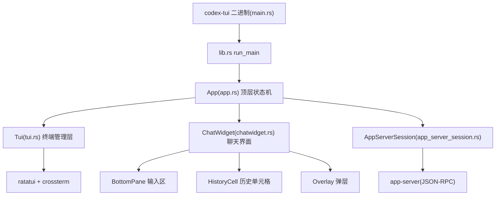
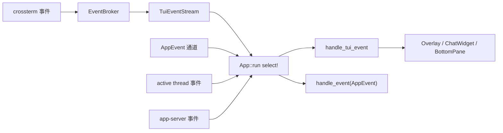

# Codex TUI 功能分析

> 分析对象：OpenAI Codex 仓库（https://github.com/openai/codex）
> 克隆位置：`/workspace/codex`（浅克隆，commit `30d9923`）
> TUI 源码：`codex-rs/tui/`
> 文档生成日期：2026-08-05

## 1. 概述

Codex TUI（crate 名 `codex-tui`）是 OpenAI Codex CLI 的终端交互界面，运行在终端内提供完整的 AI 编程会话体验：对话、命令执行、文件编辑审批、会话恢复、模型/权限/协作模式切换等，全部通过键盘在终端中完成。

与常见全屏 TUI 不同，Codex TUI 默认采用 **inline 模式**（不进入 alternate screen），将聊天界面绘制在终端底部视口（viewport）中，历史内容保留在终端正常 scrollback 里；也支持 `--no-alt-screen` 之外的 alt-screen 模式（`AltScreenMode` 可配置）用于弹层（overlay）界面。

### 技术栈

- **Rust**，异步运行时 `tokio`（multi-thread）
- **ratatui 0.30** + 自定义 fork 的 **crossterm 0.29**（`openai-oss-forks/crossterm`）做终端渲染与事件
- **pulldown-cmark** 渲染 Markdown，**syntect + two-face** 做语法高亮
- 通过 **JSON-RPC over app-server** 与后端智能体进程通信（app-server 可内嵌、本地守护进程或远程连接）
- 其他：`arboard`（剪贴板）、`image`（宠物图片）、`rmcp`（MCP）、`toml`/`serde`（配置）、`syntect`（高亮）

### 代码规模

| 指标 | 数值 |
| --- | --- |
| Rust 源文件数 | 409 |
| 代码总行数 | 约 24.1 万行 |
| 测试代码行数 | 约 2.1 万行 |
| Spinner 动画帧文件 | 360 个（9 套 x 36 帧） |

## 2. 总体架构

TUI 采用分层设计：终端管理、应用状态机、UI 组件树、渲染引擎、后端桥接五层。



- **入口层**：`main.rs` 解析 CLI，调用 `run_main`；`md-events.rs` 是辅助调试工具。
- **终端管理层（`tui::Tui`）**：负责 raw mode、bracketed paste、键盘增强（keyboard enhancement）、alt-screen 进出、视口（viewport）管理、绘制调度、历史行插入、桌面通知、进程挂起（Ctrl-Z）恢复。
- **应用层（`App`）**：拥有 `ChatWidget`、`AppServerSession` 与全部业务状态，实现四路事件源的事件循环与退出流程。
- **UI 层**：`ChatWidget` 是主聊天面，`BottomPane` 是底部输入区与弹层栈，`HistoryCell` 抽象历史消息单元格。
- **桥接层（`AppServerSession`）**：封装所有面向 app-server 的 typed JSON-RPC 调用，把 `App`/`ChatWidget` 与协议细节隔离。

## 3. 启动流程（`run_main`）

`lib.rs::run_main` 的启动流程：

1. **解析 CLI**（`cli.rs`）：用户 prompt、`--ask-for-approval`、`--search`、`--no-alt-screen`、`-c` 配置覆盖、resume/fork 内部参数等。
2. **加载配置**：读取 `config.toml`（多层：managed/system/user/profile），应用 CLI 覆盖与 profile v2。
3. **确定 app-server 目标**（`app_server_target_for_launch`）：
   - `Embedded`（进程内嵌）
   - `LocalDaemon`（复用已运行的本机守护进程 Unix socket）
   - `Remote`（显式远程端点）
4. **初始化终端**（`tui::init`）：校验 stdin/stdout 是终端，设置 raw mode、bracketed paste、键盘增强；启动终端探测（光标位置、默认颜色、键盘增强支持，OSC 10/11 查询）；设置 panic hook 以便退出时恢复终端。
5. **引导 app-server**（`AppServerSession::bootstrap`）：认证、拉取账号状态、模型列表、限流快照等。
6. **会话选择**（`SessionSelection`）：StartFresh / Resume（恢复历史会话）/ Fork（分叉）/ Exit，由 resume picker 或 CLI 参数决定。
7. **构建 `App` 并进入主事件循环**，退出时生成 `AppExitInfo`（token 用量、线程 ID、resume 提示、退出原因）。

## 4. 事件循环

`App::run` 中通过 `tokio::select!` 汇合四路事件源：

| 事件源 | 说明 |
| --- | --- |
| `app_event_rx` | 内部 `AppEvent` 通道（UI 发起的异步请求结果、定时器、后台任务回调） |
| `active_thread_rx` | 当前活动线程的 app-server 推送事件流 |
| `tui_events` | 终端输入流（`TuiEvent::Key / Paste / Resize / Draw / Resume`） |
| `app_server.next_event()` | app-server 的 ServerNotification / ServerRequest（审批、用户输入请求等） |

`TuiEvent` 由 `tui::event_stream::TuiEventStream` 产生：crossterm 键盘/焦点/粘贴事件被 broker 归一化，`Draw` 由 `FrameRequester`（frame_rate_limiter 限频，最小帧间隔）广播触发。键事件首先经过 `KeyChordMatcher` 做双键 chord 匹配，然后分发给当前活动表面（overlay / ChatWidget / BottomPane 弹层栈 / composer）。



## 5. 核心组件

### 5.1 `Tui`（tui.rs）— 终端管理层

- **模式管理**：`set_modes` / `restore` / `restore_after_exit`，启用 bracketed paste、raw mode、键盘增强（`EnableKeyboardEnhancement`）、焦点变化事件；Windows 上额外处理 VT 处理开关与输入记录模式。
- **视口（viewport）**：inline 模式下视口是屏幕底部的矩形区域；`draw()` 通过 `sync_update` 原子地绘制，`scroll_region_up` 实现视口内容滚动；resize 时用光标位置启发式（`pending_viewport_area`）保持光标位置稳定。
- **Resize reflow**：`draw_with_resize_reflow`（feature-gated）在终端尺寸变化时配合 `transcript_reflow` 重建 scrollback。
- **历史行插入**：`insert_history_lines` 把退出 TUI 前/外部进程的输出行插入到视口上方滚动区（支持 Zellij 的 raw 模式与 `HyperlinkLine` 超链接）。
- **Alt-screen**：`enter_alt_screen` / `leave_alt_screen` 保存/恢复 inline 视口；`alt_screen_enabled` 可由配置关闭。
- **外部程序运行**：`with_restored` 暂停事件流、离开 alt-screen、恢复终端模式以运行外部交互程序（编辑器等），随后恢复。
- **桌面通知**：按 `NotificationCondition`（Always/Unfocused）与焦点状态决定是否发送，后端为 OSC 9 / BEL。
- **进程挂起**：Unix 上支持 Ctrl-Z 挂起（`SuspendContext`），恢复后 `reapply_raw_mode_after_resume` 同步 crossterm 的 raw mode 缓存。
- **stderr 抑制**：`TerminalStderrGuard` 防止子进程 stderr 破坏 inline 视口。
- **宠物图片绘制**：`draw_ambient_pet_image` / `draw_pet_picker_preview_image` 在视口外渲染 sixel 图片。

### 5.2 `App`（app.rs + app/）— 顶层状态机

- 拥有 `ChatWidget`、`AppServerSession`、`RuntimeKeymap`、模型目录、多线程（primary + side threads）路由等状态。
- 事件分发在 `app/event_dispatch.rs` 的 `AppEvent` 穷尽 match 中完成，大型领域动作委托给 `app/` 下聚焦子模块：
  - `session_lifecycle.rs`：线程创建/恢复/分叉生命周期
  - `thread_routing.rs` / `agent_navigation.rs` / `agent_picker.rs`：多 agent 切换与线程路由
  - `background_requests.rs` / `app_server_requests.rs`：请求去重与后台轮询
  - `history_pagination.rs` / `history_ui.rs`：历史分页加载与 UI 状态
  - `config_persistence.rs`：配置读写落盘
  - `resize_reflow.rs`：resize 后重建 scrollback
  - `safety_buffering.rs` / `rate_limits`：限流保护
- 退出处理：`ExitMode`（ShutdownFirst / Fatal 等）、双击退出提示、`AppExitInfo`（token 用量、thread id、resume hint、更新动作）。

### 5.3 `ChatWidget`（chatwidget.rs + chatwidget/）— 聊天界面

- 消费协议事件、构建并更新 `HistoryCell` 列表，驱动主视口与 overlay 渲染。
- 提交型 transcript 单元格（committed `HistoryCell`）与**在途 active cell**（streaming 中原地变更，常为合并的 exec/tool 组）并存。
- `chatwidget/` 子模块覆盖：`interaction`（按键路由）、`streaming`、`input_submission`、`turn_lifecycle`、`tool_requests`、`permission_popups`、`review`、`plan_implementation`、`model_popups`、`settings`/`settings_popups`、`plugins`/`plugin_catalog`、`skills`、`slash_dispatch`、`goal_menu`/`goal_status`、`side`（侧边线程）、`usage`/`tokens`（token 图表）、`pets`、`status_surfaces` 等。
- 单任务指示器（spinner + 中断提示）由 agent turn 与 MCP 启动生命周期共同驱动（`update_task_running_state`）。

### 5.4 `BottomPane`（bottom_pane/）— 输入区与弹层栈

- 拥有 `ChatComposer`（可编辑输入框）与一组瞬态 `BottomPaneView`（弹层/模态）。
- 按键路由分层：`BottomPane` 决定本地表面（view vs composer）谁接收键；Ctrl+C/D 等高层意图由 `ChatWidget` 决定（view 优先消费、其次 history search 取消、最后才是中断/退出）。
- 子模块（全部位于 `bottom_pane/`）：

| 模块 | 功能 |
| --- | --- |
| `chat_composer.rs`（1.26 万行） | 输入区总状态机：draft 编辑、slash 命令提升为原子元素、Enter 提交/换行、历史导航、弹窗路由 |
| `textarea.rs` + `textarea/vim.rs` | 编辑器内核：光标/换行/kill buffer；内嵌 vim 模式（Normal/Insert、文本对象、操作符） |
| `approval_overlay.rs` | 命令执行/文件修改/MCP/权限审批弹层 |
| `mentions_v2/` | 统一 `@` 提及弹窗（文件/目录/工具），fuzzy 过滤 + 分类 tab |
| `file_search_popup.rs` | `@` 文件搜索结果弹窗 |
| `slash_commands.rs` | slash 命令过滤（按 sandbox/feature 门控）与 fuzzy 匹配 |
| `command_popup.rs` / `list_selection_view.rs` | 通用命令/列表选择器 |
| `footer.rs` | 底部状态栏（协作模式指示器、目标状态、状态行项目） |
| `effort_ignition*.rs` / `effort_status_line.rs` | 推理努力（reasoning effort）调节 |
| `mcp_server_elicitation.rs` | MCP 服务器安装引导表单 |
| `skills_toggle_view.rs` / `skill_popup.rs` | skills 开关与选择 |
| `hooks_browser_view.rs` | hooks 浏览器 |
| `feedback_view.rs` | 反馈提交 |
| `memories_settings_view.rs` | 记忆设置 |
| `status_line_setup.rs` / `status_line_style.rs` / `title_setup.rs` / `status_surface_preview.rs` | 自定义状态行/终端标题预览 |
| `experimental_features_view.rs` | 实验特性开关 |
| `request_user_input/` | 模型请求用户输入的表单渲染 |
| `paste_burst.rs` | 无 bracketed paste 终端的粘贴突发检测状态机 |
| `pending_input_preview.rs` / `pending_thread_approvals.rs` | 排队输入/待审批预览 |
| `custom_prompt_view.rs` | 自定义提示词 |
| `selection_popup_common.rs` / `multi_select_picker.rs` / `selection_tabs.rs` | 选择器公共组件 |
| `app_link_view.rs` | app 链接引导 |
| `unified_exec_footer.rs` | 统一执行页脚 |

### 5.5 `HistoryCell`（history_cell/）— 历史消息单元格

`HistoryCell` trait 是 transcript 的显示单元抽象，提供 `display_lines` / `raw_lines` 双视图（显示 vs 可搜索原文）。实现包括：

| 单元格 | 内容 |
| --- | --- |
| `messages.rs` | 用户/助手消息（Markdown 渲染） |
| `base.rs` | 基础单元格类型 |
| `exec.rs` | 命令执行结果 |
| `patches.rs` | apply-patch 文件修改摘要 |
| `plans.rs` | 计划（proposed plan） |
| `approvals.rs` | 审批记录 |
| `mcp.rs` | MCP 工具调用 |
| `request_user_input.rs` | 用户输入请求 |
| `notices.rs` | 系统通知 |
| `separators.rs` | 分隔线（会话开始等） |
| `search.rs` | 历史搜索高亮 |
| `hook_cell.rs` | hook 执行 |
| `session.rs` | 会话信息行 |
| `markdown_render_cache.rs` | 按宽度+主题缓存的 Markdown 渲染缓存 |

### 5.6 渲染引擎

- 管线：**pulldown-cmark 事件 → HyperlinkLine/Line → 宽度感知 wrap/truncate → `Renderable::render` 到 ratatui Buffer**。
- `render::renderable::Renderable` trait：`render` / `desired_height` / `cursor_pos`，是弹层与单元格的公共渲染接口。
- `render/highlight.rs`：syntect + two-face 语法高亮（bash 等），带 512KB / 10000 行 / 4KiB 单行保护。
- `streaming/`：流式渲染控制器 `StreamCore`/`StreamController`，内容分 **stable**（已沉淀）与 **tail**（可变尾）两区，commit tick 驱动 tail 沉淀；Smooth/CatchUp 两档自适应 chunking；表格 header 确认 holdback；`PlanStreamController` 渲染计划头。
- `markdown_render.rs`：Markdown 到 ratatui Line 的最终转换（含表格列宽分配、key/value 纵向渲染、行内代码等）。
- `diff_model.rs` / `diff_render.rs`：`FileChange`（Add/Delete/Update）+ 行号 gutter，主题随终端明暗自适应。
- `exec_cell/`：`$ cmd` 高亮渲染 + 实时输出（`LiveCommandOutput`，1MB 预算、head/tail 截断、耗时与退出码）；"exploring" 模式聚合连续只读命令。
- `transcript_reflow.rs`：resize 后 75ms debounce 重建 scrollback；`live_wrap.rs` 提供 URL 感知的 adaptive wrap。
- `inline_visualization.rs`：`::codex-inline-vis{...}` 指令重写为本地 HTML viewer 链接。
- `table_detect.rs`：FenceTracker 检测表格结构。

## 6. 功能模块分类

### 6.1 输入与编辑

- **键位系统**（`keymap.rs` + `keymap/`）：配置驱动的分层解析（context → global 回退 → 内置默认），10 套上下文键位表（App/Chat/Composer/Editor/VimNormal/VimOperator/VimTextObject/Pager/List/Approval）；不可配置的 `MAIN_RESERVED_BINDINGS`（ctrl-c 中断、ctrl-d 退出、Esc backtrack、alt-←/→ 切 agent、`/` `!` `@` `$` 命令前缀）；双键 chord 机制（1 秒超时，如 `ctrl-x ctrl-t`）。
- **自定义键位**（`keymap_setup/`）：`/keymap` 引导式重映射 UI（选动作 → replace/add/remove → 捕获按键），含冲突校验、多 tab 选择器、实时调试视图（`KeymapDebugView`）。
- **输入框**：`chat_composer` + `textarea`，支持 vim 模式、kill buffer（ctrl-k/y）、历史导航（↑/↓、ctrl-r 反向搜索）、原子元素占位符（slash 命令、@mention、图片）。
- **粘贴**：bracketed paste + `paste_burst`（无支持终端的突发检测状态机）、`clipboard_paste`（剪贴板图片 → PNG）。
- **外部编辑器**：`external_editor.rs` 按 `VISUAL`/`EDITOR` 环境变量解析并运行（ctrl-g 打开）。
- **剪贴板复制**：`clipboard_copy.rs` 按环境选后端（SSH 用 tmux/OSC52，本地 arboard，WSL 回退 PowerShell）。
- **IDE 集成**（`ide_context/`）：`/ide` 通过 IPC（Unix socket / Windows 命名管道）拉取当前文件/选区上下文注入提示词。
- **文件搜索与提及**：`file_search.rs`（`@` 搜索编排）+ `mentions_v2`（统一提及弹窗）。

### 6.2 会话与历史

- **会话恢复**：`resume_picker.rs`（`/resume` 选择器，25 条分页）、`session_resume.rs`（cwd 提示、本地 rollout 元数据回退）、`SessionSelection`（Fresh/Resume/Fork/Exit）。
- **会话状态**：`session_state.rs` 的 `ThreadSessionState`（模型、权限快照、cwd、协作模式、历史元数据）。
- **会话管理**：`session_archive_commands.rs`（archive/delete/unarchive）、`session_log.rs`（JSON lines 会话日志）。
- **历史搜索**：`history_cell/search.rs`、`bottom_pane/chat_composer_history/`（反向搜索批处理）。
- **多 agent**：`multi_agents.rs`（agent 选择器、alt-←/→ 快速切换）、`app/agent_navigation.rs`、`app/agent_picker.rs`。
- **侧边线程**：`chatwidget/side.rs`、`app/side.rs`（side conversation）。

### 6.3 模型、权限与执行

- **模型**：`model_catalog.rs`（模型目录）、`model_migration.rs`（模型升级引导）、`chatwidget/model_popups.rs`（模型选择弹窗）、`reasoning_shortcuts.rs`（effort 快捷键）。
- **权限/审批**：`approval_events.rs`、`bottom_pane/approval_overlay.rs`、`permission_compat.rs`、`auto_review_denials.rs`、`chatwidget/permission_popups.rs`、`chatwidget/permissions_menu.rs`。
- **协作模式**：`collaboration_modes.rs`（shift-tab 循环切换 plan/normal 等预设）。
- **目标（goal）**：`goal_display.rs`（`/goal` 格式化）、`goal_files.rs`（超长目标物化为文件）、`chatwidget/goal_menu.rs`、`chatwidget/goal_status.rs`。
- **服务层级/限流**：`service_tier_resolution.rs`、`status/rate_limits.rs`、`chatwidget/rate_limits.rs`、`app/rate_limits` 测试。
- **沙箱提示**：`chatwidget/windows_sandbox_prompts.rs`、`windows_sandbox.rs`。

### 6.4 状态与信息展示

- **状态栏**（`status/`）：账号（ChatGPT/API key）、限流快照+进度条、远程连接状态（脱敏 ws 地址）、`/status` 卡片组装；自定义状态行（`bottom_pane/status_line_setup.rs`）与终端标题（`title_setup.rs`）。
- **终端标题**：`terminal_title.rs`（OSC title，含 Trojan Source 防护）。
- **超链接**：`terminal_hyperlinks.rs`（OSC 8，与文本几何分离）。
- **tooltips**：`tooltips.rs`（启动随机提示 + 远程公告 `announcement_tip.toml`）。
- **token 用量**：`token_usage.rs`、`chatwidget/usage.rs`、`chatwidget/tokens/chart.rs`（终端内 token 图表，自定义调色板）。

### 6.5 引导、登录与迁移

- **首次启动引导**（`onboarding/`）：`welcome.rs`（欢迎屏+ASCII 动画）、`auth.rs`（ChatGPT 登录/设备码/API key）、`trust_directory.rs`（信任目录）、`onboarding_screen.rs`（状态机与固定键位 jk/1/2/3）。
- **外部 agent 配置迁移**：`external_agent_config_migration/`（检测并导入其他 agent 配置的流程 UI）。
- **配置更新**：`config_update.rs`、`app/config_persistence.rs`、`cwd_prompt.rs`（cwd 变更确认）。

### 6.6 通知、更新与宠物

- **通知**（`notifications/`）：OSC 9（Ghostty/iTerm2/Kitty/Warp/WezTerm）/ BEL 后端，tmux DCS passthrough。
- **更新**：`updates.rs`（Homebrew/GitHub/npm 后台查询，20h 缓存）、`update_action.rs`（各安装方式的更新命令）、`update_prompt.rs`（启动更新提示屏）、`update_versions.rs`（semver 比较）。
- **宠物**（`pets/`）：`/pets` 终端宠物系统；内置 8 个宠物；CDN spritesheet 版本化缓存；Kitty/Sixel 图像协议检测与最小 sixel 编码器；环境精灵避开底部面板渲染；选择器与侧栏预览。
- **动画**：`frames.rs`（9 套 x 36 帧 spinner 编译期嵌入）、`shimmer.rs`、`ascii_animation.rs`、`status_indicator_widget.rs`；`motion.rs` 的 `MotionMode` 尊重系统 reduced-motion。

## 7. 关键机制

1. **Inline 视口渲染**：TUI 只绘制屏幕底部视口，历史进入 scrollback，通过 `sync_update` + `scroll_region_up` 保证无闪烁；stderr 被重定向避免污染界面。
2. **流式文本渲染**：stable/tail 分区 + commit tick，配合自适应 chunking 与表格 holdback，兼顾流畅度与稳定内容。
3. **双键 chord**：所有动作都可绑定到两键序列（1 秒窗口），与单键共存，不改动既有分发表。
4. **Resize reflow**：尺寸变化后 debounce 重建整个 scrollback，URL 感知换行，保持宽表与代码块正确。
5. **会话恢复/分叉**：通过 app-server 的 thread 模型支持任意历史会话恢复与分叉，并提示 cwd。
6. **多事件源合一**：UI 事件、app-server 推送、线程事件、内部异步结果经 `tokio::select!` 汇合，支持侧边线程与多 agent 并发。
7. **终端探测自适应**：启动时探测光标位置/默认色/键盘增强；颜色主题按终端明暗自动适配；部分终端缺特性时优雅降级（如 Zellij raw 插入、无 bracketed paste 的 paste burst）。

## 8. 目录地图

```
codex-rs/tui/
├── Cargo.toml             # codex-tui crate（bin: codex-tui, md-events）
├── styles.md              # TUI 风格约定
├── frames/                # 9 套 spinner 动画帧（每套 36 帧 txt）
├── tooltips.txt           # 启动提示语
└── src/
    ├── main.rs            # 二进制入口
    ├── lib.rs             # run_main 启动流程、模块声明
    ├── cli.rs             # CLI 参数
    ├── tui.rs + tui/      # 终端管理（事件流/帧率/挂起/屏幕尺寸）
    ├── app.rs + app/      # 顶层状态机与事件分发
    ├── chatwidget.rs + chatwidget/  # 聊天界面（2 万行）
    ├── bottom_pane/       # 输入区与弹层（5.6 万行，含 1.26 万行 chat_composer）
    ├── history_cell/      # 历史消息单元格
    ├── keymap.rs + keymap/ + keymap_setup/  # 键位系统
    ├── streaming/         # 流式渲染控制器
    ├── render/            # Renderable trait 与语法高亮
    ├── markdown_render.rs # Markdown 渲染
    ├── exec_cell/         # 命令执行单元格
    ├── status/            # 状态栏格式化
    ├── pets/              # 宠物系统
    ├── onboarding/        # 首次启动引导
    ├── notifications/     # 桌面通知
    ├── resume_picker.rs / session_*.rs  # 会话恢复/管理
    ├── ide_context/       # IDE 集成
    ├── clipboard_*.rs / external_editor.rs  # 剪贴板/外部编辑器
    ├── updates*.rs        # 更新检查
    ├── app_server_session.rs  # app-server JSON-RPC 桥接
    └── ...                # 其余工具与测试模块
```

## 9. 规模 Top 目录（src 下）

| 目录 | 行数 | 说明 |
| --- | ---: | --- |
| `bottom_pane/` | 56180 | 输入区、弹层、审批、提及等 |
| `chatwidget/`（含 chatwidget.rs） | 51571 | 聊天主界面编排 |
| `app/`（含 app.rs） | 30235 | 顶层状态机与事件分发 |
| `history_cell/` | 8021 | 历史单元格实现 |
| `status/` | 4268 | 状态展示 |
| `pets/` | 3986 | 宠物系统 |
| `streaming/` | 3623 | 流式渲染 |
| `onboarding/` | 2985 | 首次引导 |
| `external_agent_config_migration/` | 2592 | 外部配置迁移 |
| `render/` | 2352 | 渲染基础设施 |
| `tui/`（含 tui.rs） | 2275 | 终端管理层 |
| `ide_context/` | 2017 | IDE 集成 |
