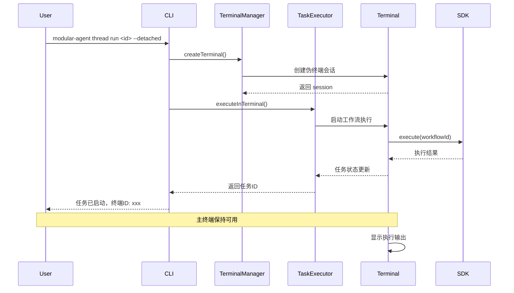

# CLI 应用终端分离功能实现方案

## 一、概述

基于 [`terminal-separation.md`](./terminal-separation.md) 文档的技术调研，本方案详细说明如何在现有的 CLI 应用中实现终端分离执行功能，使工作流线程可以在独立的终端窗口中运行，而不阻塞主终端。

## 二、现有架构分析

### 2.1 当前结构

```
apps/cli-app/
├── src/
│   ├── adapters/
│   │   ├── base-adapter.ts          # 基础适配器
│   │   └── thread-adapter.ts        # 线程适配器
│   ├── commands/
│   │   └── thread/
│   │       └── index.ts             # 线程命令组
│   ├── utils/
│   │   ├── logger.ts
│   │   └── formatter.ts
│   └── index.ts                     # CLI 入口
└── package.json
```

### 2.2 当前执行流程

1. 用户执行 `modular-agent thread run <workflow-id>`
2. [`ThreadAdapter.executeThread()`](../cli-app/src/adapters/thread-adapter.ts:15) 调用 SDK 执行工作流
3. 工作流在当前终端同步执行，阻塞终端直到完成

### 2.3 存在的问题

- 终端被阻塞，无法执行其他命令
- 无法同时运行多个工作流
- 缺乏任务状态监控和管理

## 三、目标架构设计

### 3.1 新增模块结构

```
apps/cli-app/
├── src/
│   ├── adapters/
│   │   ├── base-adapter.ts
│   │   └── thread-adapter.ts        # 需要修改
│   ├── commands/
│   │   └── thread/
│   │       └── index.ts             # 需要修改
│   ├── terminal/                    # 新增终端模块
│   │   ├── terminal-manager.ts      # 终端管理器
│   │   ├── task-executor.ts         # 任务执行器
│   │   ├── communication-bridge.ts  # 通信桥接
│   │   └── types.ts                 # 终端相关类型定义
│   ├── utils/
│   │   ├── logger.ts
│   │   └── formatter.ts
│   └── index.ts
└── package.json                     # 需要添加依赖
```

### 3.2 核心组件设计

#### 3.2.1 TerminalManager（终端管理器）

**职责：**
- 创建和管理伪终端会话
- 维护终端实例的生命周期
- 处理终端的启动、关闭和清理
- 管理多个并发终端实例

**核心方法：**
```typescript
class TerminalManager {
  // 创建新的终端会话
  createTerminal(options: TerminalOptions): TerminalSession
  
  // 关闭指定终端
  closeTerminal(sessionId: string): Promise<void>
  
  // 获取所有活跃终端
  getActiveTerminals(): TerminalSession[]
  
  // 清理所有终端
  cleanupAll(): Promise<void>
}
```

#### 3.2.2 TaskExecutor（任务执行器）

**职责：**
- 在独立终端中执行工作流线程
- 重定向输出到指定终端
- 监控任务执行状态
- 处理任务中断和异常

**核心方法：**
```typescript
class TaskExecutor {
  // 在独立终端中执行任务
  executeInTerminal(
    workflowId: string,
    input: Record<string, unknown>,
    terminal: TerminalSession
  ): Promise<TaskExecutionResult>
  
  // 监控任务状态
  monitorTask(taskId: string): Promise<TaskStatus>
  
  // 停止任务执行
  stopTask(taskId: string): Promise<void>
}
```

#### 3.2.3 CommunicationBridge（通信桥接）

**职责：**
- 建立主进程与终端进程的通信
- 同步任务状态信息
- 处理用户输入和命令
- 管理消息队列

**核心方法：**
```typescript
class CommunicationBridge {
  // 发送消息到终端
  sendToTerminal(sessionId: string, message: BridgeMessage): void
  
  // 从终端接收消息
  receiveFromTerminal(sessionId: string): Observable<BridgeMessage>
  
  // 同步任务状态
  syncTaskStatus(taskId: string, status: TaskStatus): void
}
```

### 3.3 执行流程图



## 四、详细实现步骤

### 步骤 1: 添加依赖

在 [`package.json`](../cli-app/package.json) 中添加 node-pty 依赖：

```json
{
  "dependencies": {
    "node-pty": "^1.0.0",
    "rxjs": "^7.8.1"
  }
}
```

**说明：**
- `node-pty`: 用于创建伪终端会话
- `rxjs`: 用于实现响应式通信机制

### 步骤 2: 创建终端类型定义

创建 [`src/terminal/types.ts`](../cli-app/src/terminal/types.ts)：

```typescript
/**
 * 终端配置选项
 */
export interface TerminalOptions {
  shell?: string;
  cwd?: string;
  env?: Record<string, string>;
  cols?: number;
  rows?: number;
}

/**
 * 终端会话
 */
export interface TerminalSession {
  id: string;
  pty: any;
  pid: number;
  createdAt: Date;
  status: 'active' | 'inactive' | 'closed';
}

/**
 * 任务执行结果
 */
export interface TaskExecutionResult {
  taskId: string;
  sessionId: string;
  status: 'started' | 'running' | 'completed' | 'failed';
  startTime: Date;
  endTime?: Date;
  output?: string;
  error?: string;
}

/**
 * 任务状态
 */
export interface TaskStatus {
  taskId: string;
  status: 'running' | 'completed' | 'failed' | 'cancelled';
  progress?: number;
  message?: string;
  lastUpdate: Date;
}

/**
 * 桥接消息
 */
export interface BridgeMessage {
  type: 'status' | 'output' | 'error' | 'command';
  payload: any;
  timestamp: Date;
}
```

### 步骤 3: 实现终端管理器

创建 [`src/terminal/terminal-manager.ts`](../cli-app/src/terminal/terminal-manager.ts)：

```typescript
import * as pty from 'node-pty';
import { v4 as uuidv4 } from 'uuid';
import { createLogger } from '../utils/logger.js';
import type { TerminalOptions, TerminalSession } from './types.js';

const logger = createLogger();

/**
 * 终端管理器
 * 负责创建和管理伪终端会话
 */
export class TerminalManager {
  private sessions: Map<string, TerminalSession> = new Map();

  /**
   * 创建新的终端会话
   */
  createTerminal(options: TerminalOptions = {}): TerminalSession {
    const sessionId = uuidv4();
    const shell = options.shell || process.platform === 'win32' ? 'powershell.exe' : 'bash';
    
    // 创建伪终端
    const ptyProcess = pty.spawn(shell, [], {
      name: 'xterm-color',
      cols: options.cols || 80,
      rows: options.rows || 24,
      cwd: options.cwd || process.cwd(),
      env: { ...process.env, ...options.env }
    });

    const session: TerminalSession = {
      id: sessionId,
      pty: ptyProcess,
      pid: ptyProcess.pid,
      createdAt: new Date(),
      status: 'active'
    };

    this.sessions.set(sessionId, session);
    logger.info(`终端会话已创建: ${sessionId} (PID: ${ptyProcess.pid})`);

    // 监听终端退出事件
    ptyProcess.onExit(({ exitCode, signal }) => {
      logger.info(`终端会话已退出: ${sessionId} (退出码: ${exitCode}, 信号: ${signal})`);
      session.status = 'closed';
    });

    return session;
  }

  /**
   * 关闭指定终端
   */
  async closeTerminal(sessionId: string): Promise<void> {
    const session = this.sessions.get(sessionId);
    if (!session) {
      throw new Error(`终端会话不存在: ${sessionId}`);
    }

    if (session.status !== 'closed') {
      session.pty.kill();
      session.status = 'closed';
      logger.info(`终端会话已关闭: ${sessionId}`);
    }

    this.sessions.delete(sessionId);
  }

  /**
   * 获取所有活跃终端
   */
  getActiveTerminals(): TerminalSession[] {
    return Array.from(this.sessions.values()).filter(
      session => session.status === 'active'
    );
  }

  /**
   * 获取指定终端
   */
  getTerminal(sessionId: string): TerminalSession | undefined {
    return this.sessions.get(sessionId);
  }

  /**
   * 清理所有终端
   */
  async cleanupAll(): Promise<void> {
    const promises = Array.from(this.sessions.keys()).map(sessionId =>
      this.closeTerminal(sessionId)
    );
    await Promise.all(promises);
    logger.info('所有终端会话已清理');
  }
}
```

### 步骤 4: 实现任务执行器

创建 [`src/terminal/task-executor.ts`](../cli-app/src/terminal/task-executor.ts)：

```typescript
import { getSDK } from '@modular-agent/sdk';
import { v4 as uuidv4 } from 'uuid';
import { createLogger } from '../utils/logger.js';
import type { TerminalSession, TaskExecutionResult, TaskStatus } from './types.js';

const logger = createLogger();

/**
 * 任务执行器
 * 负责在独立终端中执行工作流线程
 */
export class TaskExecutor {
  private tasks: Map<string, TaskStatus> = new Map();
  private sdk: ReturnType<typeof getSDK>;

  constructor() {
    this.sdk = getSDK();
  }

  /**
   * 在独立终端中执行任务
   */
  async executeInTerminal(
    workflowId: string,
    input: Record<string, unknown>,
    terminal: TerminalSession
  ): Promise<TaskExecutionResult> {
    const taskId = uuidv4();
    
    // 初始化任务状态
    const taskStatus: TaskStatus = {
      taskId,
      status: 'running',
      progress: 0,
      message: '任务已启动',
      lastUpdate: new Date()
    };
    this.tasks.set(taskId, taskStatus);

    // 构建执行命令
    const command = this.buildExecutionCommand(workflowId, input, taskId);
    
    // 在终端中执行命令
    terminal.pty.write(command + '\r');

    logger.info(`任务已在终端中启动: ${taskId} (会话: ${terminal.id})`);

    return {
      taskId,
      sessionId: terminal.id,
      status: 'started',
      startTime: new Date()
    };
  }

  /**
   * 监控任务状态
   */
  async monitorTask(taskId: string): Promise<TaskStatus> {
    const status = this.tasks.get(taskId);
    if (!status) {
      throw new Error(`任务不存在: ${taskId}`);
    }
    return status;
  }

  /**
   * 停止任务执行
   */
  async stopTask(taskId: string): Promise<void> {
    const status = this.tasks.get(taskId);
    if (!status) {
      throw new Error(`任务不存在: ${taskId}`);
    }

    status.status = 'cancelled';
    status.message = '任务已取消';
    status.lastUpdate = new Date();

    logger.info(`任务已停止: ${taskId}`);
  }

  /**
   * 更新任务状态
   */
  updateTaskStatus(taskId: string, updates: Partial<TaskStatus>): void {
    const status = this.tasks.get(taskId);
    if (status) {
      Object.assign(status, updates, { lastUpdate: new Date() });
    }
  }

  /**
   * 构建执行命令
   */
  private buildExecutionCommand(
    workflowId: string,
    input: Record<string, unknown>,
    taskId: string
  ): string {
    const inputJson = JSON.stringify(input).replace(/"/g, '\\"');
    return `modular-agent thread run ${workflowId} --input "${inputJson}" --task-id ${taskId}`;
  }
}
```

### 步骤 5: 实现通信桥接

创建 [`src/terminal/communication-bridge.ts`](../cli-app/src/terminal/communication-bridge.ts)：

```typescript
import { Subject, Observable } from 'rxjs';
import { createLogger } from '../utils/logger.js';
import type { BridgeMessage, TerminalSession } from './types.js';

const logger = createLogger();

/**
 * 通信桥接
 * 负责主进程与终端进程之间的通信
 */
export class CommunicationBridge {
  private messageQueues: Map<string, Subject<BridgeMessage>> = new Map();

  /**
   * 发送消息到终端
   */
  sendToTerminal(sessionId: string, message: BridgeMessage): void {
    const queue = this.messageQueues.get(sessionId);
    if (queue) {
      queue.next(message);
      logger.debug(`消息已发送到终端 ${sessionId}: ${message.type}`);
    } else {
      logger.warn(`终端 ${sessionId} 的消息队列不存在`);
    }
  }

  /**
   * 从终端接收消息
   */
  receiveFromTerminal(sessionId: string): Observable<BridgeMessage> {
    if (!this.messageQueues.has(sessionId)) {
      this.messageQueues.set(sessionId, new Subject<BridgeMessage>());
    }
    return this.messageQueues.get(sessionId)!.asObservable();
  }

  /**
   * 同步任务状态
   */
  syncTaskStatus(taskId: string, status: any): void {
    const message: BridgeMessage = {
      type: 'status',
      payload: { taskId, status },
      timestamp: new Date()
    };

    // 广播到所有相关终端
    this.messageQueues.forEach((queue) => {
      queue.next(message);
    });
  }

  /**
   * 清理指定终端的消息队列
   */
  cleanup(sessionId: string): void {
    const queue = this.messageQueues.get(sessionId);
    if (queue) {
      queue.complete();
      this.messageQueues.delete(sessionId);
      logger.debug(`终端 ${sessionId} 的消息队列已清理`);
    }
  }

  /**
   * 清理所有消息队列
   */
  cleanupAll(): void {
    this.messageQueues.forEach((queue) => queue.complete());
    this.messageQueues.clear();
    logger.info('所有消息队列已清理');
  }
}
```

### 步骤 6: 修改线程命令

修改 [`src/commands/thread/index.ts`](../cli-app/src/commands/thread/index.ts)，添加 `--detached` 选项：

```typescript
/**
 * 线程命令组
 */

import { Command } from 'commander';
import { ThreadAdapter } from '../../adapters/thread-adapter.js';
import { createLogger } from '../../utils/logger.js';
import { formatThread, formatThreadList } from '../../utils/formatter.js';
import type { CommandOptions } from '../../types/cli-types.js';

// 新增导入
import { TerminalManager } from '../../terminal/terminal-manager.js';
import { TaskExecutor } from '../../terminal/task-executor.js';
import { CommunicationBridge } from '../../terminal/communication-bridge.js';

const logger = createLogger();

// 创建全局实例
const terminalManager = new TerminalManager();
const taskExecutor = new TaskExecutor();
const communicationBridge = new CommunicationBridge();

/**
 * 创建线程命令组
 */
export function createThreadCommands(): Command {
  const threadCmd = new Command('thread')
    .description('管理线程');

  // 执行线程命令 - 添加 --detached 选项
  threadCmd
    .command('run <workflow-id>')
    .description('执行工作流线程')
    .option('-i, --input <json>', '输入数据(JSON格式)')
    .option('-v, --verbose', '详细输出')
    .option('-d, --detached', '在独立终端中运行（不阻塞当前终端）')
    .action(async (workflowId, options: CommandOptions & { 
      input?: string; 
      detached?: boolean 
    }) => {
      try {
        logger.info(`正在启动线程: ${workflowId}`);

        let inputData: Record<string, unknown> = {};
        if (options.input) {
          try {
            inputData = JSON.parse(options.input);
          } catch (error) {
            logger.error('输入数据必须是有效的JSON格式');
            process.exit(1);
          }
        }

        if (options.detached) {
          // 在独立终端中运行
          const terminal = terminalManager.createTerminal();
          const result = await taskExecutor.executeInTerminal(
            workflowId,
            inputData,
            terminal
          );

          console.log(`\n✓ 线程已在独立终端中启动`);
          console.log(`  任务ID: ${result.taskId}`);
          console.log(`  终端ID: ${result.sessionId}`);
          console.log(`  启动时间: ${result.startTime.toISOString()}`);
          console.log(`\n提示: 使用 'modular-agent thread status ${result.taskId}' 查看任务状态`);
        } else {
          // 在当前终端中运行（原有逻辑）
          const adapter = new ThreadAdapter();
          const thread = await adapter.executeThread(workflowId, inputData);
          console.log(formatThread(thread, { verbose: options.verbose }));
        }
      } catch (error) {
        logger.error(`执行线程失败: ${error instanceof Error ? error.message : String(error)}`);
        process.exit(1);
      }
    });

  // 新增：查看任务状态命令
  threadCmd
    .command('status <task-id>')
    .description('查看任务状态')
    .action(async (taskId) => {
      try {
        const status = await taskExecutor.monitorTask(taskId);
        console.log(`\n任务状态:`);
        console.log(`  任务ID: ${status.taskId}`);
        console.log(`  状态: ${status.status}`);
        console.log(`  进度: ${status.progress || 0}%`);
        console.log(`  消息: ${status.message || '无'}`);
        console.log(`  最后更新: ${status.lastUpdate.toISOString()}`);
      } catch (error) {
        logger.error(`获取任务状态失败: ${error instanceof Error ? error.message : String(error)}`);
        process.exit(1);
      }
    });

  // 新增：停止任务命令
  threadCmd
    .command('cancel <task-id>')
    .description('取消任务执行')
    .action(async (taskId) => {
      try {
        await taskExecutor.stopTask(taskId);
        logger.success(`任务已取消: ${taskId}`);
      } catch (error) {
        logger.error(`取消任务失败: ${error instanceof Error ? error.message : String(error)}`);
        process.exit(1);
      }
    });

  // 新增：列出活跃终端命令
  threadCmd
    .command('terminals')
    .description('列出所有活跃终端')
    .action(() => {
      const terminals = terminalManager.getActiveTerminals();
      if (terminals.length === 0) {
        console.log('\n当前没有活跃的终端');
        return;
      }

      console.log('\n活跃终端:');
      terminals.forEach((terminal, index) => {
        console.log(`  ${index + 1}. ID: ${terminal.id}`);
        console.log(`     PID: ${terminal.pid}`);
        console.log(`     状态: ${terminal.status}`);
        console.log(`     创建时间: ${terminal.createdAt.toISOString()}`);
        console.log('');
      });
    });

  // 暂停线程命令（保持不变）
  threadCmd
    .command('pause <thread-id>')
    .description('暂停线程')
    .action(async (threadId) => {
      try {
        logger.info(`正在暂停线程: ${threadId}`);
        const adapter = new ThreadAdapter();
        await adapter.pauseThread(threadId);
      } catch (error) {
        logger.error(`暂停线程失败: ${error instanceof Error ? error.message : String(error)}`);
        process.exit(1);
      }
    });

  // 恢复线程命令（保持不变）
  threadCmd
    .command('resume <thread-id>')
    .description('恢复线程')
    .action(async (threadId) => {
      try {
        logger.info(`正在恢复线程: ${threadId}`);
        const adapter = new ThreadAdapter();
        await adapter.resumeThread(threadId);
      } catch (error) {
        logger.error(`恢复线程失败: ${error instanceof Error ? error.message : String(error)}`);
        process.exit(1);
      }
    });

  // 停止线程命令（保持不变）
  threadCmd
    .command('stop <thread-id>')
    .description('停止线程')
    .action(async (threadId) => {
      try {
        logger.info(`正在停止线程: ${threadId}`);
        const adapter = new ThreadAdapter();
        await adapter.stopThread(threadId);
      } catch (error) {
        logger.error(`停止线程失败: ${error instanceof Error ? error.message : String(error)}`);
        process.exit(1);
      }
    });

  // 列出线程命令（保持不变）
  threadCmd
    .command('list')
    .description('列出所有线程')
    .option('-t, --table', '以表格格式输出')
    .option('-v, --verbose', '详细输出')
    .action(async (options: CommandOptions) => {
      try {
        const adapter = new ThreadAdapter();
        const threads = await adapter.listThreads();
        console.log(formatThreadList(threads, { table: options.table }));
      } catch (error) {
        logger.error(`列出线程失败: ${error instanceof Error ? error.message : String(error)}`);
        process.exit(1);
      }
    });

  // 查看线程详情命令（保持不变）
  threadCmd
    .command('show <thread-id>')
    .description('查看线程详情')
    .option('-v, --verbose', '详细输出')
    .action(async (threadId, options: CommandOptions) => {
      try {
        const adapter = new ThreadAdapter();
        const thread = await adapter.getThread(threadId);
        console.log(formatThread(thread, { verbose: options.verbose }));
      } catch (error) {
        logger.error(`获取线程详情失败: ${error instanceof Error ? error.message : String(error)}`);
        process.exit(1);
      }
    });

  // 删除线程命令（保持不变）
  threadCmd
    .command('delete <thread-id>')
    .description('删除线程')
    .option('-f, --force', '强制删除，不提示确认')
    .action(async (threadId, options: { force?: boolean }) => {
      try {
        if (!options.force) {
          logger.warn(`即将删除线程: ${threadId}`);
          logger.info('使用 --force 选项跳过确认');
          return;
        }

        const adapter = new ThreadAdapter();
        await adapter.deleteThread(threadId);
      } catch (error) {
        logger.error(`删除线程失败: ${error instanceof Error ? error.message : String(error)}`);
        process.exit(1);
      }
    });

  return threadCmd;
}
```

### 步骤 7: 添加清理逻辑

修改 [`src/index.ts`](../cli-app/src/index.ts)，添加进程退出时的清理逻辑：

```typescript
#!/usr/bin/env node

/**
 * Modular Agent CLI Application
 * 模块化智能体框架命令行应用
 */

import { Command } from 'commander';
import { createLogger } from './utils/logger.js';
import { createWorkflowCommands } from './commands/workflow/index.js';
import { createThreadCommands } from './commands/thread/index.js';
import { createCheckpointCommands } from './commands/checkpoint/index.js';
import { createTemplateCommands } from './commands/template/index.js';
import { createLLMProfileCommands } from './commands/llm-profile/index.js';
import { createScriptCommands } from './commands/script/index.js';
import { createToolCommands } from './commands/tool/index.js';
import { createTriggerCommands } from './commands/trigger/index.js';
import { createMessageCommands } from './commands/message/index.js';
import { createVariableCommands } from './commands/variable/index.js';
import { createEventCommands } from './commands/event/index.js';
import { createHumanRelayCommands } from './commands/human-relay/index.js';

// 创建日志记录器
const logger = createLogger();

// 创建主程序实例
const program = new Command();

// 配置程序基本信息
program
  .name('modular-agent')
  .description('Modular Agent Framework - 模块化智能体框架命令行工具')
  .version('1.0.0')
  .option('-v, --verbose', '启用详细输出模式')
  .option('-d, --debug', '启用调试模式');

// 添加工作流命令组
program.addCommand(createWorkflowCommands());

// 添加线程命令组
program.addCommand(createThreadCommands());

// 添加检查点命令组
program.addCommand(createCheckpointCommands());

// 添加模板命令组
program.addCommand(createTemplateCommands());

// 添加 LLM Profile 命令组
program.addCommand(createLLMProfileCommands());

// 添加脚本命令组
program.addCommand(createScriptCommands());

// 添加工具命令组
program.addCommand(createToolCommands());

// 添加触发器命令组
program.addCommand(createTriggerCommands());

// 添加消息命令组
program.addCommand(createMessageCommands());

// 添加变量命令组
program.addCommand(createVariableCommands());

// 添加事件命令组
program.addCommand(createEventCommands());

// 添加 Human Relay 命令组
program.addCommand(createHumanRelayCommands());

// 全局错误处理
program.hook('postAction', (thisCommand) => {
  const options = thisCommand.opts() as { verbose?: boolean; debug?: boolean };
  if (options.verbose || options.debug) {
    logger.info('详细模式已启用');
  }
});

// 添加进程退出清理逻辑
const cleanup = async () => {
  logger.info('正在清理资源...');
  
  // 清理终端会话
  try {
    const { TerminalManager } = await import('./terminal/terminal-manager.js');
    const { CommunicationBridge } = await import('./terminal/communication-bridge.js');
    
    const terminalManager = new TerminalManager();
    const communicationBridge = new CommunicationBridge();
    
    await terminalManager.cleanupAll();
    communicationBridge.cleanupAll();
  } catch (error) {
    logger.error(`清理资源时出错: ${error instanceof Error ? error.message : String(error)}`);
  }
  
  logger.info('资源清理完成');
  process.exit(0);
};

// 监听退出信号
process.on('SIGINT', cleanup);
process.on('SIGTERM', cleanup);
process.on('exit', cleanup);

// 解析命令行参数
program.parse(process.argv);

// 如果没有提供任何命令，显示帮助信息
if (!process.argv.slice(2).length) {
  program.outputHelp();
}
```

## 五、使用示例

### 5.1 在独立终端中运行工作流

```bash
# 在新终端中运行工作流，主终端保持可用
modular-agent thread run my-workflow --detached

# 带输入数据运行
modular-agent thread run my-workflow --input '{"name":"test"}' --detached

# 详细输出模式
modular-agent thread run my-workflow --detached --verbose
```

### 5.2 管理任务和终端

```bash
# 查看任务状态
modular-agent thread status <task-id>

# 取消任务执行
modular-agent thread cancel <task-id>

# 列出所有活跃终端
modular-agent thread terminals
```

### 5.3 传统运行方式（保持兼容）

```bash
# 在当前终端中运行（阻塞方式）
modular-agent thread run my-workflow

# 带输入数据运行
modular-agent thread run my-workflow --input '{"name":"test"}'
```

## 六、跨平台兼容性

### 6.1 支持的平台

- **Windows**: 使用 PowerShell 或 cmd.exe
- **macOS**: 使用 bash 或 zsh
- **Linux**: 使用 bash 或其他 shell

### 6.2 平台特定配置

```typescript
// 在 terminal-manager.ts 中
const shell = options.shell || process.platform === 'win32' 
  ? 'powershell.exe' 
  : 'bash';
```

### 6.3 测试计划

1. **Windows 测试**
   - 测试 PowerShell 终端创建
   - 测试 cmd.exe 终端创建
   - 验证任务执行和状态监控

2. **macOS 测试**
   - 测试 bash 终端创建
   - 测试 zsh 终端创建
   - 验证任务执行和状态监控

3. **Linux 测试**
   - 测试 bash 终端创建
   - 测试其他 shell 兼容性
   - 验证任务执行和状态监控

## 七、注意事项

### 7.1 资源管理

- **终端清理**: 确保在任务完成后正确关闭终端会话
- **内存泄漏**: 定期清理不再使用的终端和任务对象
- **进程监控**: 监控子进程状态，防止僵尸进程

### 7.2 错误处理

- **终端创建失败**: 提供清晰的错误信息和恢复建议
- **任务执行失败**: 记录详细日志，支持任务重试
- **通信中断**: 实现自动重连机制

### 7.3 安全性

- **权限检查**: 确保用户有权限创建终端和执行命令
- **输入验证**: 验证所有用户输入，防止命令注入
- **沙箱隔离**: 考虑在受限环境中执行不受信任的工作流

### 7.4 性能优化

- **并发限制**: 限制同时运行的终端数量
- **资源监控**: 监控 CPU 和内存使用情况
- **缓存机制**: 缓存常用配置和状态信息

## 八、后续扩展

### 8.1 功能增强

1. **终端日志持久化**: 将终端输出保存到文件
2. **任务调度**: 支持定时任务和延迟执行
3. **任务依赖**: 支持任务间的依赖关系
4. **资源配额**: 为每个任务分配资源限制

### 8.2 UI 改进

1. **进度条**: 显示任务执行进度
2. **实时输出**: 在主终端显示任务输出摘要
3. **通知系统**: 任务完成时发送通知
4. **交互式终端**: 支持与运行中的任务交互

### 8.3 集成扩展

1. **Web UI**: 提供网页界面管理任务
2. **API 接口**: 提供 REST API 进行远程管理
3. **插件系统**: 支持第三方插件扩展功能
4. **监控集成**: 集成 Prometheus 等监控系统

## 九、总结

本方案通过引入 `node-pty` 库和三个核心组件（TerminalManager、TaskExecutor、CommunicationBridge），实现了 CLI 应用的终端分离功能。主要优势包括：

1. **非阻塞执行**: 主终端保持可用，可以同时执行多个任务
2. **跨平台支持**: 支持 Windows、macOS 和 Linux
3. **易于管理**: 提供完整的任务和终端管理命令
4. **向后兼容**: 保持原有运行方式，不影响现有功能
5. **可扩展性**: 模块化设计，便于后续功能扩展

实施本方案后，用户将能够更高效地管理和执行工作流任务，提升 CLI 应用的使用体验。