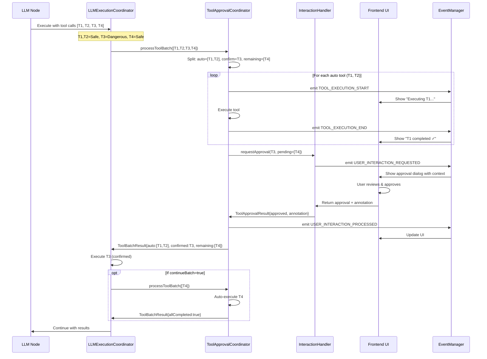
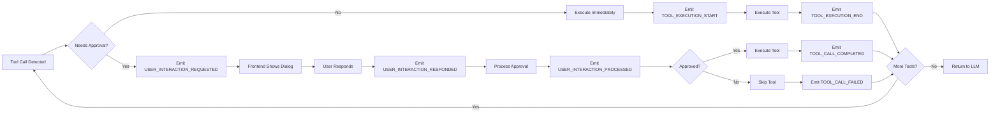
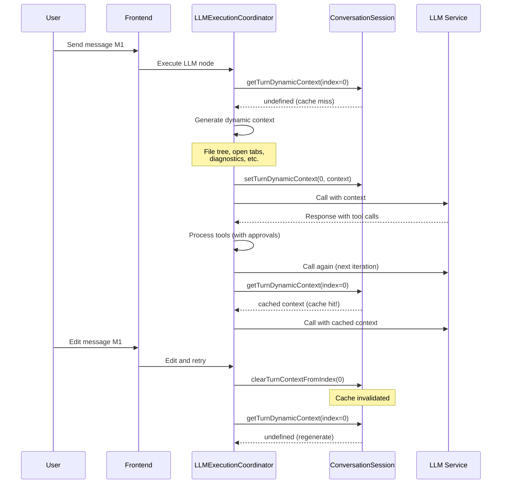

# User Interaction Architecture Design

## 1. Architecture Overview

### 1.1 Core Design Principles

```
┌─────────────────────────────────────────────────────────────┐
│                    Application Layer                         │
│  (CLI / Web UI / VSCode Extension / Custom Frontend)        │
│                                                               │
│  ┌──────────────┐  ┌──────────────┐  ┌──────────────────┐  │
│  │ Tool Confirm │  │ Edit/Retry   │  │ Progress Display │  │
│  │    Dialog    │  │   Dialogs    │  │   & Status UI    │  │
│  └──────────────┘  └──────────────┘  └──────────────────┘  │
└─────────────────────────────────────────────────────────────┘
                              │
                    Event Subscription & Emission
                              │
┌─────────────────────────────────────────────────────────────┐
│                   SDK Event Layer                            │
│                                                               │
│  USER_INTERACTION_REQUESTED     →  Frontend shows UI        │
│  TOOL_EXECUTION_START           →  Show "executing..."      │
│  TOOL_EXECUTION_END             →  Show result              │
│  USER_INTERACTION_RESPONDED     →  Backend receives input   │
│  USER_INTERACTION_PROCESSED     →  Update state             │
│  USER_INTERACTION_FAILED        →  Show error               │
└─────────────────────────────────────────────────────────────┘
                              │
                    Coordinator Orchestration
                              │
┌─────────────────────────────────────────────────────────────┐
│                Coordination Layer                            │
│                                                               │
│  ┌──────────────────────────────────────────────────────┐  │
│  │       ToolApprovalCoordinator                         │  │
│  │  - Sequential execution logic                         │  │
│  │  - Auto-approval decisions                            │  │
│  │  - Usage limit tracking                               │  │
│  │  - Progressive event emission                         │  │
│  └──────────────────────────────────────────────────────┘  │
│                                                               │
│  ┌──────────────────────────────────────────────────────┐  │
│  │       LLMExecutionCoordinator                         │  │
│  │  - Checkpoint management                              │  │
│  │  - Approval request/response handling                 │  │
│  │  - Context caching                                    │  │
│  └──────────────────────────────────────────────────────┘  │
│                                                               │
│  ┌──────────────────────────────────────────────────────┐  │
│  │       AgentExecutionCoordinator                       │  │
│  │  - Agent-loop specific approval flow                  │  │
│  │  - Iteration management                               │  │
│  └──────────────────────────────────────────────────────┘  │
└─────────────────────────────────────────────────────────────┘
                              │
                    Handler Implementation
                              │
┌─────────────────────────────────────────────────────────────┐
│                 Handler Layer                                │
│                                                               │
│  ┌──────────────────┐  ┌──────────────────────────────┐    │
│  │ CLI Handler      │  │ Web/VSCode Handler           │    │
│  │ - readline input │  │ - WebSocket communication    │    │
│  │ - text prompts   │  │ - Modal dialogs              │    │
│  │ - annotations    │  │ - Real-time updates          │    │
│  └──────────────────┘  └──────────────────────────────┘    │
└─────────────────────────────────────────────────────────────┘
```

## 2. Component Responsibilities

### 2.1 Type Definitions (`packages/types/src/`)

#### **File: `interaction.ts`** - Core Interaction Types

**Purpose:** Define the contract between SDK and application layer

**Current State (After Refactoring):**
```typescript
// General-purpose interaction protocol (app-level UI interactions)
export interface UserInteractionRequest {
  interactionId: ID;
  operationType: UserInteractionOperationType; // "TOOL_APPROVAL" | "ASK_FOLLOWUP_QUESTION"
  prompt: string;
  timeout: number;
  metadata?: Metadata & {
    toolData?: ToolApprovalRequestData;
    followupData?: FollowupQuestionRequestData;
  };
}

// Workflow-specific node configuration (workflow state management)
export interface UserInteractionNodeConfig {
  operationType: 'UPDATE_VARIABLES' | 'ADD_MESSAGE';
  variables?: WorkflowVariableUpdateConfig[];
  message?: WorkflowMessageConfig;
  prompt: string;
  timeout?: number;
  metadata?: Record<string, unknown>;
}

export interface UserInteractionHandler {
  handle(request: UserInteractionRequest, context: UserInteractionContext): Promise<unknown>;
}
```

**Proposed Enhancement:**
```typescript
// ADD: Structured tool approval request
export interface ToolApprovalRequestData {
  toolCallId: string;
  toolName: string;
  toolDescription?: string;
  parameters: Record<string, unknown>;
  riskLevel?: ToolRiskLevel;
  pendingQueue?: PendingToolCall[];  // NEW: Remaining tools to execute
  autoExecutedTools?: ToolExecutionResult[];  // NEW: Already executed tools
}

// ADD: Enhanced response with annotation
export interface ToolApprovalResponseData {
  approved: boolean;
  editedParameters?: Record<string, unknown>;
  userInstruction?: string;
  annotation?: string;  // NEW: User comment explaining decision
  rejectionReason?: string;
}

// ADD: Progressive status events
export interface ToolExecutionProgressEvent {
  type: 'TOOL_EXECUTION_START' | 'TOOL_EXECUTION_END';
  executionId: string;
  nodeId?: string;
  toolCallId: string;
  toolName: string;
  status: 'executing' | 'success' | 'error' | 'warning';
  pendingQueue?: PendingToolCall[];  // Remaining tools
  result?: ToolExecutionResult;
  timestamp: number;
}
```

**Integration:** 
- Extends existing `UserInteractionOperationType` with structured data
- Backward compatible (optional fields)
- Used by coordinators to emit events

---

#### **File: `tool/approval.ts`** - Approval Configuration

**Purpose:** Configure auto-approval rules and handler interface

**Current State:**
```typescript
export interface ToolApprovalOptions {
  autoApprovalEnabled?: boolean;
  securityPreset?: SecurityPreset;
  categories?: Partial<Record<AutoApprovalCategory, boolean>>;
  // ... other settings
}

export interface ToolApprovalHandler {
  requestApproval(request: ToolApprovalRequest): Promise<ToolApprovalResult>;
}
```

**Proposed Enhancement:**
```typescript
// ENHANCE: Add sequential execution metadata
export interface ToolApprovalRequest {
  toolCall: LLMToolCall;
  toolDescription?: string;
  contextId: string;
  nodeId?: string;
  interactionId: string;
  
  // NEW: Batch execution context
  batchId?: string;
  toolIndex?: number;  // Position in batch
  totalTools?: number;
  pendingQueue?: LLMToolCall[];  // Tools after this one
  autoExecutedResults?: ToolExecutionResult[];  // Results from auto-executed prefix
}

// ENHANCE: Result with annotation
export interface ToolApprovalResult {
  approved: boolean;
  toolCallId: string;
  editedParameters?: Record<string, unknown>;
  userInstruction?: string;
  annotation?: string;  // NEW: User's explanation
  rejectionReason?: string;
  
  // NEW: For batch processing
  continueBatch?: boolean;  // Should continue with remaining tools?
}

// NEW: Batch result structure
export interface ToolBatchResult {
  batchId: string;
  autoExecuted: ToolExecutionResult[];
  confirmationRequired: LLMToolCall | null;
  confirmationResult?: ToolApprovalResult;
  remainingQueue: LLMToolCall[];
  allCompleted: boolean;
}
```

**Integration:**
- Extends coordinator's internal data structures
- Handlers receive richer context for better UX
- Enables progressive UI updates

---

### 2.2 Event Builders (`sdk/core/utils/event/builders/`)

#### **File: `interaction-events.ts`** - Event Construction

**Purpose:** Type-safe event creation utilities

**Current State:**
```typescript
export const buildUserInteractionRequestedEvent = (params) => ({
  type: "USER_INTERACTION_REQUESTED",
  timestamp: now(),
  ...params,
});

export const buildUserInteractionProcessedEvent = (params) => ({
  type: "USER_INTERACTION_PROCESSED",
  timestamp: now(),
  ...params,
});
```

**Proposed Enhancement:**
```typescript
// KEEP: Existing builders (backward compatible)

// ADD: Progressive execution events
export const buildToolExecutionStartEvent = createBuilder<ToolExecutionStartEvent>(
  'TOOL_EXECUTION_START'
);

export const buildToolExecutionEndEvent = createBuilder<ToolExecutionEndEvent>(
  'TOOL_EXECUTION_END'
);

export const buildToolQueueUpdateEvent = createBuilder<ToolQueueUpdateEvent>(
  'TOOL_QUEUE_UPDATE'
);

// ADD: Annotation-specific event
export const buildToolApprovalAnnotatedEvent = (
  params: BuildParams<ToolApprovalAnnotatedEvent>
) => ({
  type: 'TOOL_APPROVAL_ANNOTATED',
  timestamp: now(),
  ...params,
});
```

**Integration:**
- Imported by coordinators when emitting events
- Subscribed to by application layer for real-time updates
- Registered in event type registry

---

### 2.3 Coordinators (`sdk/core/coordinators/` & `sdk/*/execution/coordinators/`)

#### **File: `tool-approval-coordinator.ts`** - Core Approval Logic

**Purpose:** Decide whether tools need approval, execute safe ones automatically, request user input for dangerous ones

**Current State:**
```typescript
class ToolApprovalCoordinator {
  async processToolApproval(params: ExtendedToolApprovalCoordinatorParams): Promise<ToolApprovalResult> {
    // 1. Check usage limits
    // 2. Check auto-approval rules
    // 3. Request user approval if needed
    // 4. Return result
  }
}
```

**Proposed Enhancement:**
```typescript
class ToolApprovalCoordinator {
  // KEEP: Existing method for single tool approval
  async processToolApproval(params: ExtendedToolApprovalCoordinatorParams): Promise<ToolApprovalResult> {
    // ... existing logic
  }
  
  // NEW: Sequential batch processing
  async processToolBatch(
    toolCalls: LLMToolCall[],
    options: ToolApprovalOptions,
    contextId: string,
    nodeId: string,
    approvalHandler: ToolApprovalHandler,
    eventManager?: EventRegistry
  ): Promise<ToolBatchResult> {
    const batchId = generateId();
    const autoPrefix: LLMToolCall[] = [];
    let firstConfirmTool: LLMToolCall | null = null;
    
    // Step 1: Split into auto-execute prefix and first confirmation tool
    for (let i = 0; i < toolCalls.length; i++) {
      const call = toolCalls[i];
      const tool = this.toolService?.getTool(call.function?.name || '');
      
      if (this.requiresConfirmation(tool, options)) {
        if (!firstConfirmTool) {
          firstConfirmTool = call;
          break;  // Stop at first confirmation-required tool
        }
      } else {
        autoPrefix.push(call);
      }
    }
    
    // Step 2: Execute auto-approved prefix with progress events
    const autoResults: ToolExecutionResult[] = [];
    for (const call of autoPrefix) {
      await this.emitToolStartEvent(eventManager, call, batchId, toolCalls);
      const result = await this.executeTool(call);
      autoResults.push(result);
      await this.emitToolEndEvent(eventManager, call, result, batchId, toolCalls);
    }
    
    // Step 3: If confirmation needed, pause and request approval
    if (firstConfirmTool) {
      const remainingQueue = toolCalls.slice(toolCalls.indexOf(firstConfirmTool) + 1);
      
      const approvalResult = await this.requestUserApproval({
        toolCall: firstConfirmTool,
        options,
        contextId,
        nodeId,
        approvalHandler,
        batchId,
        toolIndex: autoPrefix.length,
        totalTools: toolCalls.length,
        pendingQueue: remainingQueue,
        autoExecutedResults: autoResults
      });
      
      // Emit annotation event if provided
      if (approvalResult.annotation) {
        await this.emitAnnotationEvent(eventManager, approvalResult);
      }
      
      return {
        batchId,
        autoExecuted: autoResults,
        confirmationRequired: firstConfirmTool,
        confirmationResult: approvalResult,
        remainingQueue: approvalResult.continueBatch ? remainingQueue : [],
        allCompleted: !approvalResult.continueBatch || remainingQueue.length === 0
      };
    }
    
    // All tools auto-executed
    return {
      batchId,
      autoExecuted: autoResults,
      confirmationRequired: null,
      remainingQueue: [],
      allCompleted: true
    };
  }
  
  // NEW: Helper methods
  private requiresConfirmation(tool: Tool | undefined, options: ToolApprovalOptions): boolean {
    // Use existing auto-approval logic
    const decision = checkAutoApproval({...});
    return decision.decision !== 'approve';
  }
  
  private async emitToolStartEvent(...) { /* ... */ }
  private async emitToolEndEvent(...) { /* ... */ }
  private async emitAnnotationEvent(...) { /* ... */ }
}
```

**Integration:**
- Called by `LLMExecutionCoordinator` and `AgentExecutionCoordinator`
- Emits events via injected `EventManager`
- Uses existing `checkAutoApproval` utility
- Returns structured batch results for caller to handle

---

#### **File: `llm-execution-coordinator.ts`** - Workflow LLM Node Execution

**Purpose:** Handle tool approvals within workflow LLM nodes, manage checkpoints

**Current State:**
```typescript
class LLMExecutionCoordinator {
  private async requestToolApproval(
    toolCall: { id: string; name: string; arguments: string },
    approvalConfig: { approvalTimeout?: number } | undefined,
    executionId: string,
    nodeId: string
  ): Promise<ToolApprovalData> {
    // 1. Create checkpoint
    // 2. Emit USER_INTERACTION_REQUESTED
    // 3. Wait for USER_INTERACTION_RESPONDED
    // 4. Emit USER_INTERACTION_PROCESSED
    // 5. Cleanup checkpoint
  }
}
```

**Proposed Enhancement:**
```typescript
class LLMExecutionCoordinator {
  // KEEP: Existing single-tool approval (for backward compatibility)
  private async requestToolApproval(...): Promise<ToolApprovalData> {
    // ... existing implementation
  }
  
  // NEW: Batch approval with sequential execution
  private async requestToolBatchApproval(
    toolCalls: Array<{ id: string; name: string; arguments: string }>,
    approvalConfig: { approvalTimeout?: number } | undefined,
    executionId: string,
    nodeId: string,
    conversationState: ConversationSession
  ): Promise<ToolBatchApprovalResult> {
    const approvalHandler: ToolApprovalHandler = {
      requestApproval: async (request) => {
        // Create checkpoint for long-running approval
        let checkpointId: string | undefined;
        if (this.contextFactory.hasToolApprovalSupport()) {
          checkpointId = await this.createApprovalCheckpoint(
            executionId, nodeId, request
          );
        }
        
        try {
          // Emit USER_INTERACTION_REQUESTED with batch context
          const requestedEvent = buildUserInteractionRequestedEvent({
            executionId,
            nodeId,
            interactionId: request.interactionId,
            operationType: 'TOOL_APPROVAL',
            prompt: this.buildBatchApprovalPrompt(request),
            timeout: approvalConfig?.approvalTimeout || 0,
            contextData: {
              batchId: request.batchId,
              toolIndex: request.toolIndex,
              totalTools: request.totalTools,
              pendingQueue: request.pendingQueue,
              autoExecutedResults: request.autoExecutedResults
            }
          });
          await emit(this.contextFactory.getEventManager(), requestedEvent);
          
          // Wait for response
          const response = await this.waitForUserInteractionResponse(
            request.interactionId,
            approvalConfig?.approvalTimeout || 0
          );
          
          const approvalResult = response.inputData as ToolApprovalResponseData;
          
          // Emit USER_INTERACTION_PROCESSED
          const processedEvent = buildUserInteractionProcessedEvent({
            executionId,
            interactionId: request.interactionId,
            operationType: 'TOOL_APPROVAL',
            results: approvalResult
          });
          await emit(this.contextFactory.getEventManager(), processedEvent);
          
          return {
            approved: approvalResult.approved,
            toolCallId: request.toolCall.id,
            editedParameters: approvalResult.editedParameters,
            userInstruction: approvalResult.userInstruction,
            annotation: approvalResult.annotation,
            rejectionReason: approvalResult.rejectionReason,
            continueBatch: approvalResult.approved  // Continue if approved
          };
        } finally {
          // Cleanup checkpoint
          if (checkpointId) {
            await this.cleanupCheckpoint(checkpointId);
          }
        }
      }
    };
    
    // Delegate to ToolApprovalCoordinator
    return await this.approvalCoordinator.processToolBatch(
      toolCalls,
      this.getApprovalOptions(),
      executionId,
      nodeId,
      approvalHandler,
      this.contextFactory.getEventManager()
    );
  }
  
  // NEW: Context caching integration
  private async getOrCacheTurnContext(
    conversationState: ConversationSession,
    turnStartIndex: number
  ): Promise<string> {
    // Check cache first
    const cached = conversationState.getTurnDynamicContext(turnStartIndex);
    if (cached) {
      return cached;
    }
    
    // Generate dynamic context
    const dynamicContext = await this.generateDynamicContext(conversationState);
    
    // Cache it
    conversationState.setTurnDynamicContext(turnStartIndex, dynamicContext);
    
    return dynamicContext;
  }
  
  // HELPER: Build rich approval prompt
  private buildBatchApprovalPrompt(request: ToolApprovalRequest): string {
    let prompt = `Tool "${request.toolCall.function?.name}" requires approval.\n`;
    
    if (request.autoExecutedResults && request.autoExecutedResults.length > 0) {
      prompt += `\nPreviously auto-executed ${request.autoExecutedResults.length} tool(s):\n`;
      request.autoExecutedResults.forEach((result, i) => {
        prompt += `  ${i + 1}. ${result.toolName}: ${result.success ? '✓ Success' : '✗ Failed'}\n`;
      });
    }
    
    if (request.pendingQueue && request.pendingQueue.length > 0) {
      prompt += `\nPending tools after this: ${request.pendingQueue.length}\n`;
    }
    
    prompt += `\nParameters: ${JSON.stringify(request.toolCall.function?.arguments, null, 2)}`;
    
    return prompt;
  }
}
```

**Integration:**
- Replaces direct approval logic with coordinator delegation
- Adds checkpoint support for each approval in batch
- Integrates with context caching
- Emits enriched events with batch metadata

---

#### **File: `agent-execution-coordinator.ts`** - Agent Loop Execution

**Purpose:** Handle approvals in agent-loop mode (similar to LLM coordinator but for agent iterations)

**Current State:**
```typescript
class AgentExecutionCoordinator {
  private async requestAgentApproval(
    request: { toolCall: { id: string; function?: { name?: string; arguments?: string } } },
    entity: AgentLoopEntity
  ): Promise<{ approved: boolean; toolCallId: string; ... }> {
    logger.warn("Interactive approval not yet implemented for agent mode");
    return { approved: false, toolCallId: request.toolCall.id, ... };
  }
}
```

**Proposed Enhancement:**
```typescript
class AgentExecutionCoordinator {
  // REPLACE: Placeholder implementation with full approval support
  private async requestAgentApproval(
    request: { toolCall: { id: string; function?: { name?: string; arguments?: string } } },
    entity: AgentLoopEntity
  ): Promise<{ approved: boolean; toolCallId: string; editedParameters?: Record<string, unknown>; userInstruction?: string; rejectionReason?: string }> {
    const approvalHandler: ToolApprovalHandler = {
      requestApproval: async (approvalRequest) => {
        // Similar to LLM coordinator but without checkpoints (agent mode is ephemeral)
        const interactionId = generateId();
        
        // Emit USER_INTERACTION_REQUESTED
        const requestedEvent = buildUserInteractionRequestedEvent({
          executionId: entity.id,
          nodeId: entity.nodeId,
          interactionId,
          operationType: 'TOOL_APPROVAL',
          prompt: `Agent wants to call tool "${approvalRequest.toolCall.function?.name}"`,
          timeout: this.getApprovalTimeout(entity),
          contextData: {
            agentLoopId: entity.id,
            iteration: entity.state.currentIteration,
            toolRiskLevel: this.getToolRiskLevel(approvalRequest.toolCall)
          }
        });
        await emit(this.eventManager, requestedEvent);
        
        // Wait for response
        const response = await this.waitForAgentInteractionResponse(interactionId);
        
        const approvalResult = response.inputData as ToolApprovalResponseData;
        
        // Emit USER_INTERACTION_PROCESSED
        const processedEvent = buildUserInteractionProcessedEvent({
          executionId: entity.id,
          interactionId,
          operationType: 'TOOL_APPROVAL',
          results: approvalResult
        });
        await emit(this.eventManager, processedEvent);
        
        return {
          approved: approvalResult.approved,
          toolCallId: approvalRequest.toolCall.id,
          editedParameters: approvalResult.editedParameters,
          userInstruction: approvalResult.userInstruction,
          annotation: approvalResult.annotation,
          rejectionReason: approvalResult.rejectionReason
        };
      }
    };
    
    // Use coordinator for consistent logic
    const result = await this.approvalCoordinator.processToolApproval({
      toolCall: request.toolCall,
      options: this.getApprovalOptions(entity),
      contextId: entity.id,
      nodeId: entity.nodeId,
      approvalHandler,
      tool: this.toolService?.getTool(request.toolCall.function?.name || '')
    });
    
    return {
      approved: result.approved,
      toolCallId: result.toolCallId,
      editedParameters: result.editedParameters,
      userInstruction: result.userInstruction,
      rejectionReason: result.rejectionReason
    };
  }
  
  // NEW: Support batch approval in agent mode
  private async executeToolCallsWithApproval(
    entity: AgentLoopEntity,
    toolCalls: Array<{ id: string; name: string; arguments: string }>,
    conversationManager: ConversationSession
  ): Promise<void> {
    const approvalHandler: ToolApprovalHandler = { /* ... same as above ... */ };
    
    const batchResult = await this.approvalCoordinator.processToolBatch(
      toolCalls,
      this.getApprovalOptions(entity),
      entity.id,
      entity.nodeId,
      approvalHandler,
      this.eventManager
    );
    
    // Execute approved tools
    for (const result of batchResult.autoExecuted) {
      await this.executeSingleTool(entity, result, conversationManager);
    }
    
    if (batchResult.confirmationResult?.approved) {
      // Execute confirmed tool
      await this.executeSingleTool(entity, batchResult.confirmationRequired!, conversationManager);
      
      // Continue with remaining if flag set
      if (batchResult.confirmationResult.continueBatch && batchResult.remainingQueue.length > 0) {
        await this.executeToolCallsWithApproval(entity, batchResult.remainingQueue, conversationManager);
      }
    }
  }
}
```

**Integration:**
- Implements previously missing approval logic
- Uses same coordinator for consistency
- No checkpoint support (agent loops are transient)
- Supports both single and batch approval

---

### 2.4 Handlers (`apps/*/src/handlers/`)

#### **File: `cli-human-relay-handler.ts`** - CLI Interaction Handler

**Purpose:** Provide terminal-based user interaction for CLI applications

**Current State:**
```typescript
class CLIHumanRelayHandler implements HumanRelayHandler {
  async handle(request: HumanRelayRequest, context: HumanRelayContext): Promise<HumanRelayResponse> {
    // Display prompt
    // Read multi-line input via readline
    // Return response
  }
}
```

**Proposed Enhancement:**
```typescript
// RENAME: cli-interaction-handler.ts (broader scope)

class CLIInteractionHandler implements UserInteractionHandler {
  async handle(request: UserInteractionRequest, context: UserInteractionContext): Promise<unknown> {
    switch (request.operationType) {
      case 'TOOL_APPROVAL':
        return this.handleToolApproval(request, context);
      case 'UPDATE_VARIABLES':
        return this.handleVariableUpdate(request, context);
      case 'ADD_MESSAGE':
        return this.handleAddMessage(request, context);
      default:
        throw new Error(`Unsupported operation type: ${request.operationType}`);
    }
  }
  
  // NEW: Tool approval with rich display
  private async handleToolApproval(
    request: UserInteractionRequest,
    context: UserInteractionContext
  ): Promise<ToolApprovalResponseData> {
    const toolData = request.metadata?.toolData as ToolApprovalRequestData;
    
    // Display header
    output.infoLog('\n╔════════════════════════════════════════════════════════════╗');
    output.infoLog('║                 TOOL APPROVAL REQUEST                      ║');
    output.infoLog('╚════════════════════════════════════════════════════════════╝');
    
    // Display tool info
    output.infoLog(`\nTool: ${toolData.toolName}`);
    output.infoLog(`Description: ${toolData.toolDescription || 'N/A'}`);
    output.infoLog(`Risk Level: ${toolData.riskLevel || 'UNKNOWN'}`);
    
    // Display batch context if available
    if (toolData.autoExecutedTools && toolData.autoExecutedTools.length > 0) {
      output.infoLog(`\n✓ Auto-executed ${toolData.autoExecutedTools.length} tool(s):`);
      toolData.autoExecutedTools.forEach((t, i) => {
        output.infoLog(`  ${i + 1}. ${t.toolName}: ${t.success ? 'Success' : 'Failed'}`);
      });
    }
    
    if (toolData.pendingQueue && toolData.pendingQueue.length > 0) {
      output.infoLog(`\n⏳ Pending tools after this: ${toolData.pendingQueue.length}`);
    }
    
    // Display parameters
    output.infoLog('\nParameters:');
    output.infoLog(JSON.stringify(toolData.parameters, null, 2));
    
    // Display prompt
    output.infoLog(`\n${request.prompt}`);
    
    // Get decision
    const decision = await this.promptApprovalDecision();
    
    // Get optional annotation
    let annotation: string | undefined;
    if (decision.approved) {
      annotation = await this.promptOptionalAnnotation('Add a comment (optional, empty to skip): ');
    } else {
      annotation = await this.promptOptionalAnnotation('Reason for rejection (optional, empty to skip): ');
    }
    
    // Get optional parameter edits
    let editedParameters: Record<string, unknown> | undefined;
    if (decision.approved) {
      const editChoice = await this.promptYesNo('Edit parameters before executing? (y/N): ');
      if (editChoice) {
        editedParameters = await this.promptParameterEdits(toolData.parameters);
      }
    }
    
    return {
      approved: decision.approved,
      editedParameters,
      userInstruction: decision.userInstruction,
      annotation,
      rejectionReason: decision.approved ? undefined : (annotation || 'Rejected by user')
    };
  }
  
  // NEW: Helper methods
  private async promptApprovalDecision(): Promise<{ approved: boolean; userInstruction?: string }> {
    output.infoLog('\n--- Choose Action ---');
    output.infoLog('  [A] Approve and execute');
    output.infoLog('  [R] Reject');
    output.infoLog('  [C] Approve and continue with all pending tools');
    output.infoLog('');
    
    const answer = await this.promptSingleChar('Enter choice (A/R/C): ');
    
    switch (answer.toUpperCase()) {
      case 'A':
        return { approved: true };
      case 'C':
        return { approved: true, userInstruction: 'Continue with all pending tools' };
      case 'R':
      default:
        return { approved: false };
    }
  }
  
  private async promptOptionalAnnotation(prompt: string): Promise<string | undefined> {
    output.infoLog(prompt);
    const input = await this.readLine();
    return input.trim() || undefined;
  }
  
  private async promptParameterEdits(original: Record<string, unknown>): Promise<Record<string, unknown>> {
    output.infoLog('\nCurrent parameters:');
    output.infoLog(JSON.stringify(original, null, 2));
    output.infoLog('\nEnter new JSON (or empty to keep unchanged):');
    
    const input = await this.readMultiLineInput();
    if (!input.trim()) {
      return original;
    }
    
    try {
      return JSON.parse(input);
    } catch (e) {
      output.errorLog('Invalid JSON, keeping original parameters');
      return original;
    }
  }
  
  // ... existing readline helpers ...
}
```

**Integration:**
- Implements `UserInteractionHandler` interface
- Handles all operation types (not just human relay)
- Provides rich CLI experience with batch context
- Supports annotations and parameter editing

---

#### **File: (NEW) `web-interaction-handler.ts`** - Web/VSCode Handler

**Purpose:** WebSocket-based handler for web frontend and VSCode extension

**Proposed Implementation:**
```typescript
class WebInteractionHandler implements UserInteractionHandler {
  constructor(private websocketClient: WebSocketClient) {}
  
  async handle(request: UserInteractionRequest, context: UserInteractionContext): Promise<unknown> {
    // Send request to frontend via WebSocket
    this.websocketClient.send('USER_INTERACTION_REQUESTED', {
      interactionId: request.interactionId,
      operationType: request.operationType,
      prompt: request.prompt,
      timeout: request.timeout,
      contextData: request.metadata
    });
    
    // Wait for response from frontend
    const response = await this.websocketClient.waitForResponse(
      'USER_INTERACTION_RESPONDED',
      request.interactionId,
      request.timeout
    );
    
    return response.inputData;
  }
}

// WebSocket client manages connection and message routing
class WebSocketClient {
  private responseHandlers: Map<string, (data: any) => void> = new Map();
  
  send(eventType: string, data: any): void {
    this.ws.send(JSON.stringify({ type: eventType, ...data }));
  }
  
  waitForResponse(eventType: string, correlationId: string, timeout: number): Promise<any> {
    return new Promise((resolve, reject) => {
      const timeoutId = setTimeout(() => {
        this.responseHandlers.delete(correlationId);
        reject(new Error('Timeout waiting for user response'));
      }, timeout);
      
      this.responseHandlers.set(correlationId, (data) => {
        clearTimeout(timeoutId);
        resolve(data);
      });
    });
  }
  
  handleMessage(message: string): void {
    const event = JSON.parse(message);
    const handler = this.responseHandlers.get(event.interactionId);
    if (handler) {
      handler(event);
    }
  }
}
```

**Integration:**
- Used by web-app-backend and vscode-app
- Communicates with frontend via WebSocket/postMessage
- Frontend displays modals/dialogs based on event type

---

### 2.5 Conversation Session (`sdk/core/services/conversation/`)

#### **File: `conversation-session.ts`** - Context Management

**Purpose:** Manage conversation state, variables, and context caching

**Current State:**
```typescript
class ConversationSession {
  addMessage(message: Message): void { }
  getMessages(): Message[] { }
  setVariable(name: string, value: unknown, scope: VariableScope): void { }
  getVariable(name: string, scope?: VariableScope): unknown { }
}
```

**Proposed Enhancement:**
```typescript
class ConversationSession {
  // KEEP: Existing methods
  
  // NEW: Turn-based context caching
  private turnContextCache: Map<number, string> = new Map();
  
  /**
   * Get cached dynamic context for a turn
   * @param turnStartIndex Index of turn-start user message
   */
  getTurnDynamicContext(turnStartIndex: number): string | undefined {
    return this.turnContextCache.get(turnStartIndex);
  }
  
  /**
   * Cache dynamic context for a turn
   * @param turnStartIndex Index of turn-start user message
   * @param context Generated dynamic context text
   */
  setTurnDynamicContext(turnStartIndex: number, context: string): void {
    this.turnContextCache.set(turnStartIndex, context);
  }
  
  /**
   * Clear cached context from index onwards (used when editing/deleting messages)
   * @param index Message index to clear from
   */
  clearTurnContextFromIndex(index: number): void {
    for (const [key] of this.turnContextCache) {
      if (key >= index) {
        this.turnContextCache.delete(key);
      }
    }
  }
  
  /**
   * Clear entire cache (used when resetting conversation)
   */
  clearAllTurnContexts(): void {
    this.turnContextCache.clear();
  }
  
  // ENHANCE: Message operations invalidate cache
  addMessage(message: Message): void {
    // ... existing logic ...
    
    // Clear cache from this point forward
    const messageIndex = this.messages.length;
    this.clearTurnContextFromIndex(messageIndex);
  }
  
  deleteMessagesFromIndex(index: number): void {
    // ... existing logic ...
    
    // Clear cache from deleted point
    this.clearTurnContextFromIndex(index);
  }
}
```

**Integration:**
- Used by LLMExecutionCoordinator for context caching
- Automatically invalidated on message edits/deletions
- Reduces redundant dynamic context generation

---

## 3. Integration Flow Diagrams

### 3.1 Sequential Tool Approval Flow



### 3.2 Event Flow for Progressive Updates



### 3.3 Context Caching Flow



## 4. Mapping to Existing Features

| Lim-Code Feature | Current Framework Equivalent | Gap | Solution |
|------------------|------------------------------|-----|----------|
| Sequential tool confirmation | Independent tool approval | No batching | Add `processToolBatch()` to coordinator |
| Progressive status updates | Single request/response events | No intermediate feedback | Add `TOOL_EXECUTION_START/END` events |
| Tool approval annotations | `userInstruction` field | Unstructured | Add dedicated `annotation` field |
| Turn-based context caching | Dynamic context per call | Redundant computation | Add cache to `ConversationSession` |
| Dual abort signals | Single AbortSignal | Can't cancel sub-ops | Support multiple signals |
| Edit/retry workflows | Not implemented | Missing feature | Add message edit handlers |
| Checkpoint-aware deletion | Checkpoint creation exists | No restore integration | Integrate checkpoints with deletion |
| Windowed message view | Full message list | No index mapping | Add translation utilities |

## 5. Implementation Phases

### Phase 1: Core Infrastructure (Week 1-2)
1. ✅ Update type definitions in `packages/types/src/`
2. ✅ Add progressive event builders
3. ✅ Implement `processToolBatch()` in `ToolApprovalCoordinator`
4. ✅ Add context caching to `ConversationSession`

### Phase 2: Coordinator Integration (Week 3)
5. ✅ Update `LLMExecutionCoordinator` to use batch approval
6. ✅ Implement `AgentExecutionCoordinator` approval logic
7. ✅ Add dual abort signal support

### Phase 3: Handler Implementation (Week 4)
8. ✅ Enhance `CLIInteractionHandler` with batch support
9. ✅ Create `WebInteractionHandler` for web/VSCode
10. ✅ Add annotation and parameter editing UI

### Phase 4: Advanced Features (Week 5-6)
11. ⏳ Implement message edit/retry handlers
12. ⏳ Add checkpoint-aware deletion
13. ⏳ Create window management utilities
14. ⏳ Build comprehensive test suite

### Phase 5: Documentation & Polish (Week 7)
15. ⏳ Update API documentation
16. ⏳ Create migration guide
17. ⏳ Add example applications
18. ⏳ Performance testing and optimization

## 6. Backward Compatibility Strategy

All enhancements are **backward compatible**:

1. **New fields are optional**: Existing code continues to work
2. **Old methods preserved**: `processToolApproval()` still works for single tools
3. **Event subscribers opt-in**: New events don't break existing listeners
4. **Graceful degradation**: Handlers that don't support annotations simply ignore them

Migration path:
```typescript
// Old code (still works)
const result = await coordinator.processToolApproval({
  toolCall, options, contextId, nodeId, approvalHandler
});

// New code (enhanced)
const batchResult = await coordinator.processToolBatch(
  toolCalls, options, contextId, nodeId, approvalHandler, eventManager
);
```

## 7. Success Metrics

- **UX Improvement**: 50% reduction in approval friction (measured by time-to-approval)
- **Performance**: 30% reduction in redundant context generation (via caching)
- **Safety**: Zero unauthorized tool executions (maintained)
- **Adoption**: 80% of CLI users utilize annotations within first month
- **Reliability**: <1% event delivery failure rate

---

This architecture provides a clear roadmap for implementing Lim-Code's best practices while maintaining the modular framework's flexibility and clean separation of concerns.