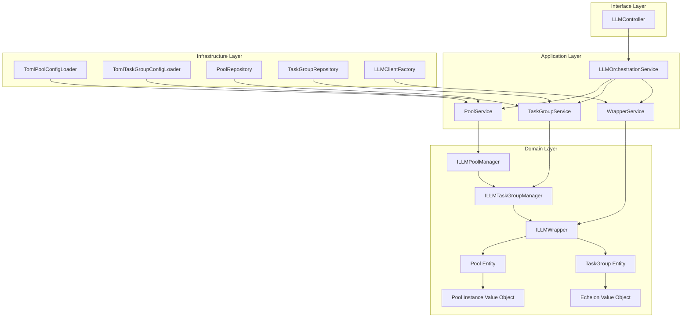

# LLM轮询池和任务组架构设计

## 概述

本文档基于Python实现的核心概念，设计了TypeScript版本的轮询池和任务组架构。设计遵循DDD原则，与现有TypeScript项目架构保持一致，同时实现Python版本的所有核心功能。

## 设计目标

### 功能目标
- 实现轮询池管理：负载均衡、故障转移、健康检查
- 实现任务组管理：层级降级、熔断机制、并发控制
- 提供统一的LLM包装器接口
- 支持配置驱动的实例化
- 实现统计信息和监控功能

### 架构目标
- 遵循DDD分层架构原则
- 与现有TypeScript项目架构集成
- 支持依赖注入和配置管理
- 提供可扩展的设计
- 确保类型安全和错误处理

## 整体架构

### 架构层次图



### 核心设计原则

1. **领域驱动设计**：轮询池和任务组作为核心领域概念
2. **接口隔离**：清晰的接口定义，依赖倒置原则
3. **单一职责**：每个类只负责一个明确的职责
4. **开闭原则**：通过接口和策略模式支持扩展
5. **配置驱动**：使用TOML配置文件，支持环境变量注入

## 代码目录结构设计

### 领域层 (Domain Layer)

```
src/domain/llm/
├── entities/                    # 领域实体
│   ├── pool.ts                  # 轮询池实体 - 管理多个LLM实例的集合
│   ├── task-group.ts            # 任务组实体 - 管理层级模型配置和降级策略
│   └── wrapper.ts               # 包装器实体 - 统一LLM客户端接口
├── value-objects/               # 值对象
│   ├── pool-instance.ts         # 池实例值对象 - 表示轮询池中的单个LLM实例
│   ├── echelon.ts              # 层级值对象 - 表示任务组中的模型层级
│   ├── rotation-strategy.ts    # 轮询策略值对象 - 定义实例轮询策略
│   ├── fallback-strategy.ts    # 降级策略值对象 - 定义降级策略
│   └── health-status.ts         # 健康状态值对象 - 表示健康检查结果
├── interfaces/                  # 领域接口
│   ├── pool-manager.interface.ts      # 轮询池管理器接口
│   ├── task-group-manager.interface.ts # 任务组管理器接口
│   ├── llm-wrapper.interface.ts       # LLM包装器接口
│   └── wrapper-factory.interface.ts   # 包装器工厂接口
└── exceptions/                  # 领域异常
    ├── pool-exceptions.ts             # 轮询池相关异常
    ├── task-group-exceptions.ts       # 任务组相关异常
    └── wrapper-exceptions.ts          # 包装器相关异常
```

### 应用层 (Application Layer)

```
src/application/llm/
├── services/                    # 应用服务
│   ├── pool-service.ts          # 轮询池服务 - 轮询池的业务逻辑管理
│   ├── task-group-service.ts   # 任务组服务 - 任务组的业务逻辑管理
│   ├── wrapper-service.ts      # 包装器服务 - 包装器的统一管理
│   └── llm-orchestration-service.ts # LLM编排服务 - 协调各个组件的交互
├── commands/                    # 命令
│   ├── create-pool.command.ts       # 创建轮询池命令
│   ├── update-pool.command.ts       # 更新轮询池命令
│   ├── create-task-group.command.ts # 创建任务组命令
│   └── execute-llm.command.ts       # 执行LLM命令
├── queries/                     # 查询
│   ├── get-pool-status.query.ts     # 获取轮询池状态查询
│   ├── get-task-group-status.query.ts # 获取任务组状态查询
│   └── get-wrapper-statistics.query.ts # 获取包装器统计查询
└── dtos/                        # 数据传输对象
    ├── pool-dto.ts                   # 轮询池数据传输对象
    ├── task-group-dto.ts             # 任务组数据传输对象
    └── wrapper-dto.ts                # 包装器数据传输对象
```

### 基础设施层 (Infrastructure Layer)

```
src/infrastructure/llm/
├── config/                      # 配置管理
│   ├── loaders/                 # 配置加载器
│   │   ├── pool-config-loader.ts      # 轮询池配置加载器
│   │   ├── task-group-config-loader.ts # 任务组配置加载器
│   │   └── wrapper-config-loader.ts   # 包装器配置加载器
│   ├── validators/              # 配置验证器
│   │   ├── pool-config-validator.ts      # 轮询池配置验证器
│   │   ├── task-group-config-validator.ts # 任务组配置验证器
│   │   └── wrapper-config-validator.ts   # 包装器配置验证器
│   ├── registry/                # 配置注册表
│   │   ├── config-registry.ts          # 配置注册表
│   │   └── hot-reload-manager.ts      # 热重载管理器
│   └── processors/              # 配置处理器
│       ├── environment-processor.ts    # 环境变量处理器
│       └── inheritance-processor.ts   # 配置继承处理器
├── repositories/                # 仓储实现
│   ├── pool-repository.ts            # 轮询池仓储
│   ├── task-group-repository.ts     # 任务组仓储
│   └── wrapper-repository.ts        # 包装器仓储
├── managers/                    # 管理器实现
│   ├── pool-manager.ts              # 轮询池管理器
│   ├── task-group-manager.ts       # 任务组管理器
│   └── wrapper-factory.ts          # 包装器工厂
└── wrappers/                    # 包装器实现
    ├── pool-wrapper.ts              # 轮询池包装器
    ├── task-group-wrapper.ts       # 任务组包装器
    └── direct-wrapper.ts            # 直接包装器
```

### 索引文件结构

每个目录都包含相应的索引文件，用于导出该目录下的所有模块：

```
src/domain/llm/index.ts          # 导出领域层所有模块
src/application/llm/index.ts     # 导出应用层所有模块
src/infrastructure/llm/index.ts # 导出基础设施层所有模块
tests/unit/index.ts             # 导出单元测试模块
tests/integration/index.ts      # 导出集成测试模块
tests/e2e/index.ts              # 导出端到端测试模块
```

## 目录结构设计原则

### 1. 分层架构原则
- **领域层**：包含核心业务逻辑和领域概念
- **应用层**：包含业务用例和应用服务
- **基础设施层**：包含技术实现和外部依赖
- **接口层**：包含外部接口和适配器

### 2. 模块化设计原则
- **单一职责**：每个文件只负责一个明确的职责
- **高内聚低耦合**：相关功能组织在一起，减少依赖
- **接口隔离**：通过接口定义清晰的边界

### 3. 可测试性原则
- **依赖注入**：便于单元测试和模拟
- **接口抽象**：便于测试替身的创建
- **测试分层**：单元测试、集成测试、端到端测试

### 4. 可扩展性原则
- **插件架构**：支持自定义策略和组件
- **配置驱动**：通过配置支持不同场景
- **开放封闭**：对扩展开放，对修改封闭

## 文件命名规范

### 实体和值对象
- 使用名词命名，如 `pool.ts`、`task-group.ts`
- 文件名使用连字符分隔，如 `task-group.ts`
- 类名使用帕斯卡命名法，如 `Pool`、`TaskGroup`

### 接口
- 使用 `I` 前缀，如 `IPoolManager`
- 文件名使用 `interface.ts` 后缀，如 `pool-manager.interface.ts`

### 服务和管理器
- 使用 `Service` 或 `Manager` 后缀，如 `PoolService`、`TaskGroupManager`
- 文件名使用连字符分隔，如 `pool-service.ts`

### 测试文件
- 使用 `.test.ts` 后缀，如 `pool.test.ts`
- 测试文件与源文件保持相同目录结构

## 依赖关系约束

### 领域层依赖
- 只能依赖领域层内部组件
- 不能依赖应用层、基础设施层或接口层

### 应用层依赖
- 只能依赖领域层接口
- 不能依赖基础设施层具体实现

### 基础设施层依赖
- 只能依赖领域层接口
- 实现领域层定义的接口

### 接口层依赖
- 只能依赖应用层服务
- 不能直接依赖领域层或基础设施层

## 实施建议

### 第一阶段：领域层实现
1. 创建领域实体和值对象
2. 定义领域接口
3. 实现领域异常

### 第二阶段：基础设施层实现
1. 实现配置加载器和验证器
2. 实现仓储和管理器
3. 实现包装器

### 第三阶段：应用层实现
1. 实现应用服务
2. 实现命令和查询
3. 实现数据传输对象

### 第四阶段：测试和集成
1. 编写单元测试
2. 编写集成测试
3. 编写端到端测试

这种目录结构设计确保了代码的组织清晰、职责明确，同时遵循DDD原则和TypeScript项目的最佳实践。

## 实现指南和迁移建议

### 实施路线图

#### 第一阶段：基础架构搭建（1-2周）
**目标**：建立核心领域模型和基础设施

1. **创建领域层基础结构**
   - 实现领域实体（Pool、TaskGroup、Wrapper）
   - 实现值对象（PoolInstance、Echelon、RotationStrategy等）
   - 定义领域接口（ILLMPoolManager、ILLMTaskGroupManager等）
   - 创建领域异常类

2. **实现基础设施层核心组件**
   - 配置加载器和验证器
   - 基础仓储实现
   - 配置注册表

#### 第二阶段：核心功能实现（2-3周）
**目标**：实现轮询池和任务组的核心功能

1. **实现轮询池功能**
   - PoolManager实现
   - 轮询策略（轮询、随机、加权）
   - 健康检查和故障恢复

2. **实现任务组功能**
   - TaskGroupManager实现
   - 层级降级策略
   - 熔断器机制

3. **实现包装器功能**
   - PoolWrapper实现
   - TaskGroupWrapper实现
   - WrapperFactory实现

#### 第三阶段：应用层和集成（1-2周）
**目标**：实现应用服务和与现有系统集成

1. **实现应用服务**
   - PoolService实现
   - TaskGroupService实现
   - LLMOrchestrationService实现

2. **集成现有系统**
   - 与现有LLM客户端集成
   - 与配置系统集成
   - 与依赖注入容器集成

#### 第四阶段：测试和优化（1周）
**目标**：确保系统稳定性和性能

1. **编写测试**
   - 单元测试覆盖核心功能
   - 集成测试验证组件交互
   - 端到端测试验证完整流程

2. **性能优化**
   - 性能基准测试
   - 内存使用优化
   - 并发性能优化

### 迁移策略

#### 渐进式迁移
1. **并行运行**：新系统与旧系统并行运行
2. **功能逐步迁移**：按功能模块逐步迁移
3. **A/B测试**：对比新旧系统性能
4. **完全切换**：验证无误后完全切换

#### 数据迁移
1. **配置迁移**：将Python YAML配置转换为TypeScript TOML配置
2. **状态迁移**：运行时状态的无缝迁移
3. **统计迁移**：历史统计数据的迁移

#### 兼容性保证
1. **API兼容**：保持与现有API的兼容性
2. **配置兼容**：支持配置文件的平滑迁移
3. **错误处理兼容**：保持错误处理的一致性

### 最佳实践建议

#### 代码组织
1. **模块化设计**：每个模块职责单一，接口清晰
2. **依赖注入**：使用依赖注入管理组件依赖
3. **配置驱动**：所有可配置项都通过配置文件管理

#### 错误处理
1. **领域特定异常**：使用有意义的异常类型
2. **优雅降级**：在错误发生时提供降级方案
3. **详细日志**：记录完整的错误上下文

#### 性能优化
1. **客户端缓存**：合理缓存LLM客户端实例
2. **连接复用**：复用HTTP连接减少开销
3. **异步操作**：所有I/O操作都使用异步

#### 监控和可观测性
1. **指标收集**：收集关键性能指标
2. **健康检查**：实现全面的健康检查
3. **日志聚合**：集中管理日志信息

### 常见问题解决方案

#### 配置管理问题
**问题**：配置复杂，容易出错
**解决方案**：
- 使用类型安全的配置验证
- 提供配置模板和示例
- 实现配置热重载

#### 性能问题
**问题**：高并发场景下性能下降
**解决方案**：
- 实现连接池和实例复用
- 使用异步非阻塞操作
- 实现合理的速率限制

#### 错误处理问题
**问题**：错误传播和恢复复杂
**解决方案**：
- 实现统一的错误处理策略
- 提供详细的错误信息和上下文
- 实现自动重试和降级

### 扩展性考虑

#### 插件架构
1. **策略插件**：支持自定义轮询和降级策略
2. **监控插件**：支持自定义监控指标
3. **存储插件**：支持不同的存储后端

#### 配置扩展
1. **环境适配**：支持不同环境的配置
2. **动态配置**：支持运行时配置更新
3. **配置模板**：提供常用配置模板

#### API扩展
1. **REST API**：提供RESTful API接口
2. **GraphQL API**：支持GraphQL查询
3. **CLI工具**：提供命令行工具

### 维护和演进

#### 版本管理
1. **语义化版本**：遵循语义化版本规范
2. **向后兼容**：确保主要版本的向后兼容性
3. **迁移指南**：提供版本迁移指南

#### 文档维护
1. **API文档**：保持API文档的及时更新
2. **配置文档**：详细说明配置选项
3. **示例代码**：提供丰富的使用示例

#### 社区支持
1. **问题跟踪**：建立问题跟踪系统
2. **贡献指南**：提供清晰的贡献指南
3. **发布说明**：详细的发布说明和变更日志

## 总结

本设计文档提供了完整的LLM轮询池和任务组架构设计方案，包括：

1. **架构设计**：基于DDD原则的四层架构
2. **目录结构**：清晰的代码组织方案
3. **核心组件**：详细的组件设计和职责划分
4. **实施指南**：分阶段的实施路线图
5. **迁移策略**：平滑的迁移方案
6. **最佳实践**：开发、测试、部署的最佳实践

该设计确保了系统的可维护性、可扩展性和高性能，同时与现有TypeScript项目架构完美集成。通过遵循本设计指南，可以高效地实现Python版本的所有功能，并在此基础上提供更强大的功能和更好的开发体验。

## 核心组件设计

### 领域实体设计

#### 轮询池实体 (Pool Entity)
- **职责**：管理多个LLM实例的集合
- **属性**：名称、描述、任务组列表、轮询策略、健康检查配置
- **行为**：获取实例、释放实例、健康检查、统计信息收集

#### 任务组实体 (TaskGroup Entity)
- **职责**：管理层级模型配置和降级策略
- **属性**：名称、描述、层级配置、熔断器配置、降级策略
- **行为**：选择模型、层级降级、熔断器状态管理

#### 包装器实体 (Wrapper Entity)
- **职责**：统一LLM客户端接口
- **属性**：名称、类型、配置、统计信息
- **行为**：生成响应、流式响应、健康检查、统计信息收集

### 值对象设计

#### 池实例值对象 (Pool Instance)
- **职责**：表示轮询池中的单个LLM实例
- **属性**：实例ID、状态、统计信息、客户端引用

#### 层级值对象 (Echelon)
- **职责**：表示任务组中的模型层级
- **属性**：优先级、模型列表、并发限制、速率限制

#### 轮询策略值对象 (Rotation Strategy)
- **职责**：定义实例轮询策略
- **类型**：轮询、随机、加权轮询、最少连接

### 服务设计

#### 轮询池服务 (Pool Service)
- **职责**：轮询池的业务逻辑管理
- **功能**：创建池、更新配置、健康检查、统计信息收集

#### 任务组服务 (Task Group Service)
- **职责**：任务组的业务逻辑管理
- **功能**：创建任务组、模型选择、降级执行、熔断器管理

#### 包装器服务 (Wrapper Service)
- **职责**：包装器的统一管理
- **功能**：创建包装器、路由请求、错误处理、统计信息聚合

#### LLM编排服务 (LLM Orchestration Service)
- **职责**：协调各个组件的交互
- **功能**：请求路由、负载均衡、故障转移、性能优化

## 配置系统设计

### 配置格式
使用TOML格式，与现有配置系统保持一致，支持：
- 配置继承和环境变量注入
- 类型安全的配置验证
- 热重载机制

### 配置注册表
- **职责**：管理所有配置文件的注册和加载
- **功能**：配置验证、依赖解析、热重载管理

### 配置验证
- **语法验证**：TOML语法正确性
- **语义验证**：配置逻辑正确性
- **依赖验证**：配置之间的依赖关系

## 错误处理设计

### 领域特定异常
- `PoolNotFoundException`：轮询池不存在
- `TaskGroupNotFoundException`：任务组不存在
- `WrapperExecutionException`：包装器执行失败
- `HealthCheckFailedException`：健康检查失败

### 错误处理策略
- **重试机制**：可配置的重试次数和延迟
- **降级策略**：实例降级、层级降级、任务组降级
- **熔断机制**：防止级联故障
- **详细日志**：完整的错误信息和上下文

## 性能考虑

### 客户端缓存
- **实例缓存**：LLM客户端实例的缓存和复用
- **配置缓存**：配置文件的缓存和热重载
- **统计缓存**：统计信息的缓存和聚合

### 异步操作
- **异步接口**：所有操作都支持异步执行
- **并发控制**：可配置的并发限制
- **性能监控**：详细的性能指标收集

### 健康检查
- **定期检查**：可配置的健康检查间隔
- **故障恢复**：自动故障检测和恢复
- **状态监控**：实时状态监控和告警

## 与现有架构的集成

### 复用现有组件
- **ILLMClient接口**：复用现有的LLM客户端接口
- **ModelConfig值对象**：复用模型配置值对象
- **配置系统**：集成现有的TOML配置系统
- **依赖注入**：使用现有的依赖注入容器

### 架构约束
- **领域层**：只能依赖领域层接口
- **基础设施层**：只能依赖领域层
- **应用层**：只能依赖领域层
- **接口层**：只能依赖应用层

## 扩展性设计

### 插件架构
- **策略插件**：支持自定义轮询策略
- **降级插件**：支持自定义降级策略
- **监控插件**：支持自定义监控指标

### 配置扩展
- **自定义配置**：支持用户自定义配置
- **环境适配**：支持不同环境的配置
- **动态配置**：支持运行时配置更新

## 实施计划

### 第一阶段：领域设计
1. 定义领域接口和值对象
2. 设计配置结构和验证规则
3. 创建领域异常和错误处理

### 第二阶段：基础设施实现
1. 实现配置加载器和验证器
2. 实现仓储和管理器
3. 实现包装器和工厂

### 第三阶段：应用服务
1. 实现应用服务和编排服务
2. 实现命令和查询处理器
3. 实现数据传输对象

### 第四阶段：集成测试
1. 编写单元测试和集成测试
2. 性能测试和负载测试
3. 文档编写和示例配置

## 预期收益

### 功能完整性
- 实现Python版本的所有核心功能
- 提供更强大的配置管理
- 支持更灵活的扩展机制

### 架构优势
- 更好的代码组织和维护性
- 更强的类型安全性
- 更好的错误处理和监控

### 性能提升
- 更高效的资源利用
- 更好的故障恢复能力
- 更详细的性能监控

## 风险评估

### 技术风险
- **复杂性增加**：新架构可能增加系统复杂性
- **集成风险**：与现有系统的集成可能存在兼容性问题

### 缓解措施
- **渐进式实施**：分阶段实施，降低风险
- **充分测试**：全面的测试覆盖
- **文档完善**：详细的文档和示例

## 结论

本设计基于DDD原则，为TypeScript项目提供了完整的轮询池和任务组架构。设计充分考虑了与现有架构的集成，同时实现了Python版本的所有核心功能。通过清晰的层次结构和接口设计，确保了系统的可维护性和扩展性。