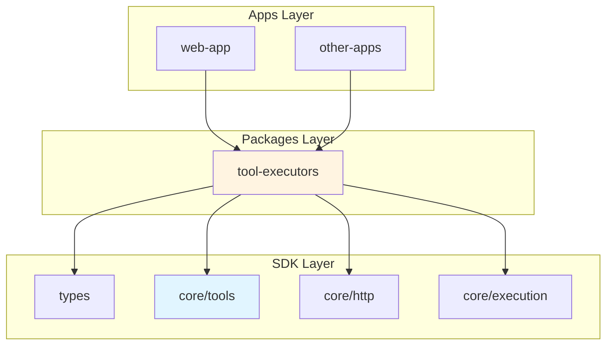
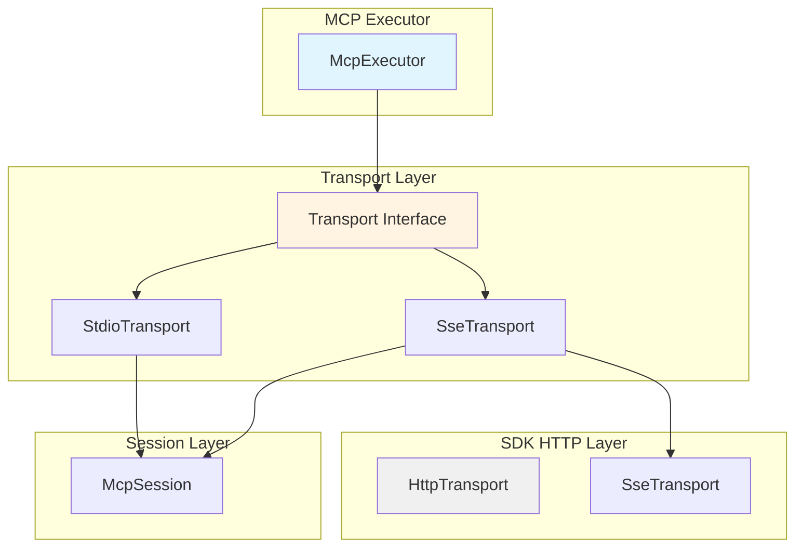

# Tool Executors 包设计文档

## 📋 概述

`@modular-agent/tool-executors` 是一个提供工具执行器具体实现的共享包，构建在 `@modular-agent/sdk` 之上，为应用层提供可复用的工具执行能力。

## 🎯 设计目标

1. **清晰的职责划分**：SDK提供抽象，packages提供实现
2. **可复用性**：可被多个应用独立使用
3. **可扩展性**：支持多种传输模式和执行器类型
4. **向后兼容**：保持现有API不变

## 🏗️ 架构设计

### 依赖关系

```
apps/ (应用层)
  ↓ 依赖
packages/tool-executors/ (实现层)
  ↓ 依赖
sdk/ (核心SDK)
```

### 层次结构



## 📁 目录结构

```
packages/tool-executors/
├── package.json
├── tsconfig.json
├── src/
│   ├── index.ts                          # 主入口
│   ├── mcp/
│   │   ├── index.ts                      # MCP模块导出
│   │   ├── mcp-executor.ts               # MCP执行器
│   │   ├── impl/
│   │   │   ├── stdio-transport.ts        # Stdio传输实现
│   │   │   ├── sse-transport.ts          # SSE传输实现
│   │   │   └── mcp-session.ts            # MCP会话管理
│   │   └── types.ts                      # MCP类型定义
│   ├── rest/
│   │   ├── index.ts                      # REST模块导出
│   │   ├── rest-executor.ts              # REST执行器
│   │   └── impl/
│   │       └── http-client.ts            # HTTP客户端封装
│   ├── stateful/
│   │   ├── index.ts                      # Stateful模块导出
│   │   ├── stateful-executor.ts          # Stateful执行器
│   │   └── impl/
│   │       └── instance-manager.ts       # 实例管理
│   └── stateless/
│       ├── index.ts                      # Stateless模块导出
│       ├── stateless-executor.ts         # Stateless执行器
│       └── impl/
│           └── function-wrapper.ts       # 函数封装
└── __tests__/
    ├── mcp/
    │   ├── stdio-transport.test.ts
    │   ├── sse-transport.test.ts
    │   └── mcp-executor.test.ts
    ├── rest/
    │   └── rest-executor.test.ts
    ├── stateful/
    │   └── stateful-executor.test.ts
    └── stateless/
        └── stateless-executor.test.ts
```

## 🔧 依赖配置

### package.json

```json
{
  "name": "@modular-agent/tool-executors",
  "version": "1.0.0",
  "description": "工具执行器实现包",
  "main": "dist/index.js",
  "types": "dist/index.d.ts",
  "scripts": {
    "build": "tsc",
    "test": "jest",
    "typecheck": "tsc --noEmit"
  },
  "dependencies": {
    "@modular-agent/sdk": "workspace:*"
  },
  "devDependencies": {
    "@types/node": "workspace:*"
  }
}
```

**说明**：
- ✅ 只声明必要的依赖
- ✅ `@modular-agent/sdk` 包含 zod，无需重复添加
- ✅ TypeScript、Jest 等开发依赖由根 package.json 统一管理

## 🎮 应用层使用方式

### 方案1：通过SDK统一导入（推荐）

应用层通过SDK导入工具执行器，SDK内部使用tool-executors的实现。

```typescript
// apps/web-app/src/tools.ts
import { 
  McpToolExecutor,
  RestToolExecutor,
  StatefulToolExecutor,
  StatelessToolExecutor 
} from '@modular-agent/sdk';

// SDK内部会自动使用tool-executors的实现
const mcpExecutor = new McpToolExecutor();
const restExecutor = new RestToolExecutor();
```

**优点**：
- ✅ 统一的导入入口
- ✅ 应用层无需关心实现细节
- ✅ SDK可以控制版本兼容性

### 方案2：直接使用tool-executors

应用层直接使用tool-executors包，绕过SDK的适配器层。

```typescript
// apps/web-app/src/tools.ts
import { 
  McpExecutor,
  RestExecutor,
  StatefulExecutor,
  StatelessExecutor 
} from '@modular-agent/tool-executors';

// 直接使用实现
const mcpExecutor = new McpExecutor();
const restExecutor = new RestExecutor();
```

**优点**：
- ✅ 更直接的依赖关系
- ✅ 减少一层抽象
- ✅ 更灵活的定制能力

**缺点**：
- ⚠️ 需要手动处理SDK类型转换
- ⚠️ 可能失去SDK提供的额外功能

### 推荐方案

**推荐使用方案1**，原因：
1. 保持架构清晰性
2. SDK可以提供统一的错误处理和日志
3. 便于未来扩展和维护
4. 符合分层架构原则

## 🔌 MCP多模式支持

### 传输模式

MCP执行器支持两种传输模式：

1. **Stdio模式**：通过标准输入输出通信
2. **SSE模式**：通过Server-Sent Events通信

### 架构设计



### 实现细节

#### 1. 传输接口

```typescript
// src/mcp/impl/transport.ts
import type { Transport, TransportOptions, TransportResponse } from '@modular-agent/sdk';

export interface McpTransport extends Transport {
  /**
   * 发送MCP消息
   */
  send(method: string, params?: any): Promise<any>;
  
  /**
   * 订阅通知
   */
  onNotification(callback: (notification: any) => void): void;
  
  /**
   * 断开连接
   */
  disconnect(): Promise<void>;
}
```

#### 2. Stdio传输实现

```typescript
// src/mcp/impl/stdio-transport.ts
import { spawn, ChildProcessWithoutNullStreams } from 'child_process';
import { McpTransport } from './transport';

export class StdioTransport implements McpTransport {
  private process: ChildProcessWithoutNullStreams | null = null;
  private messageIdCounter = 0;
  private pendingRequests = new Map<number, { resolve: (value: any) => void; reject: (error: any) => void }>();
  
  constructor(private config: { command: string; args: string[]; env?: Record<string, string> }) {}
  
  async connect(): Promise<void> {
    this.process = spawn(this.config.command, this.config.args, {
      stdio: ['pipe', 'pipe', 'pipe'],
      env: { ...process.env, ...this.config.env }
    });
    
    this.startReadingMessages();
    await this.initialize();
  }
  
  async execute<T = any>(url: string, options?: any): Promise<{ data: T; requestId?: string }> {
    // Stdio模式下，url是工具名
    const toolName = url;
    const parameters = options?.query || {};
    
    const result = await this.send('tools/call', {
      name: toolName,
      arguments: parameters
    });
    
    return {
      data: result as T,
      requestId: 'stdio-transport'
    };
  }
  
  async send(method: string, params?: any): Promise<any> {
    return new Promise((resolve, reject) => {
      const id = ++this.messageIdCounter;
      const message = {
        jsonrpc: '2.0',
        id,
        method,
        params
      };
      
      this.pendingRequests.set(id, { resolve, reject });
      
      if (this.process?.stdin) {
        this.process.stdin.write(JSON.stringify(message) + '\n');
      }
    });
  }
  
  private startReadingMessages(): void {
    if (!this.process?.stdout) return;
    
    let buffer = '';
    this.process.stdout.on('data', (chunk) => {
      buffer += chunk.toString();
      const lines = buffer.split('\n');
      buffer = lines.pop() || '';
      
      for (const line of lines) {
        if (line.trim()) {
          try {
            const message = JSON.parse(line.trim());
            this.handleMessage(message);
          } catch (error) {
            console.error(`Failed to parse MCP message: ${error}`);
          }
        }
      }
    });
  }
  
  private handleMessage(message: any): void {
    if (message.id !== undefined) {
      const request = this.pendingRequests.get(message.id);
      if (request) {
        this.pendingRequests.delete(message.id);
        if (message.error) {
          request.reject(new Error(message.error.message || 'Unknown error'));
        } else {
          request.resolve(message.result);
        }
      }
    }
  }
  
  private async initialize(): Promise<void> {
    await this.send('initialize', {
      protocolVersion: '2.0',
      capabilities: {
        experimental: {},
        tools: { listChanged: false }
      }
    });
    await this.send('notifications/initialized', {});
  }
  
  async disconnect(): Promise<void> {
    if (this.process) {
      this.process.kill();
    }
    this.pendingRequests.clear();
  }
  
  onNotification(callback: (notification: any) => void): void {
    // 实现通知订阅
  }
}
```

#### 3. SSE传输实现

```typescript
// src/mcp/impl/sse-transport.ts
import { SseTransport as SseTransportBase } from '@modular-agent/sdk';
import { McpTransport } from './transport';

export class SseTransport implements McpTransport {
  private sseTransport: SseTransportBase;
  private messageIdCounter = 0;
  private pendingRequests = new Map<number, { resolve: (value: any) => void; reject: (error: any) => void }>();
  
  constructor(private config: { url: string; headers?: Record<string, string> }) {
    this.sseTransport = new SseTransport(config.url, config.headers);
  }
  
  async connect(): Promise<void> {
    // SSE连接在首次请求时建立
  }
  
  async execute<T = any>(url: string, options?: any): Promise<{ data: T; requestId?: string }> {
    const toolName = url;
    const parameters = options?.query || {};
    
    const result = await this.send('tools/call', {
      name: toolName,
      arguments: parameters
    });
    
    return {
      data: result as T,
      requestId: 'sse-transport'
    };
  }
  
  async send(method: string, params?: any): Promise<any> {
    return new Promise((resolve, reject) => {
      const id = ++this.messageIdCounter;
      
      this.pendingRequests.set(id, { resolve, reject });
      
      // 使用SDK的SseTransport发送请求
      this.sseTransport.execute(this.config.url, {
        method: 'POST',
        headers: { 'Content-Type': 'application/json' },
        body: {
          jsonrpc: '2.0',
          id,
          method,
          params
        }
      }).then(response => {
        const message = response.data;
        if (message.id === id) {
          this.pendingRequests.delete(id);
          if (message.error) {
            reject(new Error(message.error.message || 'Unknown error'));
          } else {
            resolve(message.result);
          }
        }
      }).catch(reject);
    });
  }
  
  async disconnect(): Promise<void> {
    this.pendingRequests.clear();
  }
  
  onNotification(callback: (notification: any) => void): void {
    // 使用SSE流接收通知
    const stream = this.sseTransport.executeStream(this.config.url);
    
    (async () => {
      for await (const message of stream) {
        if (message.method) {
          callback(message);
        }
      }
    })();
  }
}
```

#### 4. MCP执行器

```typescript
// src/mcp/mcp-executor.ts
import { BaseToolExecutor } from '@modular-agent/sdk';
import type { Tool, McpToolConfig } from '@modular-agent/sdk';
import { StdioTransport } from './impl/stdio-transport';
import { SseTransport } from './impl/sse-transport';
import { McpTransport } from './impl/transport';

export class McpExecutor extends BaseToolExecutor {
  private transports: Map<string, McpTransport> = new Map();
  
  protected async doExecute(
    tool: Tool,
    parameters: Record<string, any>,
    threadContext?: any
  ): Promise<any> {
    const config = tool.config as McpToolConfig;
    const serverName = config?.serverName;
    
    if (!serverName) {
      throw new Error(`Tool '${tool.name}' does not have a serverName in config`);
    }
    
    const transport = await this.getOrCreateTransport(serverName, config);
    const result = await transport.execute(tool.name, { query: parameters });
    
    return {
      serverName,
      toolName: tool.name,
      result
    };
  }
  
  private async getOrCreateTransport(serverName: string, config: McpToolConfig): Promise<McpTransport> {
    if (this.transports.has(serverName)) {
      return this.transports.get(serverName)!;
    }
    
    let transport: McpTransport;
    
    // 根据配置选择传输模式
    if (config.transportMode === 'sse' || config.serverUrl?.startsWith('http')) {
      // SSE模式
      transport = new SseTransport({
        url: config.serverUrl || '',
        headers: config.headers
      });
    } else {
      // Stdio模式（默认）
      const [command, ...args] = (config.serverUrl || 'npx -y @modelcontextprotocol/server-filesystem').split(' ');
      transport = new StdioTransport({
        command: command || 'npx',
        args,
        env: config.env
      });
    }
    
    await (transport as any).connect?.();
    this.transports.set(serverName, transport);
    
    return transport;
  }
  
  async closeAll(): Promise<void> {
    const disconnectPromises = Array.from(this.transports.values()).map(transport =>
      transport.disconnect()
    );
    await Promise.all(disconnectPromises);
    this.transports.clear();
  }
}
```

## 📦 导出结构

### 主入口 (src/index.ts)

```typescript
// MCP执行器
export { McpExecutor } from './mcp/mcp-executor';
export { StdioTransport } from './mcp/impl/stdio-transport';
export { SseTransport } from './mcp/impl/sse-transport';

// REST执行器
export { RestExecutor } from './rest/rest-executor';

// Stateful执行器
export { StatefulExecutor } from './stateful/stateful-executor';

// Stateless执行器
export { StatelessExecutor } from './stateless/stateless-executor';
```

### SDK适配器 (sdk/core/tools/executors/*.ts)

```typescript
// sdk/core/tools/executors/mcp.ts
import { McpExecutor } from '@modular-agent/tool-executors';
import { BaseToolExecutor } from '../base-tool-executor';

export class McpToolExecutor extends BaseToolExecutor {
  private executor: McpExecutor;
  
  constructor() {
    super();
    this.executor = new McpExecutor();
  }
  
  protected async doExecute(
    tool: Tool,
    parameters: Record<string, any>,
    threadContext?: ThreadContext
  ): Promise<any> {
    return this.executor.doExecute(tool, parameters, threadContext);
  }
  
  async closeAll(): Promise<void> {
    return this.executor.closeAll();
  }
}
```

## 🧪 测试策略

### 单元测试

每个执行器和传输实现都有独立的单元测试：

```typescript
// __tests__/mcp/stdio-transport.test.ts
import { StdioTransport } from '../../src/mcp/impl/stdio-transport';

describe('StdioTransport', () => {
  it('should connect to MCP server', async () => {
    const transport = new StdioTransport({
      command: 'echo',
      args: ['test']
    });
    
    await transport.connect();
    expect(transport).toBeDefined();
  });
  
  it('should send and receive messages', async () => {
    // 测试消息发送和接收
  });
});
```

### 集成测试

测试执行器与SDK的集成：

```typescript
// __tests__/integration/tool-execution.test.ts
import { McpExecutor } from '@modular-agent/tool-executors';
import { Tool, ToolType } from '@modular-agent/sdk';

describe('Tool Execution Integration', () => {
  it('should execute MCP tool', async () => {
    const executor = new McpExecutor();
    const tool: Tool = {
      id: 'test-tool',
      name: 'test-tool',
      type: ToolType.MCP,
      description: 'Test tool',
      parameters: {
        properties: {},
        required: []
      },
      config: {
        serverName: 'test-server',
        serverUrl: 'npx -y @modelcontextprotocol/server-filesystem'
      }
    };
    
    const result = await executor.execute(tool, {});
    expect(result.success).toBe(true);
  });
});
```

## 🚀 迁移计划

### 阶段1：创建基础结构
1. 创建 `packages/tool-executors` 目录
2. 配置 `package.json` 和 `tsconfig.json`
3. 创建目录结构

### 阶段2：实现MCP执行器
1. 实现传输接口
2. 实现Stdio传输
3. 实现SSE传输
4. 实现MCP执行器
5. 编写测试

### 阶段3：实现其他执行器
1. 实现REST执行器
2. 实现Stateful执行器
3. 实现Stateless执行器
4. 编写测试

### 阶段4：SDK适配
1. 修改SDK执行器为适配器
2. 更新导出
3. 验证兼容性

### 阶段5：文档和示例
1. 编写使用文档
2. 创建示例代码
3. 更新架构文档

## 📝 注意事项

1. **依赖管理**：只声明必要的依赖，避免重复
2. **类型安全**：充分利用SDK的类型定义
3. **错误处理**：统一使用SDK的错误类型
4. **向后兼容**：保持现有API不变
5. **测试覆盖**：确保高测试覆盖率
6. **文档完善**：提供清晰的API文档

## 🔗 相关文档

- [SDK架构文档](../../sdk/README.md)
- [工具类型定义](../../sdk/types/tool.ts)
- [HTTP传输层](../../sdk/core/http/transport.ts)
- [Monorepo规范](../../README.md)