# Tool Executors 架构设计

## 📐 整体架构

### 分层架构

```
┌─────────────────────────────────────────────────────────┐
│                    Apps Layer                            │
│  (web-app, cli-app, etc.)                                │
└────────────────────┬────────────────────────────────────┘
                     │ 使用
┌────────────────────▼────────────────────────────────────┐
│              SDK Layer (适配器层)                        │
│  - BaseToolExecutor (抽象基类)                           │
│  - McpToolExecutor (适配器)                              │
│  - RestToolExecutor (适配器)                             │
│  - StatefulToolExecutor (适配器)                         │
│  - StatelessToolExecutor (适配器)                        │
└────────────────────┬────────────────────────────────────┘
                     │ 调用
┌────────────────────▼────────────────────────────────────┐
│         Tool Executors Layer (实现层)                    │
│  - McpExecutor (核心实现)                                │
│  - RestExecutor (核心实现)                               │
│  - StatefulExecutor (核心实现)                           │
│  - StatelessExecutor (核心实现)                          │
│  - Transport implementations                             │
└────────────────────┬────────────────────────────────────┘
                     │ 依赖
┌────────────────────▼────────────────────────────────────┐
│              SDK Core Layer (核心层)                     │
│  - Types (Tool, ToolConfig, etc.)                       │
│  - HTTP Transport (HttpTransport, SseTransport)          │
│  - Errors (ToolError, NetworkError, etc.)               │
│  - Execution Context (ThreadContext)                    │
└─────────────────────────────────────────────────────────┘
```

### 模块依赖图

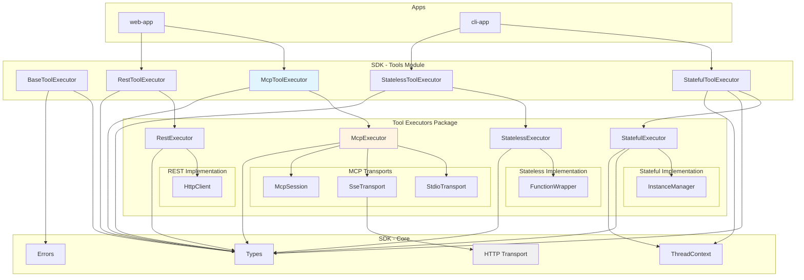

## 🎯 MCP执行器架构

### MCP传输层设计

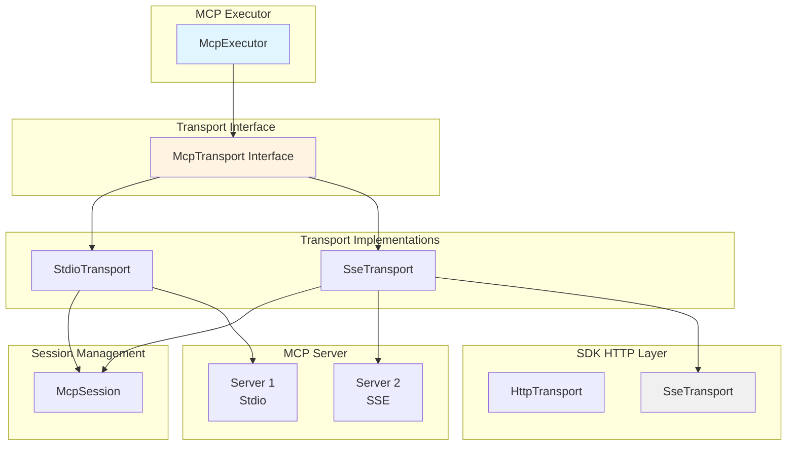

### MCP消息流

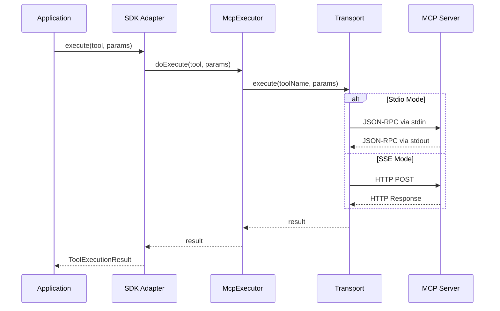

## 🔌 REST执行器架构

### REST执行器设计

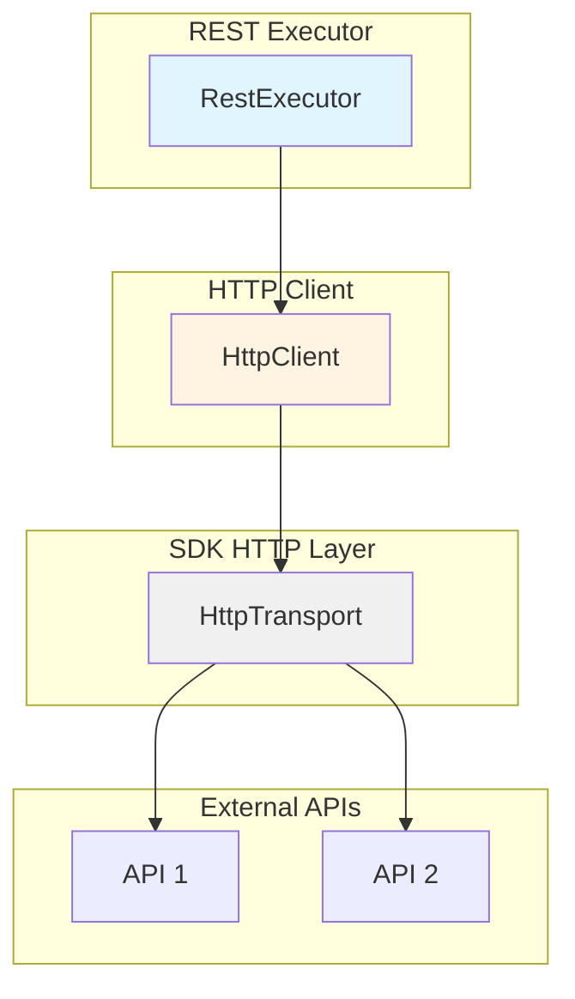

### REST请求流程

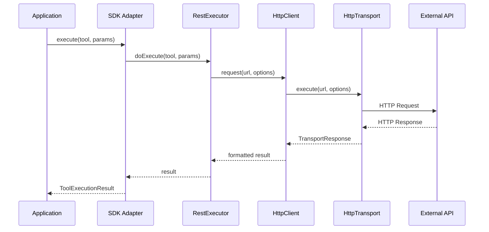

## 🧩 Stateful执行器架构

### Stateful执行器设计

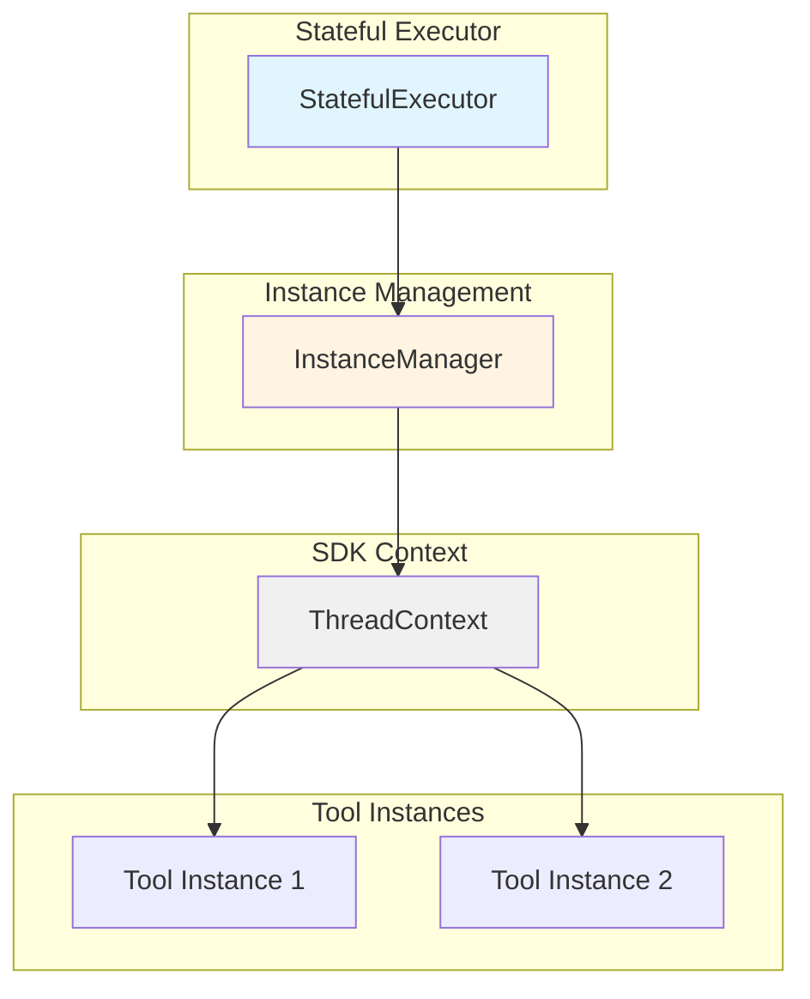

### Stateful执行流程

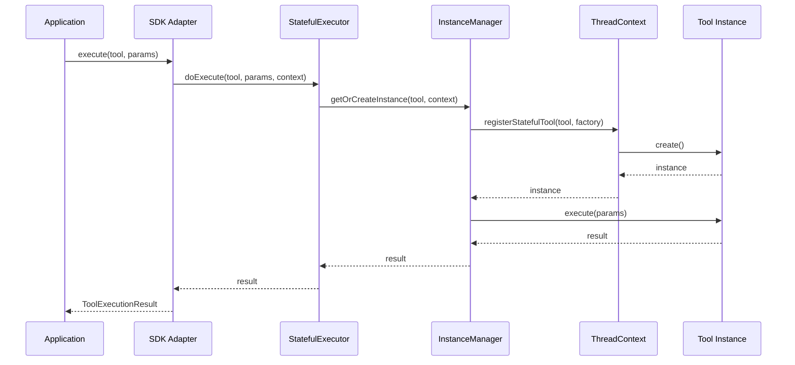

## 🎯 Stateless执行器架构

### Stateless执行器设计

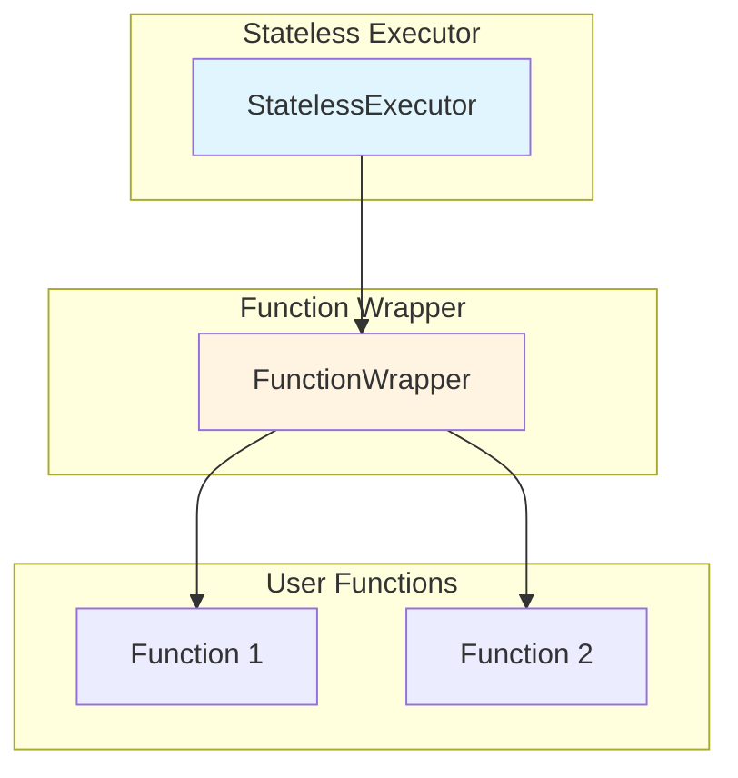

### Stateless执行流程

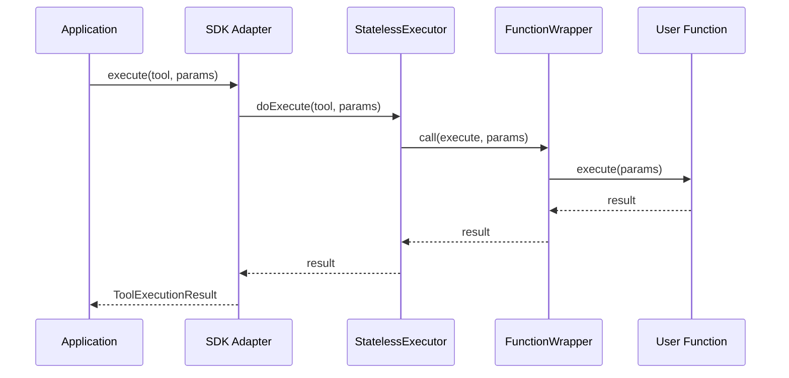

## 🔄 数据流

### 完整的执行流程

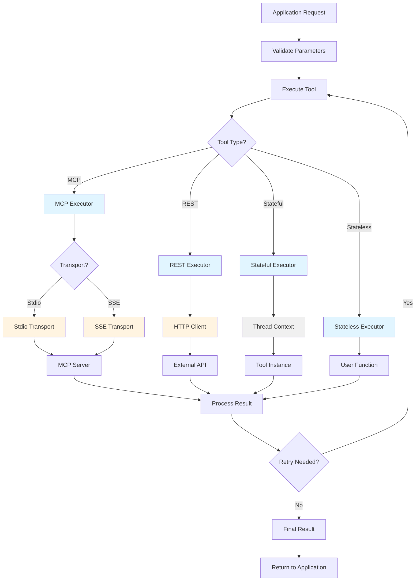

## 📊 错误处理流程

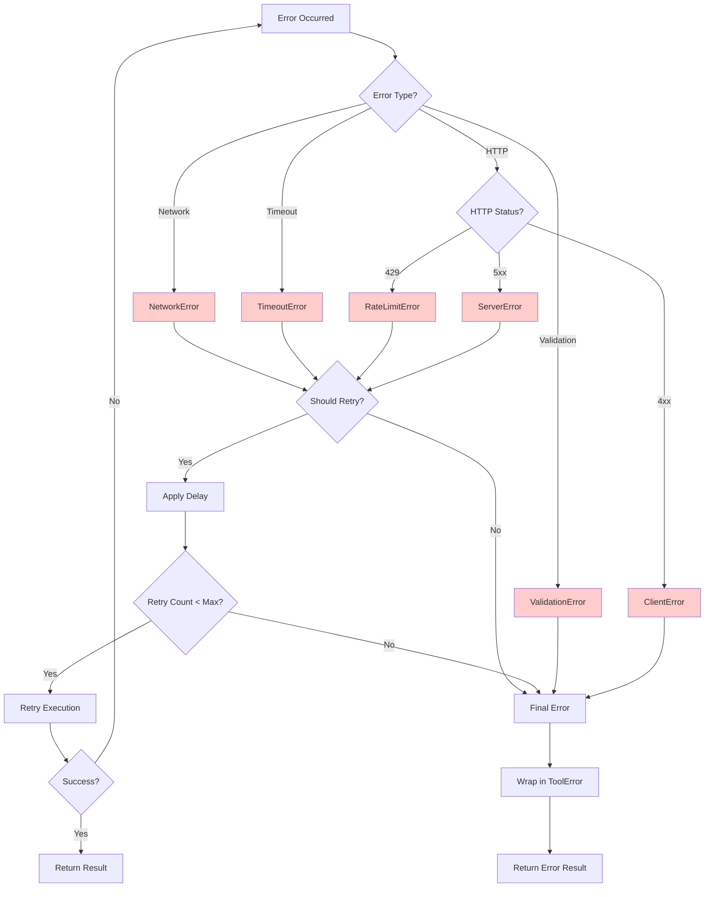

## 🔐 安全考虑

### 1. 输入验证
- 所有参数通过zod schema验证
- 类型安全检查
- 格式验证（URL、email等）

### 2. 错误处理
- 统一的错误类型
- 敏感信息过滤
- 错误日志记录

### 3. 资源管理
- 连接池管理
- 超时控制
- 资源清理

### 4. 权限控制
- ThreadContext隔离
- 实例生命周期管理
- 访问控制

## 🚀 性能优化

### 1. 连接复用
- Transport实例缓存
- 连接池管理
- Keep-alive机制

### 2. 并发控制
- 请求队列
- 并发限制
- 背压处理

### 3. 缓存策略
- 结果缓存
- 配置缓存
- Schema缓存

### 4. 资源优化
- 懒加载
- 按需创建
- 及时释放

## 📈 可扩展性

### 1. 新增执行器
```typescript
// 1. 在packages/tool-executors中创建新执行器
export class NewExecutor extends BaseToolExecutor {
  protected async doExecute(tool, params, context) {
    // 实现逻辑
  }
}

// 2. 在SDK中创建适配器
export class NewToolExecutor extends BaseToolExecutor {
  private executor = new NewExecutor();
  
  protected async doExecute(tool, params, context) {
    return this.executor.doExecute(tool, params, context);
  }
}

// 3. 在ToolType中添加新类型
export enum ToolType {
  // ...existing types
  NEW = 'NEW'
}
```

### 2. 新增传输模式
```typescript
// 1. 实现传输接口
export class NewTransport implements McpTransport {
  async execute(url, options) {
    // 实现逻辑
  }
  
  async disconnect() {
    // 清理逻辑
  }
}

// 2. 在McpExecutor中注册
private async getOrCreateTransport(serverName, config) {
  if (config.transportMode === 'new') {
    return new NewTransport(config);
  }
  // ...existing logic
}
```

## 📝 设计原则

1. **单一职责**：每个模块只负责一个功能
2. **开闭原则**：对扩展开放，对修改关闭
3. **依赖倒置**：依赖抽象而非具体实现
4. **接口隔离**：使用最小接口
5. **里氏替换**：子类可以替换父类

## 🔗 相关文档

- [设计文档](./README.md)
- [迁移指南](./migration-guide.md)
- [API文档](./api.md)
- [最佳实践](./best-practices.md)