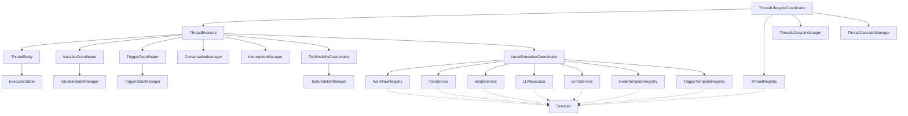

# Context目录设计分析与重构方案（长期架构）

## 概述

本文档分析`sdk/core/execution/context`目录的职责和设计模式，提出彻底的重构方案，完全移除上下文模式，采用"自包含实体 + 服务层"的架构设计。

## 核心设计原则

1. **自包含实体**: 每个操作状态的实体应该是独立的，管理自己的状态
2. **避免上下文**: 不通过上下文传递依赖，使用显式依赖注入
3. **全局单例通过services目录**: 共享服务通过`sdk/core/services`目录访问
4. **逻辑分层**: 具体逻辑使用coordinators、managers、handlers目录
5. **无向后兼容**: 彻底重构，不保留旧架构

## 当前架构问题总结

### ExecutionContext的问题
- 构造函数包含15个依赖参数，违反单一职责原则
- 既是DI容器又是服务定位器，职责混乱
- 所有执行组件都通过ExecutionContext访问，形成中心化依赖
- 测试困难，创建测试实例复杂

### ThreadContext的问题
- 1003行代码，职责爆炸
- 直接依赖多个协调器、管理器和服务，高耦合
- 同时处理数据访问、状态管理、协调逻辑，违反单一职责原则
- 构造函数参数多，依赖复杂，难以维护

### ExecutionState的问题
- 相对合理，职责清晰
- 可以保留作为独立的状态管理实体

## 重构方案

### 架构设计

```
sdk/core/
├── services/                    # 全局单例服务层
│   ├── workflow-registry.ts
│   ├── thread-registry.ts
│   ├── event-manager.ts
│   ├── tool-service.ts
│   ├── script-service.ts
│   ├── error-service.ts
│   ├── task-registry.ts
│   ├── graph-registry.ts
│   ├── node-template-registry.ts
│   └── trigger-template-registry.ts
│
├── execution/
│   ├── entities/                # 自包含实体层（新增）
│   │   ├── thread-entity.ts
│   │   ├── execution-state.ts
│   │   └── index.ts
│   │
│   ├── managers/                # 状态管理器层
│   │   ├── variable-state-manager.ts
│   │   ├── trigger-state-manager.ts
│   │   ├── conversation-manager.ts
│   │   ├── interruption-manager.ts
│   │   ├── tool-visibility-manager.ts
│   │   ├── thread-lifecycle-manager.ts
│   │   ├── thread-cascade-manager.ts
│   │   └── index.ts
│   │
│   ├── coordinators/            # 协调器层
│   │   ├── variable-coordinator.ts
│   │   ├── trigger-coordinator.ts
│   │   ├── tool-visibility-coordinator.ts
│   │   ├── thread-lifecycle-coordinator.ts
│   │   ├── node-execution-coordinator.ts
│   │   ├── llm-execution-coordinator.ts
│   │   ├── checkpoint-coordinator.ts
│   │   └── index.ts
│   │
│   ├── handlers/                # 处理器层
│   │   ├── node-handlers/
│   │   ├── trigger-handlers/
│   │   ├── hook-handlers/
│   │   └── index.ts
│   │
│   ├── executors/               # 执行器层
│   │   ├── llm-executor.ts
│   │   ├── tool-call-executor.ts
│   │   └── index.ts
│   │
│   ├── thread-builder.ts        # Thread构建器
│   ├── thread-executor.ts       # Thread执行器
│   └── index.ts
│
└── di/                          # 依赖注入配置
    ├── container-config.ts
    └── service-identifiers.ts
```

### 依赖层次

```
应用层
    ↓
服务层 (sdk/core/services/) - 全局单例
    ↓
协调器层 (sdk/core/execution/coordinators/) - 流程编排
    ↓
管理器层 (sdk/core/execution/managers/) - 状态管理
    ↓
实体层 (sdk/core/execution/entities/) - 数据封装
```

### 依赖规则

1. **单向依赖**: 上层可以依赖下层，下层不能依赖上层
2. **显式注入**: 所有依赖通过构造函数显式注入
3. **接口隔离**: 使用接口定义契约，减少具体依赖
4. **无循环依赖**: 严格避免循环依赖

## 详细设计

### 1. 实体层 (entities)

#### ThreadEntity
```typescript
// sdk/core/execution/entities/thread-entity.ts

/**
 * Thread实体 - 自包含的数据实体
 * 封装Thread实例的数据访问操作
 */
export class ThreadEntity {
  constructor(
    private readonly thread: Thread,
    private readonly executionState: ExecutionState
  ) {}

  // ========== 基础属性访问 ==========

  getThreadId(): string {
    return this.thread.id;
  }

  getWorkflowId(): string {
    return this.thread.workflowId;
  }

  getStatus(): ThreadStatus {
    return this.thread.status;
  }

  setStatus(status: ThreadStatus): void {
    this.thread.status = status;
  }

  getCurrentNodeId(): string {
    return this.thread.currentNodeId;
  }

  setCurrentNodeId(nodeId: string): void {
    this.thread.currentNodeId = nodeId;
  }

  // ========== 输入输出 ==========

  getInput(): Record<string, any> {
    return this.thread.input;
  }

  getOutput(): Record<string, any> {
    return this.thread.output;
  }

  setOutput(output: Record<string, any>): void {
    this.thread.output = output;
  }

  // ========== 执行结果 ==========

  addNodeResult(result: any): void {
    this.thread.nodeResults.push(result);
  }

  getNodeResults(): any[] {
    return this.thread.nodeResults;
  }

  // ========== 错误信息 ==========

  addError(error: any): void {
    this.thread.errors.push(error);
  }

  getErrors(): any[] {
    return this.thread.errors;
  }

  // ========== 时间信息 ==========

  getStartTime(): number {
    return this.thread.startTime;
  }

  getEndTime(): number | undefined {
    return this.thread.endTime;
  }

  setEndTime(endTime: number): void {
    this.thread.endTime = endTime;
  }

  // ========== 图导航 ==========

  getGraph(): PreprocessedGraph {
    return this.thread.graph;
  }

  // ========== 子图执行状态 ==========

  enterSubgraph(workflowId: ID, parentWorkflowId: ID, input: any): void {
    this.executionState.enterSubgraph(workflowId, parentWorkflowId, input);
  }

  exitSubgraph(): void {
    this.executionState.exitSubgraph();
  }

  getCurrentWorkflowId(): ID {
    return this.executionState.getCurrentWorkflowId(this.thread.workflowId);
  }

  getCurrentSubgraphContext(): SubgraphContext | null {
    return this.executionState.getCurrentSubgraphContext();
  }

  getSubgraphStack(): SubgraphContext[] {
    return this.executionState.getSubgraphStack();
  }

  isInSubgraph(): boolean {
    return this.executionState.isInSubgraph();
  }

  // ========== Fork/Join上下文 ==========

  getForkId(): string | undefined {
    return this.thread.forkJoinContext?.forkId;
  }

  setForkId(forkId: string): void {
    if (!this.thread.forkJoinContext) {
      this.thread.forkJoinContext = { forkId, forkPathId: '' };
    }
    this.thread.forkJoinContext.forkId = forkId;
  }

  getForkPathId(): string | undefined {
    return this.thread.forkJoinContext?.forkPathId;
  }

  setForkPathId(forkPathId: string): void {
    if (!this.thread.forkJoinContext) {
      this.thread.forkJoinContext = { forkId: '', forkPathId };
    }
    this.thread.forkJoinContext.forkPathId = forkPathId;
  }

  // ========== 触发子工作流上下文 ==========

  getChildThreadIds(): ID[] {
    return this.thread.triggeredSubworkflowContext?.childThreadIds || [];
  }

  registerChildThread(childThreadId: ID): void {
    if (!this.thread.triggeredSubworkflowContext) {
      this.thread.triggeredSubworkflowContext = {
        parentThreadId: '',
        childThreadIds: [],
        triggeredSubworkflowId: ''
      };
    }
    if (!this.thread.triggeredSubworkflowContext.childThreadIds) {
      this.thread.triggeredSubworkflowContext.childThreadIds = [];
    }
    if (!this.thread.triggeredSubworkflowContext.childThreadIds.includes(childThreadId)) {
      this.thread.triggeredSubworkflowContext.childThreadIds.push(childThreadId);
    }
  }

  unregisterChildThread(childThreadId: ID): void {
    if (this.thread.triggeredSubworkflowContext?.childThreadIds) {
      this.thread.triggeredSubworkflowContext.childThreadIds =
        this.thread.triggeredSubworkflowContext.childThreadIds.filter(
          (id: ID) => id !== childThreadId
        );
    }
  }

  getParentThreadId(): ID | undefined {
    return this.thread.triggeredSubworkflowContext?.parentThreadId;
  }

  setParentThreadId(parentThreadId: ID): void {
    if (!this.thread.triggeredSubworkflowContext) {
      this.thread.triggeredSubworkflowContext = {
        parentThreadId,
        childThreadIds: [],
        triggeredSubworkflowId: ''
      };
    }
    this.thread.triggeredSubworkflowContext.parentThreadId = parentThreadId;
  }

  getTriggeredSubworkflowId(): ID | undefined {
    return this.thread.triggeredSubworkflowContext?.triggeredSubworkflowId;
  }

  setTriggeredSubworkflowId(subworkflowId: ID): void {
    if (!this.thread.triggeredSubworkflowContext) {
      this.thread.triggeredSubworkflowContext = {
        parentThreadId: '',
        childThreadIds: [],
        triggeredSubworkflowId: subworkflowId
      };
    }
    this.thread.triggeredSubworkflowContext.triggeredSubworkflowId = subworkflowId;
  }

  // ========== 获取原始Thread对象 ==========

  getThread(): Thread {
    return this.thread;
  }
}
```

#### ExecutionState（保留）
```typescript
// sdk/core/execution/entities/execution-state.ts

/**
 * ExecutionState - 执行状态管理器
 * 管理Thread执行过程中的临时状态
 * 与持久化数据分离，专注于执行时状态管理
 */
export class ExecutionState {
  private subgraphStack: SubgraphContext[] = [];

  enterSubgraph(workflowId: ID, parentWorkflowId: ID, input: any): void {
    this.subgraphStack.push({
      workflowId,
      parentWorkflowId,
      startTime: now(),
      input,
      depth: this.subgraphStack.length
    });
  }

  exitSubgraph(): void {
    this.subgraphStack.pop();
  }

  getCurrentSubgraphContext(): SubgraphContext | null {
    return this.subgraphStack.length > 0
      ? this.subgraphStack[this.subgraphStack.length - 1] || null
      : null;
  }

  getSubgraphStack(): SubgraphContext[] {
    return [...this.subgraphStack];
  }

  isInSubgraph(): boolean {
    return this.subgraphStack.length > 0;
  }

  getCurrentWorkflowId(baseWorkflowId: ID): ID {
    const context = this.getCurrentSubgraphContext();
    return context ? context.workflowId : baseWorkflowId;
  }

  getCurrentDepth(): number {
    return this.subgraphStack.length;
  }

  cleanup(): void {
    this.subgraphStack = [];
  }

  clone(): ExecutionState {
    const cloned = new ExecutionState();
    cloned.subgraphStack = this.subgraphStack.map(context => ({ ...context }));
    return cloned;
  }
}
```

### 2. 管理器层 (managers)

#### ToolVisibilityManager（新增）
```typescript
// sdk/core/execution/managers/tool-visibility-manager.ts

/**
 * ToolVisibilityManager - 工具可见性管理器
 * 管理工具的可见性状态
 */
export class ToolVisibilityManager implements LifecycleCapable {
  private contexts: Map<string, ToolVisibilityContext> = new Map();

  initializeContext(
    threadId: string,
    availableTools: string[],
    scope: VisibilityScope,
    scopeId: string
  ): void {
    this.contexts.set(threadId, {
      threadId,
      currentScope: scope,
      scopeId,
      visibleTools: new Set(availableTools),
      declarationHistory: []
    });
  }

  getVisibleTools(threadId: string): Set<string> {
    const context = this.contexts.get(threadId);
    return context ? context.visibleTools : new Set();
  }

  updateVisibility(
    threadId: string,
    newTools: string[],
    scope: VisibilityScope,
    scopeId: string
  ): void {
    const context = this.contexts.get(threadId);
    if (!context) {
      this.initializeContext(threadId, newTools, scope, scopeId);
      return;
    }

    context.currentScope = scope;
    context.scopeId = scopeId;
    context.visibleTools = new Set(newTools);
  }

  deleteContext(threadId: string): void {
    this.contexts.delete(threadId);
  }

  cleanup(): void {
    this.contexts.clear();
  }

  getSnapshot(threadId: string): ToolVisibilityContext | undefined {
    return this.contexts.get(threadId);
  }

  restoreSnapshot(threadId: string, snapshot: ToolVisibilityContext): void {
    this.contexts.set(threadId, snapshot);
  }
}
```

### 3. 协调器层 (coordinators)

#### ThreadExecutionCoordinator（新增）
```typescript
// sdk/core/execution/coordinators/thread-execution-coordinator.ts

/**
 * ThreadExecutionCoordinator - Thread执行协调器
 * 协调Thread的执行流程，编排各个组件完成执行任务
 */
export class ThreadExecutionCoordinator {
  constructor(
    private readonly threadEntity: ThreadEntity,
    private readonly variableCoordinator: VariableCoordinator,
    private readonly triggerCoordinator: TriggerCoordinator,
    private readonly conversationManager: ConversationManager,
    private readonly interruptionManager: InterruptionManager,
    private readonly toolVisibilityCoordinator: ToolVisibilityCoordinator,
    private readonly nodeExecutionCoordinator: NodeExecutionCoordinator
  ) {}

  async execute(): Promise<ThreadResult> {
    // 执行流程编排
    while (true) {
      // 检查中断状态
      if (this.interruptionManager.shouldPause()) {
        throw new ThreadPausedError('Thread execution paused');
      }

      if (this.interruptionManager.shouldStop()) {
        throw new ThreadStoppedError('Thread execution stopped');
      }

      // 获取当前节点
      const currentNodeId = this.threadEntity.getCurrentNodeId();
      if (!currentNodeId) {
        break;
      }

      // 执行节点
      const result = await this.nodeExecutionCoordinator.executeNode(
        this.threadEntity,
        currentNodeId
      );

      // 更新节点结果
      this.threadEntity.addNodeResult(result);

      // 更新当前节点ID
      this.threadEntity.setCurrentNodeId(result.nextNodeId);
    }

    return {
      threadId: this.threadEntity.getThreadId(),
      status: this.threadEntity.getStatus(),
      output: this.threadEntity.getOutput(),
      errors: this.threadEntity.getErrors(),
      metadata: {}
    };
  }
}
```

### 4. 执行器层 (executors)

#### ThreadExecutor（重构）
```typescript
// sdk/core/execution/thread-executor.ts

/**
 * ThreadExecutor - Thread执行器
 * 负责Thread的执行，使用协调器编排执行流程
 */
export class ThreadExecutor {
  constructor(
    // 全局服务
    private readonly workflowRegistry: WorkflowRegistry,
    private readonly threadRegistry: ThreadRegistry,
    private readonly eventManager: EventManager,
    private readonly toolService: ToolService,
    private readonly scriptService: ScriptService,
    private readonly llmExecutor: LLMExecutor,
    private readonly errorService: ErrorService,
    private readonly taskRegistry: TaskRegistry,
    private readonly graphRegistry: GraphRegistry,
    private readonly nodeTemplateRegistry: NodeTemplateRegistry,
    private readonly triggerTemplateRegistry: TriggerTemplateRegistry,

    // 管理器
    private readonly threadLifecycleManager: ThreadLifecycleManager,
    private readonly threadCascadeManager: ThreadCascadeManager,
    private readonly checkpointStateManager: CheckpointStateManager,
    private readonly toolVisibilityManager: ToolVisibilityManager,

    // 协调器
    private readonly threadLifecycleCoordinator: ThreadLifecycleCoordinator
  ) {}

  async executeThread(threadEntity: ThreadEntity): Promise<ThreadResult> {
    // 创建执行所需的管理器和协调器
    const variableStateManager = new VariableStateManager();
    const triggerStateManager = new TriggerStateManager(threadEntity.getThreadId());
    const conversationManager = new ConversationManager();
    const interruptionManager = new InterruptionManager(
      threadEntity.getThreadId(),
      threadEntity.getCurrentNodeId()
    );

    const variableCoordinator = new VariableCoordinator(
      variableStateManager,
      this.eventManager,
      threadEntity.getThreadId(),
      threadEntity.getWorkflowId()
    );

    const triggerCoordinator = new TriggerCoordinator(
      this.threadRegistry,
      this.workflowRegistry,
      triggerStateManager
    );

    const toolVisibilityCoordinator = new ToolVisibilityCoordinator(
      this.toolService
    );

    const nodeExecutionCoordinator = new NodeExecutionCoordinator(
      this.workflowRegistry,
      this.toolService,
      this.scriptService,
      this.llmExecutor,
      this.errorService,
      this.nodeTemplateRegistry,
      this.triggerTemplateRegistry
    );

    const threadExecutionCoordinator = new ThreadExecutionCoordinator(
      threadEntity,
      variableCoordinator,
      triggerCoordinator,
      conversationManager,
      interruptionManager,
      toolVisibilityCoordinator,
      nodeExecutionCoordinator
    );

    // 执行Thread
    return await threadExecutionCoordinator.execute();
  }
}
```

### 5. ThreadBuilder（重构）

```typescript
// sdk/core/execution/thread-builder.ts

/**
 * ThreadBuilder - Thread构建器
 * 负责构建ThreadEntity和相关的管理器
 */
export class ThreadBuilder {
  constructor(
    private readonly workflowRegistry: WorkflowRegistry
  ) {}

  async build(workflowId: string, options: ThreadOptions = {}): Promise<ThreadEntity> {
    // 获取工作流定义
    const workflow = this.workflowRegistry.get(workflowId);
    if (!workflow) {
      throw new WorkflowNotFoundError(`Workflow not found: ${workflowId}`, workflowId);
    }

    // 创建Thread实例
    const thread: Thread = {
      id: generateId(),
      workflowId,
      status: 'PENDING',
      currentNodeId: workflow.startNodeId,
      input: options.input || {},
      output: {},
      nodeResults: [],
      errors: [],
      startTime: now(),
      endTime: undefined,
      graph: workflow.graph,
      variables: workflow.variables || [],
      threadType: 'MAIN',
      forkJoinContext: undefined,
      triggeredSubworkflowContext: undefined
    };

    // 创建ExecutionState
    const executionState = new ExecutionState();

    // 创建ThreadEntity
    const threadEntity = new ThreadEntity(thread, executionState);

    return threadEntity;
  }
}
```

### 6. ThreadLifecycleCoordinator（重构）

```typescript
// sdk/core/execution/coordinators/thread-lifecycle-coordinator.ts

/**
 * ThreadLifecycleCoordinator - Thread生命周期协调器
 * 协调Thread的完整生命周期管理
 */
export class ThreadLifecycleCoordinator {
  constructor(
    private readonly threadRegistry: ThreadRegistry,
    private readonly threadLifecycleManager: ThreadLifecycleManager,
    private readonly threadCascadeManager: ThreadCascadeManager,
    private readonly threadExecutor: ThreadExecutor
  ) {}

  async execute(workflowId: string, options: ThreadOptions = {}): Promise<ThreadResult> {
    // 构建ThreadEntity
    const threadBuilder = new ThreadBuilder(this.workflowRegistry);
    const threadEntity = await threadBuilder.build(workflowId, options);

    // 注册ThreadEntity
    this.threadRegistry.register(threadEntity);

    // 启动Thread
    await this.threadLifecycleManager.startThread(threadEntity.getThread());

    // 执行Thread
    const result = await this.threadExecutor.executeThread(threadEntity);

    // 完成Thread
    const status = result.metadata?.status;
    const isSuccess = status === 'COMPLETED';

    if (isSuccess) {
      await this.threadLifecycleManager.completeThread(threadEntity.getThread(), result);
    } else {
      const errors = threadEntity.getErrors();
      const lastError = errors.length > 0 ? errors[errors.length - 1] : new Error('Execution failed');
      await this.threadLifecycleManager.failThread(threadEntity.getThread(), lastError);
    }

    return result;
  }

  async pauseThread(threadId: string): Promise<void> {
    const threadEntity = this.threadRegistry.get(threadId);
    if (!threadEntity) {
      throw new ThreadContextNotFoundError(`ThreadEntity not found`, threadId);
    }

    await this.threadLifecycleManager.pauseThread(threadEntity.getThread());
  }

  async resumeThread(threadId: string): Promise<ThreadResult> {
    const threadEntity = this.threadRegistry.get(threadId);
    if (!threadEntity) {
      throw new ThreadContextNotFoundError(`ThreadEntity not found`, threadId);
    }

    await this.threadLifecycleManager.resumeThread(threadEntity.getThread());
    return await this.threadExecutor.executeThread(threadEntity);
  }

  async stopThread(threadId: string): Promise<void> {
    const threadEntity = this.threadRegistry.get(threadId);
    if (!threadEntity) {
      throw new ThreadContextNotFoundError(`ThreadEntity not found`, threadId);
    }

    await this.threadLifecycleManager.cancelThread(threadEntity.getThread(), 'user_requested');
    await this.threadCascadeManager.cascadeCancel(threadId);
  }
}
```

### 7. DI容器配置（重构）

```typescript
// sdk/core/di/container-config.ts

/**
 * DI 容器配置
 * 配置 DI 容器的所有服务绑定
 */
export function initializeContainer(): Container {
  const container = new Container();

  // ============================================================
  // 第一层：无依赖的存储层服务
  // ============================================================

  container.bind(Identifiers.GraphRegistry)
    .to(GraphRegistry)
    .inSingletonScope();

  container.bind(Identifiers.ThreadRegistry)
    .to(ThreadRegistry)
    .inSingletonScope();

  // ============================================================
  // 第二层：无依赖的业务层服务
  // ============================================================

  container.bind(Identifiers.EventManager)
    .to(EventManager)
    .inSingletonScope();

  container.bind(Identifiers.ToolService)
    .to(ToolService)
    .inSingletonScope();

  container.bind(Identifiers.ScriptService)
    .to(ScriptService)
    .inSingletonScope();

  container.bind(Identifiers.NodeTemplateRegistry)
    .to(NodeTemplateRegistry)
    .inSingletonScope();

  container.bind(Identifiers.TriggerTemplateRegistry)
    .to(TriggerTemplateRegistry)
    .inSingletonScope();

  container.bind(Identifiers.TaskRegistry)
    .toDynamicValue(() => TaskRegistry.getInstance())
    .inSingletonScope();

  // ============================================================
  // 第三层：依赖第二层的业务层服务
  // ============================================================

  container.bind(Identifiers.ErrorService)
    .toDynamicValue((c: any) => {
      const eventManager = c.get(Identifiers.EventManager);
      return new ErrorService(eventManager);
    })
    .inSingletonScope();

  // ============================================================
  // 第四层：依赖存储层的业务层服务
  // ============================================================

  container.bind(Identifiers.WorkflowRegistry)
    .toDynamicValue((c: any) => {
      const threadRegistry = c.get(Identifiers.ThreadRegistry);
      return new WorkflowRegistry({ maxRecursionDepth: 10 }, threadRegistry);
    })
    .inSingletonScope();

  // ============================================================
  // 第五层：执行层基础服务
  // ============================================================

  container.bind(Identifiers.LLMExecutor)
    .toDynamicValue((c: any) => {
      const eventManager = c.get(Identifiers.EventManager);
      return LLMExecutor.getInstance(eventManager);
    })
    .inSingletonScope();

  container.bind(Identifiers.MessageStorageManager)
    .toDynamicValue((c: any) => {
      return new MessageStorageManager('default');
    })
    .inSingletonScope();

  container.bind(Identifiers.ThreadLifecycleManager)
    .toDynamicValue((c: any) => {
      const eventManager = c.get(Identifiers.EventManager);
      const messageStorageManager = c.get(Identifiers.MessageStorageManager);
      return new ThreadLifecycleManager(eventManager, messageStorageManager);
    })
    .inSingletonScope();

  container.bind(Identifiers.ToolVisibilityManager)
    .to(ToolVisibilityManager)
    .inSingletonScope();

  // ============================================================
  // 第六层：依赖第五层的执行层服务
  // ============================================================

  container.bind(Identifiers.ThreadCascadeManager)
    .toDynamicValue((c: any) => {
      const threadRegistry = c.get(Identifiers.ThreadRegistry);
      const lifecycleManager = c.get(Identifiers.ThreadLifecycleManager);
      const eventManager = c.get(Identifiers.EventManager);
      const taskRegistry = c.get(Identifiers.TaskRegistry);
      return new ThreadCascadeManager(threadRegistry, lifecycleManager, eventManager, taskRegistry);
    })
    .inSingletonScope();

  container.bind(Identifiers.CheckpointStateManager)
    .toDynamicValue((c: any) => {
      const eventManager = c.get(Identifiers.EventManager);
      const callback = getStorageCallback();

      if (!callback) {
        throw new Error(
          'CheckpointStateManager requires a CheckpointStorageCallback implementation. ' +
          'Please provide it via SDK initialization options using setStorageCallback().'
        );
      }

      return new CheckpointStateManager(callback, eventManager);
    })
    .inSingletonScope();

  // ============================================================
  // 第七层：ThreadExecutor（依赖所有服务）
  // ============================================================

  container.bind(Identifiers.ThreadExecutor)
    .toDynamicValue((c: any) => {
      const workflowRegistry = c.get(Identifiers.WorkflowRegistry);
      const threadRegistry = c.get(Identifiers.ThreadRegistry);
      const eventManager = c.get(Identifiers.EventManager);
      const toolService = c.get(Identifiers.ToolService);
      const scriptService = c.get(Identifiers.ScriptService);
      const llmExecutor = c.get(Identifiers.LLMExecutor);
      const errorService = c.get(Identifiers.ErrorService);
      const taskRegistry = c.get(Identifiers.TaskRegistry);
      const graphRegistry = c.get(Identifiers.GraphRegistry);
      const nodeTemplateRegistry = c.get(Identifiers.NodeTemplateRegistry);
      const triggerTemplateRegistry = c.get(Identifiers.TriggerTemplateRegistry);
      const threadLifecycleManager = c.get(Identifiers.ThreadLifecycleManager);
      const threadCascadeManager = c.get(Identifiers.ThreadCascadeManager);
      const checkpointStateManager = c.get(Identifiers.CheckpointStateManager);
      const toolVisibilityManager = c.get(Identifiers.ToolVisibilityManager);
      const threadLifecycleCoordinator = c.get(Identifiers.ThreadLifecycleCoordinator);

      return new ThreadExecutor(
        workflowRegistry,
        threadRegistry,
        eventManager,
        toolService,
        scriptService,
        llmExecutor,
        errorService,
        taskRegistry,
        graphRegistry,
        nodeTemplateRegistry,
        triggerTemplateRegistry,
        threadLifecycleManager,
        threadCascadeManager,
        checkpointStateManager,
        toolVisibilityManager,
        threadLifecycleCoordinator
      );
    })
    .inSingletonScope();

  // ============================================================
  // 第八层：ThreadLifecycleCoordinator
  // ============================================================

  container.bind(Identifiers.ThreadLifecycleCoordinator)
    .toDynamicValue((c: any) => {
      const threadRegistry = c.get(Identifiers.ThreadRegistry);
      const threadLifecycleManager = c.get(Identifiers.ThreadLifecycleManager);
      const threadCascadeManager = c.get(Identifiers.ThreadCascadeManager);
      const threadExecutor = c.get(Identifiers.ThreadExecutor);
      const workflowRegistry = c.get(Identifiers.WorkflowRegistry);

      return new ThreadLifecycleCoordinator(
        threadRegistry,
        threadLifecycleManager,
        threadCascadeManager,
        threadExecutor,
        workflowRegistry
      );
    })
    .inSingletonScope();

  return container;
}
```

## 迁移步骤

### 步骤1：创建新的实体层
1. 创建`sdk/core/execution/entities/`目录
2. 创建`ThreadEntity`类
3. 保留`ExecutionState`类
4. 创建`index.ts`导出

### 步骤2：创建新的管理器
1. 创建`ToolVisibilityManager`类
2. 更新现有管理器的依赖注入

### 步骤3：创建新的协调器
1. 创建`ThreadExecutionCoordinator`类
2. 更新现有协调器的依赖注入

### 步骤4：重构执行器
1. 重构`ThreadExecutor`类
2. 重构`ThreadBuilder`类
3. 重构`ThreadLifecycleCoordinator`类

### 步骤5：更新DI容器配置
1. 移除`ExecutionContext`的绑定
2. 更新`ThreadExecutor`的绑定
3. 更新`ThreadLifecycleCoordinator`的绑定

### 步骤6：更新所有依赖代码
1. 更新所有使用`ExecutionContext`的代码
2. 更新所有使用`ThreadContext`的代码
3. 更新所有处理器、管理器、协调器

### 步骤7：删除旧代码
1. 删除`ExecutionContext`类
2. 删除`ThreadContext`类
3. 删除`context`目录

### 步骤8：更新测试
1. 更新所有测试用例
2. 确保所有测试通过

## 预期收益

### 架构改进
1. **降低耦合度**: 组件之间依赖更清晰，通过显式依赖注入
2. **提高可测试性**: 每个组件可以独立测试，无需模拟整个上下文
3. **增强可维护性**: 职责分离，变更影响范围小
4. **提升可扩展性**: 新增功能更容易集成

### 代码质量
1. **减少代码量**: ThreadContext从1000+行分解为多个小类
2. **提高可读性**: 每个类职责明确，代码更易理解
3. **改善类型安全**: 依赖关系更明确，类型错误更少

### 开发体验
1. **简化调试**: 问题定位更快速
2. **加速开发**: 新功能开发更高效
3. **降低风险**: 变更影响可预测

## 风险与缓解措施

### 风险1：迁移工作量大
**缓解措施**:
- 制定详细的迁移计划
- 分阶段执行，每个阶段验证
- 提供充分的测试覆盖

### 风险2：性能影响
**缓解措施**:
- 进行性能基准测试
- 优化关键路径
- 确保性能不下降

### 风险3：团队学习曲线
**缓解措施**:
- 提供详细的文档
- 创建示例代码
- 安排代码审查和指导

## 结论

本重构方案彻底移除了上下文模式，采用"自包含实体 + 服务层"的架构设计，完全符合以下原则：

1. **自包含实体**: ThreadEntity作为自包含的数据实体，管理自己的状态
2. **避免上下文**: 不通过上下文传递依赖，使用显式依赖注入
3. **全局单例通过services目录**: 共享服务通过`sdk/core/services`目录访问
4. **逻辑分层**: 具体逻辑使用coordinators、managers、handlers目录

该重构将显著提升代码质量、可维护性和可测试性，为系统的长期演进奠定坚实基础。

## 附录

### 新架构依赖图


### 受影响文件列表

#### 需要删除的文件
1. `sdk/core/execution/context/execution-context.ts`
2. `sdk/core/execution/context/thread-context.ts`
3. `sdk/core/execution/context/index.ts`
4. `sdk/core/execution/context/` 目录

#### 需要创建的文件
1. `sdk/core/execution/entities/thread-entity.ts`
2. `sdk/core/execution/entities/index.ts`
3. `sdk/core/execution/managers/tool-visibility-manager.ts`
4. `sdk/core/execution/coordinators/thread-execution-coordinator.ts`

#### 需要重构的文件
1. `sdk/core/execution/entities/execution-state.ts` - 移动到entities目录
2. `sdk/core/execution/thread-builder.ts` - 重构依赖注入
3. `sdk/core/execution/thread-executor.ts` - 重构依赖注入
4. `sdk/core/execution/coordinators/thread-lifecycle-coordinator.ts` - 重构依赖注入
5. `sdk/core/di/container-config.ts` - 移除ExecutionContext绑定
6. 所有使用ExecutionContext和ThreadContext的文件