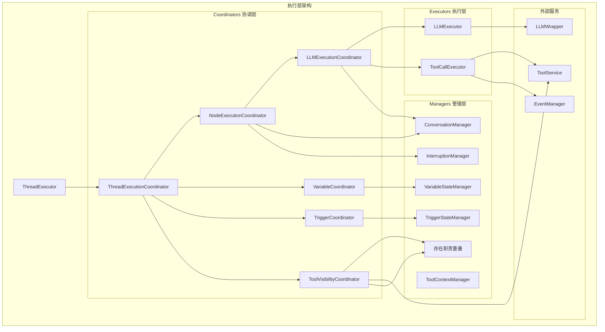

# SDK Core Execution 层架构分析报告

## 概述
本报告分析 `sdk/core/execution` 目录下的三个子目录：`coordinators`、`managers`、`executors` 的职责划分、设计合理性，识别潜在问题并提出改进建议。

## 当前架构

### 1. Coordinators（协调器）
**设计原则**：无状态组件，负责协调各个管理器之间的交互
**职责**：封装复杂的协调逻辑，通过依赖注入接收管理器
**文件列表**：
- `node-execution-coordinator.ts` - 节点执行协调器
- `trigger-coordinator.ts` - 触发器协调器
- `llm-execution-coordinator.ts` - LLM执行协调器
- `thread-lifecycle-coordinator.ts` - Thread生命周期协调器
- `thread-operation-coordinator.ts` - Thread操作协调器
- `thread-execution-coordinator.ts` - Thread执行协调器
- `variable-coordinator.ts` - 变量协调器
- `tool-visibility-coordinator.ts` - 工具可见性协调器
- `checkpoint-coordinator.ts` - 检查点协调器

### 2. Managers（管理器）
**设计原则**：有状态组件，负责管理运行时状态
**职责**：维护线程隔离的状态，提供状态操作接口
**文件列表**：
- `trigger-state-manager.ts` - 触发器状态管理器
- `variable-state-manager.ts` - 变量状态管理器
- `tool-context-manager.ts` - 工具上下文管理器
- `message-storage-manager.ts` - 消息存储管理器
- `conversation-manager.ts` - 对话管理器
- `interruption-manager.ts` - 中断管理器
- `interruption-detector.ts` - 中断检测器
- `tool-visibility-manager.ts` - 工具可见性管理器
- `thread-pool-manager.ts` - 线程池管理器
- `task-queue-manager.ts` - 任务队列管理器
- 等共18个文件

### 3. Executors（执行器）
**设计原则**：无状态组件，执行具体操作
**职责**：提供具体的执行能力（LLM调用、工具调用）
**文件列表**：
- `llm-executor.ts` - LLM执行器
- `tool-call-executor.ts` - 工具调用执行器

## 架构关系图



## 职责分析

### 清晰的职责划分
1. **协调器 (Coordinators)**：业务流程编排，无状态
   - 示例：`LLMExecutionCoordinator` 协调LLM调用、工具调用、对话状态更新
   - 优点：分离了业务流程和状态管理

2. **管理器 (Managers)**：状态管理，有状态
   - 示例：`VariableStateManager` 管理变量值的存储和检索
   - 优点：线程隔离，支持快照/恢复

3. **执行器 (Executors)**：具体操作执行，无状态
   - 示例：`LLMExecutor` 执行LLM API调用
   - 优点：专注于技术实现细节

## 识别的问题

### 1. 协调器违反无状态原则（严重问题）
**核心问题**：`ToolVisibilityCoordinator` 违反了协调器的无状态设计原则
- 协调器定义：无状态组件，负责协调各个管理器之间的交互
- 实际实现：`ToolVisibilityCoordinator` 维护了 `private contexts: Map<string, ToolVisibilityContext>` 状态
- 后果：与 `ToolVisibilityManager` 功能高度重叠，造成职责混乱

### 2. 职责划分不清晰
**问题**：`ToolVisibilityCoordinator` 承担了过多职责
- 状态管理：维护可见性上下文（本应是管理器职责）
- 业务协调：协调作用域切换、工具添加等流程
- 消息生成：生成LLM可见性声明消息
- 事件处理：管理声明历史记录

### 3. 层次过多问题
**潜在问题**：某些场景存在三层以上的委托
```
ThreadExecutor → ThreadExecutionCoordinator → NodeExecutionCoordinator →
LLMExecutionCoordinator → LLMExecutor → LLMWrapper
```
每层增加间接性，可能影响可维护性和性能。

### 4. 命名不一致
- `InterruptionManager` 和 `InterruptionDetector` 职责划分合理
- 但 `ToolContextManager` 和 `ToolVisibilityManager` 关系不清晰

### 5. 依赖复杂度
协调器通常依赖多个管理器，形成复杂的依赖网，增加测试难度。

## 改进建议

### 建议1：重构 ToolVisibility 组件（高优先级）
**方案**：重新划分职责，恢复架构原则
1. **状态管理归管理器**：将 `ToolVisibilityCoordinator` 中的状态管理逻辑移入 `ToolVisibilityManager`
   - 移除 `ToolVisibilityCoordinator` 中的 `private contexts` 字段
   - 增强 `ToolVisibilityManager` 的状态管理能力
2. **协调逻辑归协调器**：`ToolVisibilityCoordinator` 专注于业务流程协调
   - 依赖注入 `ToolVisibilityManager` 进行状态操作
   - 保留消息生成、作用域切换协调等业务逻辑
3. **提取消息服务**：将消息生成逻辑提取为 `ToolVisibilityMessageBuilder` 工具类

**重构后关系**：
```
ToolVisibilityCoordinator（无状态）
  ├── 依赖：ToolVisibilityManager（有状态）
  ├── 依赖：ToolVisibilityMessageBuilder（无状态）
  └── 职责：协调可见性变更流程
```

### 建议2：简化层次结构（中优先级）
**方案**：对于简单场景，允许协调器直接调用执行器，减少中间层
- 评估 `LLMExecutionCoordinator` → `LLMExecutor` → `LLMWrapper` 的必要性
- 考虑将 `LLMExecutor` 的功能直接集成到 `LLMWrapper`，或让协调器直接调用 `LLMWrapper`

### 建议3：统一命名规范（中优先级）
**方案**：明确协调器和管理器的命名模式
- 协调器：`XxxCoordinator`，负责业务流程协调，必须无状态
- 管理器：`XxxStateManager` 或 `XxxManager`，负责状态管理，必须有状态
- 执行器：`XxxExecutor`，负责具体操作执行，无状态
- 服务：`XxxService`，负责外部集成

### 建议4：依赖注入优化（低优先级）
**方案**：使用依赖注入容器简化协调器的构造函数
- 当前：`NodeExecutionCoordinator` 构造函数接收12个依赖项
- 优化：使用配置对象或工厂模式减少构造函数参数

### 建议5：职责重新划分（低优先级）
**方案**：重新评估某些组件的归属
- `ConversationManager` 目前是管理器，但包含业务逻辑（token计算、消息管理）
- 考虑拆分为：`ConversationStateManager`（状态） + `ConversationService`（业务逻辑）

## 实施优先级

| 优先级 | 改进项 | 影响范围 | 预计工作量 |
|--------|--------|----------|------------|
| 高 | 重构 ToolVisibility 组件（恢复架构原则） | 中等 | 中等 |
| 中 | 简化 LLM 调用层次 | 小 | 小 |
| 中 | 统一命名规范 | 大 | 大 |
| 低 | 依赖注入优化 | 中等 | 中等 |
| 低 | 职责重新划分（如 ConversationManager 拆分） | 大 | 大 |

## 结论

当前的三层架构（协调器-管理器-执行器）整体设计合理，符合关注点分离原则。主要问题在于 `ToolVisibilityCoordinator` 违反了无状态原则，造成职责重叠。建议优先重构该组件以恢复架构一致性，其他改进可作为长期优化项。

架构的清晰度高于绝对的性能优化，当前设计有利于团队协作和代码维护，适度的间接性是合理的。但必须严格遵守架构原则（协调器无状态、管理器有状态），否则会导致职责混乱。