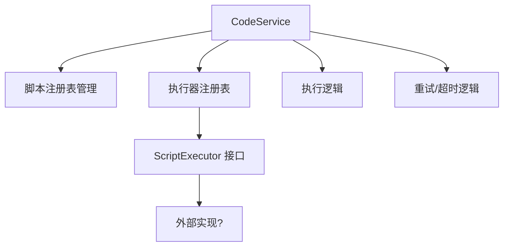
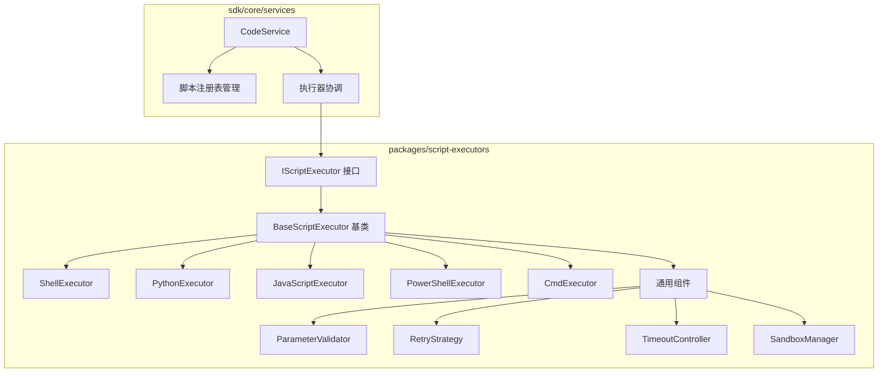
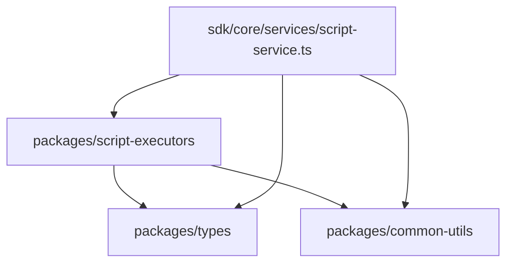

# 脚本执行模块重构计划

## 1. 背景与目标

### 1.1 当前问题

当前 `sdk/core/services/code-service.ts` 存在以下架构问题：

| 问题 | 影响 |
|------|------|
| 职责不单一 | 同时管理脚本注册表和执行逻辑，违反单一职责原则 |
| 缺乏执行器抽象 | 没有统一的执行器基类，通用逻辑无法复用 |
| 与 tool-executors 架构不一致 | 增加学习和维护成本 |
| 无内置执行器实现 | 需要每个项目自行实现 Shell、Python 等执行器 |

### 1.2 重构目标

- 创建独立的 `packages/script-executors` 模块
- 与 `packages/tool-executors` 保持架构一致性
- 提供开箱即用的脚本执行器实现
- 简化 `code-service.ts` 职责

---

## 2. 架构对比

### 2.1 当前架构



### 2.2 目标架构



---

## 3. 目录结构设计

```
packages/script-executors/
├── package.json
├── tsconfig.json
├── vitest.config.mjs
└── src/
    ├── index.ts                    # 统一导出
    ├── core/                       # 核心基础设施
    │   ├── interfaces/
    │   │   └── IScriptExecutor.ts  # 执行器接口
    │   ├── base/
    │   │   └── BaseScriptExecutor.ts # 抽象基类
    │   ├── components/             # 通用组件
    │   │   ├── ParameterValidator.ts
    │   │   ├── RetryStrategy.ts
    │   │   ├── TimeoutController.ts
    │   │   └── SandboxManager.ts
    │   └── types.ts                # 核心类型
    ├── shell/                      # Shell 执行器
    │   ├── ShellExecutor.ts
    │   └── types.ts
    ├── python/                     # Python 执行器
    │   ├── PythonExecutor.ts
    │   └── types.ts
    ├── javascript/                 # JavaScript 执行器
    │   ├── JavaScriptExecutor.ts
    │   └── types.ts
    ├── powershell/                 # PowerShell 执行器
    │   ├── PowerShellExecutor.ts
    │   └── types.ts
    └── cmd/                        # CMD 执行器
        ├── CmdExecutor.ts
        └── types.ts
```

---

## 4. 接口设计

### 4.1 IScriptExecutor 接口

职责：定义所有脚本执行器必须实现的契约

```typescript
interface IScriptExecutor {
  /**
   * 执行脚本
   * @param script 脚本定义
   * @param options 执行选项
   * @param context 执行上下文（线程隔离等）
   */
  execute(
    script: Script,
    options?: ScriptExecutionOptions,
    context?: ExecutionContext
  ): Promise<ScriptExecutionResult>;

  /**
   * 验证脚本配置
   * @param script 脚本定义
   */
  validate(script: Script): ValidationResult;

  /**
   * 获取支持的脚本类型
   */
  getSupportedTypes(): ScriptType[];

  /**
   * 清理资源（可选）
   */
  cleanup?(): Promise<void>;
}
```

### 4.2 BaseScriptExecutor 抽象基类

职责：提供通用执行逻辑（验证、重试、超时、沙箱）

```typescript
abstract class BaseScriptExecutor implements IScriptExecutor {
  protected validator: ParameterValidator;
  protected retryStrategy: RetryStrategy;
  protected timeoutController: TimeoutController;
  protected sandboxManager?: SandboxManager;

  constructor(config?: ExecutorConfig);

  // 模板方法模式
  async execute(script, options, context): Promise<ScriptExecutionResult> {
    // 1. 验证脚本
    // 2. 准备执行环境（沙箱）
    // 3. 执行（带重试和超时）
    // 4. 标准化结果
    // 5. 清理资源
  }

  // 子类实现
  protected abstract doExecute(
    script: Script,
    context?: ExecutionContext
  ): Promise<ExecutionOutput>;
}
```

### 4.3 执行器配置类型

```typescript
interface ExecutorConfig {
  // 重试配置
  maxRetries?: number;
  baseDelay?: number;
  exponentialBackoff?: boolean;
  
  // 超时配置
  timeout?: number;
  
  // 沙箱配置
  sandbox?: SandboxConfig;
  
  // 资源限制
  resourceLimits?: ResourceLimits;
}

interface ExecutionContext {
  threadId?: string;
  workingDirectory?: string;
  environment?: Record<string, string>;
  signal?: AbortSignal;
}
```

---

## 5. 具体执行器规划

### 5.1 ShellExecutor

- **支持类型**: SHELL
- **执行方式**: 使用 Node.js child_process 执行 shell 脚本
- **特性**: 
  - 支持环境变量注入
  - 支持工作目录切换
  - 支持超时控制
  - 可选沙箱模式（使用 Docker）

### 5.2 PythonExecutor

- **支持类型**: PYTHON
- **执行方式**: 调用系统 Python 解释器
- **特性**:
  - 自动检测 Python 版本
  - 支持虚拟环境
  - 依赖管理（requirements.txt）
  - 可选沙箱模式

### 5.3 JavaScriptExecutor

- **支持类型**: JAVASCRIPT
- **执行方式**: 使用 Node.js vm 模块或子进程
- **特性**:
  - 支持 ES6+ 语法
  - 模块导入控制
  - 内存限制
  - 执行时间限制

### 5.4 PowerShellExecutor

- **支持类型**: POWERSHELL
- **执行方式**: 调用 PowerShell 进程
- **特性**:
  - 支持 Windows 和 PowerShell Core
  - 执行策略处理
  - 编码处理

### 5.5 CmdExecutor

- **支持类型**: CMD
- **执行方式**: Windows cmd.exe
- **特性**:
  - Windows 专用
  - 批处理支持

---

## 6. script-service.ts 重构方案

### 6.1 职责调整

| 当前职责 | 调整后 |
|---------|--------|
| 脚本注册表管理 | 保留 |
| 执行器注册表管理 | 保留（简化） |
| 执行逻辑 | 移除，委托给执行器 |
| 重试/超时逻辑 | 移除，由执行器处理 |
| 错误转换 | 保留（轻量级包装） |

### 6.2 新的 ScriptService 结构

```typescript
class ScriptService {
  private scripts: Map<string, Script>;
  private executorRegistry: Map<ScriptType, IScriptExecutor>;

  // 脚本管理（保留）
  registerScript(script: Script): void;
  unregisterScript(name: string): void;
  getScript(name: string): Script;
  listScripts(): Script[];
  
  // 执行器管理（简化）
  registerExecutor(type: ScriptType, executor: IScriptExecutor): void;
  getExecutor(type: ScriptType): IScriptExecutor | undefined;
  
  // 执行（委托给执行器）
  async execute(
    scriptName: string,
    options?: Partial<ScriptExecutionOptions>,
    context?: ExecutionContext
  ): Promise<Result<ScriptExecutionResult, ScriptExecutionError>>;
  
  // 批量执行
  async executeBatch(
    executions: ExecutionTask[],
    context?: ExecutionContext
  ): Promise<Result<ScriptExecutionResult[], ScriptExecutionError>>;
}
```

### 6.3 依赖关系



---

## 7. 迁移步骤

### 阶段 1: 创建 script-executors 包（第 1-2 周）

1. **初始化包结构**
   - 创建 `packages/script-executors/` 目录
   - 配置 package.json、tsconfig.json
   - 设置测试框架

2. **实现核心基础设施**
   - 定义 `IScriptExecutor` 接口
   - 实现 `BaseScriptExecutor` 基类
   - 实现通用组件（验证器、重试策略、超时控制）

3. **实现 ShellExecutor**
   - 作为第一个参考实现
   - 编写单元测试

### 阶段 2: 实现其他执行器（第 3-4 周）

1. 实现 `PythonExecutor`
2. 实现 `JavaScriptExecutor`
3. 实现 `PowerShellExecutor`
4. 实现 `CmdExecutor`
5. 为每个执行器编写测试

### 阶段 3: 重构 script-service.ts（第 5 周）

1. **添加依赖**
    - 在 sdk/package.json 中添加 `script-executors` 依赖

2. **简化 ScriptService**
    - 移除执行逻辑
    - 移除重试/超时逻辑
    - 委托给执行器

3. **更新测试**
    - 修改现有测试
    - 添加集成测试

### 阶段 4: 验证与文档（第 6 周）

1. 运行完整测试套件
2. 更新 API 文档
3. 编写迁移指南
4. 代码审查

---

## 8. 风险与缓解措施

| 风险 | 影响 | 缓解措施 |
|------|------|---------|
| 破坏现有 API | 高 | 保持 CodeService 公共 API 不变 |
| 性能回归 | 中 | 添加性能基准测试 |
| 沙箱兼容性问题 | 中 | 提供回退到非沙箱模式 |
| 测试覆盖不足 | 高 | 要求每个执行器 >80% 覆盖率 |

---

## 9. 验收标准

- [x] `packages/script-executors` 包创建完成
- [x] 5 种脚本执行器全部实现
- [x] `code-service.ts` 重构完成，职责单一
- [ ] 所有现有测试通过
- [ ] 新功能测试覆盖率 >80%
- [ ] 性能无显著下降（<5%）
- [x] 文档更新完成

---

## 10. 附录

### 10.1 与 tool-executors 的对比

| 特性 | tool-executors | script-executors（规划） |
|------|---------------|------------------------|
| 接口 | IToolExecutor | IScriptExecutor |
| 基类 | BaseExecutor | BaseScriptExecutor |
| 执行目标 | Tool | Script |
| 参数传递 | Record<string, any> | ScriptExecutionOptions |
| 沙箱支持 | 部分 | 完整 |
| 线程隔离 | 支持 | 支持 |

### 10.2 命名规范

遵循项目命名规范，避免使用：
- ~~EnhancedScriptExecutor~~
- ~~UnifiedScriptExecutor~~
- ~~SmartScriptExecutor~~

使用功能导向命名：
- `BaseScriptExecutor`
- `ShellExecutor`
- `SandboxManager`