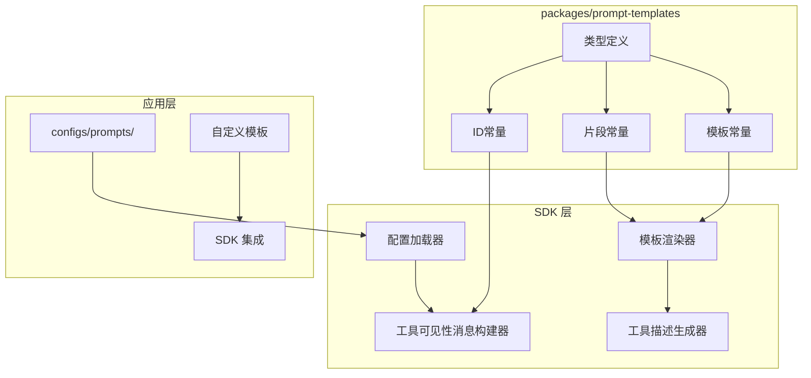
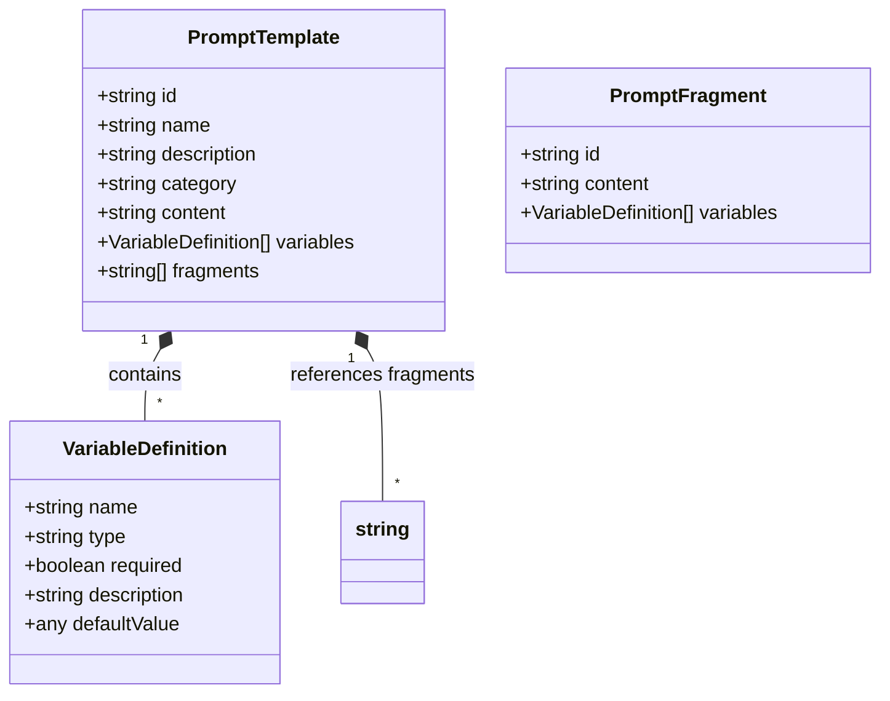

# 提示词模板包设计文档

## 概述

`packages/prompt-templates` 是一个纯静态定义包，为 Modular Agent Framework 提供统一的提示词模板定义。该包不包含任何运行时逻辑、状态管理或配置加载，仅导出类型定义和模板内容常量。所有处理逻辑由 SDK 层负责，应用层可通过配置覆盖默认模板。

### 设计目标
1. **纯静态**：包内仅包含类型和常量，无运行时依赖。
2. **类型安全**：提供完整的 TypeScript 类型定义，支持 IDE 自动补全。
3. **可扩展**：应用层可通过配置或编程方式覆盖和扩展模板。
4. **模块化**：模板按类别组织，支持片段（fragments）复用。
5. **版本化**：遵循语义化版本控制，确保向后兼容。

### 设计原则
- **零运行时依赖**：不依赖任何其他包（仅 TypeScript 内置类型）。
- **不可变性**：导出的常量不可修改，应用层覆盖需创建新对象。
- **自文档化**：通过类型系统提供完整提示。
- **配置驱动**：支持通过 `configs/prompts/` 目录覆盖模板。

## 架构

### 整体架构图



### 包间依赖关系
- `packages/prompt-templates` → 无依赖（仅 `typescript`）
- `sdk` → `@modular-agent/prompt-templates`（开发依赖）
- `apps/*` → `@modular-agent/prompt-templates`（可选依赖）

### 数据流
1. **模板定义**：包内定义默认模板常量。
2. **配置加载**：SDK 加载应用层配置（如 `configs/prompts/`），合并到默认模板。
3. **模板渲染**：SDK 调用 `renderTemplate` 函数，将变量注入模板。
4. **消息生成**：SDK 各组件（如 `ToolVisibilityMessageBuilder`）使用渲染后的模板生成最终消息。

## 组件和接口

### 1. 类型定义组件 (`src/types/`)

#### `template.ts`
```typescript
export interface PromptTemplate {
  id: string;
  name: string;
  description: string;
  category: 'system' | 'rules' | 'user-command' | 'tools' | 'composite';
  content: string;  // 含 {{variable}} 占位符
  variables?: VariableDefinition[];
  fragments?: string[];  // 引用的片段ID
}

export interface VariableDefinition {
  name: string;
  type: 'string' | 'number' | 'boolean' | 'object';
  required: boolean;
  description?: string;
  defaultValue?: any;
}

export interface TemplateFillRule {
  templateId: string;
  variableMapping: Record<string, string>;  // 变量名 -> 上下文路径映射
  fragmentMapping?: Record<string, string>; // 片段ID -> 实际内容映射
}
```

#### `fragment.ts`
```typescript
export interface PromptFragment {
  id: string;
  content: string;
  variables?: VariableDefinition[];
}
```

#### `composition.ts`
```typescript
export interface TemplateComposition {
  baseTemplateId: string;
  overrides: Partial<PromptTemplate>;
  fragmentReplacements?: Record<string, string>;
}
```

### 2. 模板常量组件 (`src/templates/`)

#### 目录结构
```
templates/
├── system/           # 系统提示词
│   ├── assistant.ts
│   ├── coder.ts
│   └── index.ts
├── rules/            # 规则提示词
│   ├── format.ts
│   ├── safety.ts
│   └── index.ts
├── user-commands/    # 用户指令
│   ├── code-review.ts
│   ├── data-analysis.ts
│   └── index.ts
└── tools/            # 工具相关模板
    ├── visibility/
    │   ├── declaration.ts
    │   ├── table-row.ts
    │   └── change-type.ts
    ├── descriptions/
    │   ├── single-line.ts
    │   ├── table-format.ts
    │   └── list-format.ts
    └── parameters/
        ├── schema.ts
        └── validation.ts
```

#### 关键模板示例

**工具可见性声明模板** (`tools/visibility/declaration.ts`)
```typescript
export const TOOL_VISIBILITY_DECLARATION_TEMPLATE: PromptTemplate = {
  id: 'tools.visibility.declaration',
  name: 'Tool Visibility Declaration',
  description: '工具可见性声明主模板',
  category: 'tools',
  content: `## 工具可见性声明

**生效时间**: {{timestamp}}
**当前作用域**: {{scope}}({{scopeId}})
**变更类型**: {{changeTypeText}}

### 当前可用工具清单

| 工具名称 | 工具ID | 说明 |
|----------|--------|------|
{{toolDescriptions}}

### 重要提示

1. **仅可使用上述清单中的工具**，其他工具调用将被拒绝
2. 工具参数必须符合schema定义
3. 如需更多工具，请完成当前任务后退出当前作用域`,
  variables: [
    { name: 'timestamp', type: 'string', required: true, description: '生效时间' },
    { name: 'scope', type: 'string', required: true, description: '作用域类型' },
    { name: 'scopeId', type: 'string', required: true, description: '作用域ID' },
    { name: 'changeTypeText', type: 'string', required: true, description: '变更类型文本' },
    { name: 'toolDescriptions', type: 'string', required: true, description: '工具描述表格行' }
  ]
};

// 表格行模板（字符串常量）
export const TOOL_TABLE_ROW_TEMPLATE = '| {{toolName}} | {{toolId}} | {{toolDescription}} |';

// 变更类型文本映射
export const VISIBILITY_CHANGE_TYPE_TEXTS = {
  init: '初始化',
  enter_scope: '进入作用域',
  add_tools: '新增工具',
  exit_scope: '退出作用域',
  refresh: '刷新声明'
} as const;
```

**工具参数 Schema 模板** (`tools/parameters/schema.ts`)
```typescript
export const TOOL_PARAMETERS_SCHEMA_TEMPLATE: PromptTemplate = {
  id: 'tools.parameters.schema',
  name: 'Tool Parameters Schema Description',
  description: '工具参数Schema描述模板',
  category: 'tools',
  content: `工具名称: {{toolName}}
工具ID: {{toolId}}
工具描述: {{toolDescription}}

参数Schema:
\`\`\`json
{{parametersSchema}}
\`\`\`

参数说明:
{{parametersDescription}}`,
  variables: [
    { name: 'toolName', type: 'string', required: true },
    { name: 'toolId', type: 'string', required: true },
    { name: 'toolDescription', type: 'string', required: true },
    { name: 'parametersSchema', type: 'string', required: true },
    { name: 'parametersDescription', type: 'string', required: false }
  ]
};
```

### 3. 片段常量组件 (`src/fragments/`)

包含可复用的提示词片段，如工具描述片段、可见性声明片段等。

### 4. 常量组件 (`src/constants/`)

#### `template-ids.ts`
```typescript
export const TEMPLATE_IDS = {
  SYSTEM: {
    CODER: 'system.coder',
    ASSISTANT: 'system.assistant',
  },
  RULES: {
    FORMAT: 'rules.format',
    SAFETY: 'rules.safety',
  },
  TOOLS: {
    VISIBILITY_DECLARATION: 'tools.visibility.declaration',
    DESCRIPTION_TABLE: 'tools.description.table',
    PARAMETERS_SCHEMA: 'tools.parameters.schema',
  },
  FRAGMENTS: {
    TOOL_VISIBILITY: 'fragment.tool_visibility',
  }
} as const;
```

#### `variable-names.ts`
```typescript
export const VARIABLE_NAMES = {
  TOOL: {
    NAME: 'toolName',
    ID: 'toolId',
    DESCRIPTION: 'toolDescription',
  },
  VISIBILITY: {
    TIMESTAMP: 'timestamp',
    SCOPE: 'scope',
    SCOPE_ID: 'scopeId',
    CHANGE_TYPE_TEXT: 'changeTypeText',
    TOOL_DESCRIPTIONS: 'toolDescriptions',
  }
} as const;
```

### 5. SDK 集成接口

#### 模板渲染器 (`sdk/core/utils/template-renderer.ts`)
```typescript
export function renderTemplate(
  template: string,
  variables: Record<string, any>
): string {
  // 实现 {{variable}} 替换逻辑
}
```

#### 工具描述生成器 (`sdk/core/utils/tool-description-generator.ts`)
```typescript
export function generateToolDescription(
  tool: Tool,
  format: 'table' | 'single-line' | 'list' = 'table'
): string {
  // 使用 packages/prompt-templates 中的模板
}
```

#### 配置加载器 (`sdk/api/config/prompt-template-loader.ts`)
```typescript
export async function loadPromptTemplateConfig(
  configPath: string,
  defaultTemplate: PromptTemplate
): Promise<PromptTemplate> {
  // 加载并合并应用层配置
}
```

## 数据模型

### 模板数据模型



### 变量替换语法
- 占位符格式：`{{variableName}}`
- 支持嵌套路径：`{{tool.metadata.name}}`
- 默认值语法：`{{variableName:defaultValue}}`（由 SDK 渲染器实现）

### 配置合并模型
```typescript
type MergedTemplate = {
  // 默认模板
  ...defaultTemplate,
  // 应用层配置覆盖
  ...configOverride,
  // 深度合并 content 和 variables
  content: configOverride.content ?? defaultTemplate.content,
  variables: mergeArrays(defaultTemplate.variables, configOverride.variables)
};
```

## 错误处理

### 1. 模板渲染错误
- **变量缺失**：当必需变量未提供时，渲染器应抛出 `TemplateVariableMissingError`，包含缺失变量名。
- **类型不匹配**：当变量类型与定义不符时，记录警告但继续渲染（转换为字符串）。

### 2. 配置加载错误
- **文件不存在**：静默回退到默认模板，记录调试日志。
- **格式错误**：抛出 `TemplateConfigParseError`，包含文件路径和解析错误详情。
- **验证失败**：当配置不符合 `PromptTemplate` 类型时，抛出 `TemplateValidationError`。

### 3. 集成错误
- **模板 ID 冲突**：包内模板 ID 必须唯一，构建时通过类型检查确保。
- **片段引用不存在**：当模板引用不存在的片段 ID 时，运行时抛出 `FragmentNotFoundError`。

### 错误恢复策略
- **降级策略**：配置加载失败时使用默认模板。
- **验证前置**：在构建时通过 TypeScript 类型检查捕获大多数错误。
- **详细日志**：所有错误应包含上下文信息（模板 ID、变量名、文件路径）。

## 附录

### A. 模板变量命名规范
- 使用 camelCase 命名。
- 前缀表示上下文：`tool`、`scope`、`user` 等。
- 描述性名称：`toolName` 而非 `name`。

### B. 配置文件格式示例 (TOML)
```toml
# configs/prompts/tools/visibility/declaration.toml
id = "tools.visibility.declaration"
name = "Custom Tool Visibility Declaration"

content = """
## 自定义工具可见性声明

**生效时间**: {{timestamp}}
**当前作用域**: {{scope}}({{scopeId}})
**变更类型**: {{changeTypeText}}

### 可用工具

{{toolDescriptions}}

### 注意事项
- 只能使用上述工具
- 参数必须符合 schema
- 需要更多工具请完成任务后退出
"""

[[variables]]
name = "timestamp"
type = "string"
required = true
description = "生效时间"

[[variables]]
name = "scope"
type = "string"
required = true
description = "作用域类型"
```

### C. 已知限制
1. 模板不需要支持条件逻辑（由 SDK 处理）。
2. 变量替换不需要支持复杂表达式。
3. 片段嵌套深度限制为 3 层（防止循环引用）。