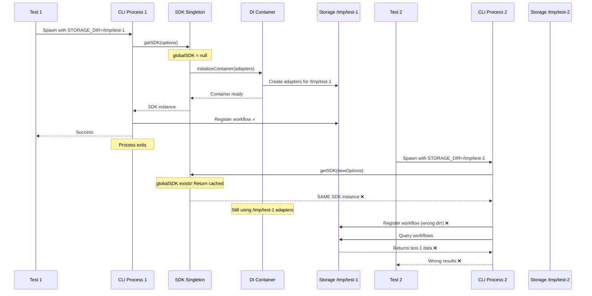
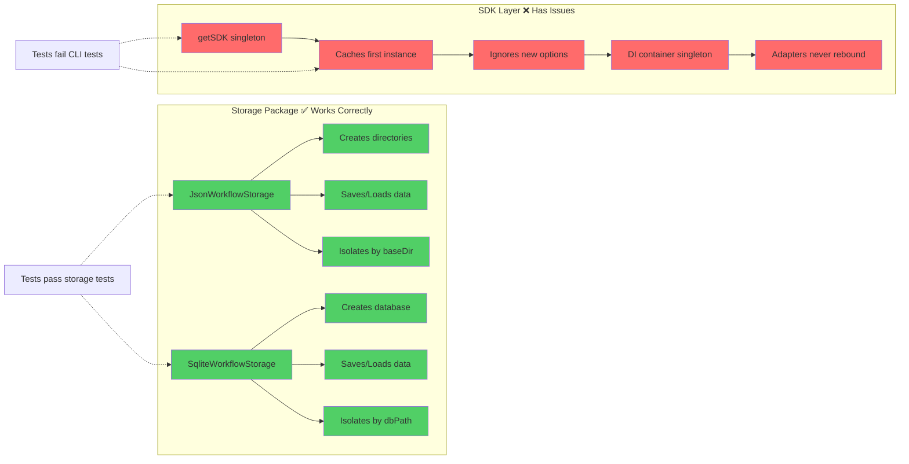

# CLI Storage Isolation Architecture Diagram

## Problem Architecture (Current)

```mermaid
graph TB
    subgraph "Test Suite Process"
        A[Test 1 Starts] --> B[Set STORAGE_DIR=/tmp/test-1]
        B --> C[Spawn CLI Process 1]
        C --> D[CLI calls getSDK]
        D --> E{globalSDK exists?}
        E -->|No| F[Create new SDK instance]
        F --> G[Initialize DI Container]
        G --> H[Bind Storage Adapters to /tmp/test-1]
        H --> I[Register workflow to /tmp/test-1 ✓]
        I --> J[Test 1 Ends]
        
        J --> K[Test 2 Starts]
        K --> L[Set STORAGE_DIR=/tmp/test-2]
        L --> M[Spawn CLI Process 2]
        M --> N[CLI calls getSDK]
        N --> O{globalSDK exists?}
        O -->|Yes - Cached!| P[Return cached SDK instance ❌]
        P --> Q[Use OLD adapters pointing to /tmp/test-1 ❌]
        Q --> R[Register workflow to WRONG directory ❌]
        R --> S[Query returns empty/wrong results ❌]
    end
    
    style P fill:#ff6b6b
    style Q fill:#ff6b6b
    style R fill:#ff6b6b
    style S fill:#ff6b6b
```



## Root Cause Flow



## Solution Architecture (Proposed)

### Option 1: SDK Reset Function

```mermaid
graph TB
    subgraph "Test Suite with Reset"
        A[Test 1 Starts] --> B[Set STORAGE_DIR=/tmp/test-1]
        B --> C[Spawn CLI Process 1]
        C --> D[getSDK - creates new instance]
        D --> E[Initialize with /tmp/test-1]
        E --> F[Register workflow ✓]
        F --> G[Test 1 Ends]
        G --> H[Call resetSDK]
        H --> I[Destroy globalSDK]
        I --> J[Reset DI Container]
        
        J --> K[Test 2 Starts]
        K --> L[Set STORAGE_DIR=/tmp/test-2]
        L --> M[Spawn CLI Process 2]
        M --> N[getSDK - creates NEW instance ✓]
        N --> O[Initialize with /tmp/test-2 ✓]
        O --> P[Register workflow to correct dir ✓]
        P --> Q[Query returns correct results ✓]
    end
    
    style H fill:#51cf66
    style I fill:#51cf66
    style J fill:#51cf66
    style N fill:#51cf66
    style O fill:#51cf66
    style P fill:#51cf66
    style Q fill:#51cf66
```



### Option 2: Multiple SDK Instances

```mermaid
graph TB
    subgraph "Test Suite with createSDK"
        A[Test 1 Starts] --> B[Set STORAGE_DIR=/tmp/test-1]
        B --> C[Spawn CLI Process 1]
        C --> D[createSDK - always new instance]
        D --> E[Initialize with /tmp/test-1]
        E --> F[Register workflow ✓]
        F --> G[Test 1 Ends]
        G --> H[Destroy SDK instance]
        
        H --> I[Test 2 Starts]
        I --> J[Set STORAGE_DIR=/tmp/test-2]
        J --> K[Spawn CLI Process 2]
        K --> L[createSDK - NEW instance ✓]
        L --> M[Initialize with /tmp/test-2 ✓]
        M --> N[Register workflow to correct dir ✓]
        N --> O[Query returns correct results ✓]
    end
    
    style D fill:#51cf66
    style L fill:#51cf66
    style M fill:#51cf66
    style N fill:#51cf66
    style O fill:#51cf66
```



## Storage Package vs SDK Layer



## Key Insights

### What Works ✅

1. **Storage implementations** correctly isolate data when given different paths
2. **Directory creation** works properly for both JSON and SQLite
3. **CRUD operations** function correctly in isolation
4. **Path resolution** handles relative and absolute paths

### What Fails ❌

1. **SDK singleton** prevents creating fresh instances per test
2. **DI container caching** blocks adapter reconfiguration
3. **Options ignored** after first `getSDK()` call
4. **No reset mechanism** available for test isolation

### The Gap 🔍

```
Storage Package Level:     Different baseDir → Different data ✅
                           (Works correctly)

SDK Orchestration Level:   Different STORAGE_DIR → Same adapters ❌
                           (Broken due to singleton)
```

## Test Execution Comparison

### Storage Integration Tests (Pass)

```typescript
beforeEach(async () => {
  // Fresh temp directory for each test
  tempBaseDir = await mkdtemp(join(tmpdir(), "test-"));
  
  // Fresh storage instance for each test
  storage = new JsonWorkflowStorage({ baseDir: tempBaseDir });
  await storage.initialize();
});

afterEach(async () => {
  // Clean up completely
  await storage.close();
  await rm(tempBaseDir, { recursive: true });
});
```

**Result**: Each test gets isolated storage → All tests pass ✅

### CLI Integration Tests (Fail)

```typescript
// Test 1
process.env.STORAGE_DIR = "/tmp/test-1";
spawn("node", ["cli.js", "register"]);  // Creates SDK #1

// Test 2
process.env.STORAGE_DIR = "/tmp/test-2";
spawn("node", ["cli.js", "register"]);  // Reuses SDK #1 ❌
```

**Result**: Tests share SDK instance → Isolation fails ❌

## Recommended Fix Implementation

```typescript
// sdk/api/shared/core/sdk.ts

/**
 * Reset the global SDK instance (for testing)
 */
export async function resetSDK(): Promise<void> {
  if (globalSDK) {
    try {
      await globalSDK.shutdown();  // Close storage adapters
      await globalSDK.destroy();   // Clean up resources
    } catch (error) {
      logger.error("Error during SDK reset", { error });
    }
    globalSDK = null;
  }
  
  // Reset DI container
  resetContainer();
  
  logger.info("SDK reset completed");
}

/**
 * Get or create SDK instance
 */
export function getSDK(options?: SDKOptions): SDK {
  if (!globalSDK) {
    globalSDK = new SDK(options);
  }
  return globalSDK;
}

/**
 * Create a new isolated SDK instance (alternative to singleton)
 */
export function createSDK(options?: SDKOptions): SDK {
  return new SDK(options);
}
```

**Usage in CLI tests**:

```typescript
import { resetSDK } from "@wf-agent/sdk";

describe("CLI Storage Isolation", () => {
  afterEach(async () => {
    // Force fresh SDK for next test
    await resetSDK();
  });
  
  it("should isolate test 1", async () => {
    process.env.STORAGE_DIR = "/tmp/test-1";
    // ... test code
  });
  
  it("should isolate test 2", async () => {
    process.env.STORAGE_DIR = "/tmp/test-2";
    // ... test code - gets fresh SDK
  });
});
```
