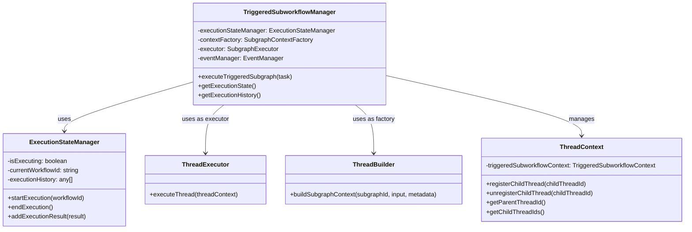
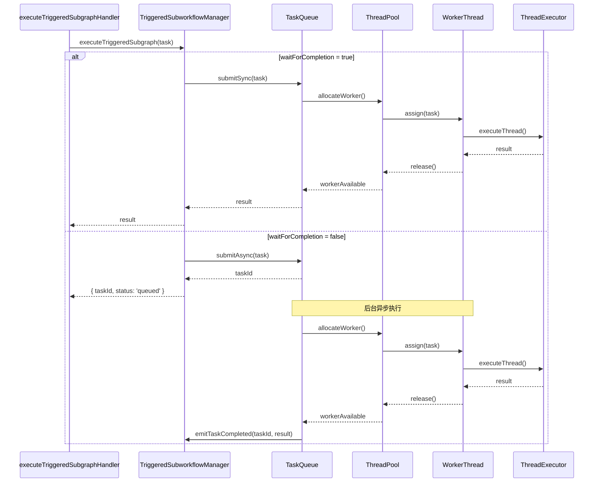

# Triggered子工作流异步执行设计分析报告

## 执行摘要

本报告对当前triggered子工作流的设计进行了深入分析，重点关注异步执行能力和线程管理机制。分析发现，虽然已经引入了`TriggeredSubworkflowManager`来改善架构，但在异步执行、线程管理和并发控制方面仍存在显著问题。建议引入任务队列和线程池机制来彻底解决这些问题。

---

## 1. 当前设计状态评估

### 1.1 已完成的改进

根据代码审查，以下改进已经实施：

| 改进项 | 状态 | 说明 |
|--------|------|------|
| **TriggeredSubworkflowManager** | ✅ 已实现 | 专门的管理器负责triggered子工作流生命周期 |
| **ThreadExecutor职责分离** | ✅ 已完成 | 不再实现SubgraphContextFactory接口 |
| **ExecutionState清理** | ✅ 已完成 | 不再管理triggered子工作流状态 |
| **向后兼容方法** | ✅ 已标记 | ThreadContext中的deprecated方法 |

### 1.2 核心架构组件



---

## 2. 核心问题分析

### 2.1 异步执行支持不完整（严重）

**问题描述：**

虽然`TriggeredSubgraphTask`配置中包含`waitForCompletion`选项，但实际实现中并没有真正的异步执行机制。

**代码证据：**

```typescript
// sdk/core/execution/handlers/trigger-handlers/execute-triggered-subgraph-handler.ts:143
// 执行触发子工作流
const result = await manager.executeTriggeredSubgraph(task);

// sdk/core/execution/managers/triggered-subworkflow-manager.ts:126-166
async executeTriggeredSubgraph(
  task: TriggeredSubgraphTask
): Promise<ExecutedSubgraphResult> {
  // ... 总是同步等待完成
  const threadResult = await this.executor.executeThread(subgraphContext);
  // ...
}
```

**影响：**
- `waitForCompletion: false`配置无效
- 无法实现真正的后台任务执行
- 主工作流会被阻塞，即使配置了异步执行
- 无法支持高并发场景

**实际行为：**
```typescript
// 无论配置如何，都会同步等待
const task: TriggeredSubgraphTask = {
  subgraphId: triggeredWorkflowId,
  input,
  triggerId,
  mainThreadContext,
  config: {
    waitForCompletion: false,  // ❌ 这个配置被忽略
    timeout: 30000,
    recordHistory: true,
  }
};

// 仍然会阻塞等待
const result = await manager.executeTriggeredSubgraph(task);
```

### 2.2 线程关系管理混乱（严重）

**问题描述：**

父子线程关系管理分散在多个地方，缺乏统一的生命周期管理。

**代码证据：**

```typescript
// sdk/core/execution/context/thread-context.ts:806-820
registerChildThread(childThreadId: ID): void {
  if (!this.thread.triggeredSubworkflowContext) {
    this.thread.triggeredSubworkflowContext = {
      parentThreadId: '',
      childThreadIds: [],
      triggeredSubworkflowId: ''
    };
  }
  if (!this.thread.triggeredSubworkflowContext.childThreadIds) {
    this.thread.triggeredSubworkflowContext.childThreadIds = [];
  }
  if (!this.thread.triggeredSubworkflowContext.childThreadIds.includes(childThreadId)) {
    this.thread.triggeredSubworkflowContext.childThreadIds.push(childThreadId);
  }
}
```

**问题点：**
1. **手动注册/注销** - 需要手动调用`registerChildThread`和`unregisterChildThread`
2. **没有自动清理** - 子线程完成后不会自动从列表中移除
3. **状态不一致风险** - 多个地方可能同时修改这个列表
4. **缺乏引用计数** - 无法追踪子线程的实际状态

**影响：**
- 内存泄漏风险（已完成的子线程仍在列表中）
- 状态不一致（列表中的线程可能已不存在）
- 调试困难（无法准确知道活跃的子线程）
- 资源泄漏（无法正确清理子线程资源）

### 2.3 缺乏并发控制（中等）

**问题描述：**

没有限制并发子工作流数量，可能导致资源耗尽。

**代码证据：**

```typescript
// 没有并发限制检查
async executeTriggeredSubgraph(
  task: TriggeredSubgraphTask
): Promise<ExecutedSubgraphResult> {
  // 直接执行，没有检查并发数量
  const subgraphContext = await this.createSubgraphContext(task);
  const threadResult = await this.executeSubgraph(subgraphContext, task);
  // ...
}
```

**影响：**
- 可能创建大量并发子工作流
- 资源耗尽（内存、CPU、连接池）
- 系统不稳定
- 无法实现优先级调度

### 2.4 缺乏超时和取消机制（中等）

**问题描述：**

虽然配置中有`timeout`选项，但没有实际的超时和取消实现。

**代码证据：**

```typescript
// timeout配置存在但未使用
config?: {
  waitForCompletion?: boolean;
  timeout?: number;  // ❌ 未实现
  recordHistory?: boolean;
  metadata?: any;
};
```

**影响：**
- 长时间运行的子工作流无法被中断
- 资源无法及时释放
- 系统响应性下降
- 无法实现优雅降级

### 2.5 状态管理分散（中等）

**问题描述：**

子工作流状态分散在多个组件中。

**状态分布：**

| 组件 | 状态 | 用途 |
|------|------|------|
| `ExecutionStateManager` | `isExecuting`, `currentWorkflowId`, `executionHistory` | 执行状态管理 |
| `ThreadContext.triggeredSubworkflowContext` | `parentThreadId`, `childThreadIds`, `triggeredSubworkflowId` | 线程关系 |
| `ThreadRegistry` | 所有注册的线程 | 线程注册表 |
| `ThreadContext.thread` | `threadType`, `forkJoinContext` | 线程元数据 |

**影响：**
- 状态同步困难
- 容易出现不一致
- 调试复杂
- 维护成本高

---

## 3. 替代设计方案

### 3.1 方案一：任务队列 + 线程池（推荐）

**设计思路：**

引入任务队列和线程池机制，实现真正的异步执行和并发控制。

**架构图：**



**核心组件：**

```typescript
/**
 * 任务队列接口
 */
interface TaskQueue {
  /**
   * 提交同步任务（等待完成）
   */
  submitSync(task: TriggeredSubgraphTask): Promise<ExecutedSubgraphResult>;
  
  /**
   * 提交异步任务（立即返回）
   */
  submitAsync(task: TriggeredSubgraphTask): Promise<string>; // 返回taskId
  
  /**
   * 获取任务状态
   */
  getTaskStatus(taskId: string): TaskStatus;
  
  /**
   * 取消任务
   */
  cancelTask(taskId: string): Promise<boolean>;
  
  /**
   * 获取队列统计
   */
  getQueueStats(): QueueStats;
}

/**
 * 线程池接口
 */
interface ThreadPool {
  /**
   * 分配工作线程
   */
  allocateWorker(): Promise<WorkerThread>;
  
  /**
   * 释放工作线程
   */
  releaseWorker(worker: WorkerThread): void;
  
  /**
   * 获取池统计
   */
  getPoolStats(): PoolStats;
  
  /**
   * 关闭线程池
   */
  shutdown(): Promise<void>;
}

/**
 * 工作线程接口
 */
interface WorkerThread {
  /**
   * 执行任务
   */
  execute(task: TriggeredSubgraphTask): Promise<ExecutedSubgraphResult>;
  
  /**
   * 取消当前任务
   */
  cancel(): Promise<boolean>;
  
  /**
   * 获取状态
   */
  getStatus(): WorkerStatus;
}

/**
 * 任务状态
 */
enum TaskStatus {
  QUEUED = 'queued',
  RUNNING = 'running',
  COMPLETED = 'completed',
  FAILED = 'failed',
  CANCELLED = 'cancelled',
  TIMEOUT = 'timeout'
}

/**
 * 工作线程状态
 */
enum WorkerStatus {
  IDLE = 'idle',
  BUSY = 'busy',
  SHUTTING_DOWN = 'shutting_down'
}
```

**实现示例：**

```typescript
/**
 * TriggeredSubworkflowManager - 重构版本
 */
export class TriggeredSubworkflowManager {
  private taskQueue: TaskQueue;
  private threadPool: ThreadPool;
  private eventManager: EventManager;
  private taskRegistry: Map<string, TaskInfo> = new Map();

  constructor(
    contextFactory: SubgraphContextFactory,
    executor: SubgraphExecutor,
    eventManager: EventManager,
    config: SubworkflowManagerConfig = {}
  ) {
    this.eventManager = eventManager;
    
    // 创建线程池
    this.threadPool = new ThreadPoolImpl({
      minWorkers: config.minWorkers || 2,
      maxWorkers: config.maxWorkers || 10,
      idleTimeout: config.idleTimeout || 30000,
      taskTimeout: config.taskTimeout || 60000
    });
    
    // 创建任务队列
    this.taskQueue = new TaskQueueImpl({
      maxQueueSize: config.maxQueueSize || 100,
      threadPool: this.threadPool,
      contextFactory,
      executor,
      eventManager
    });
    
    // 监听任务完成事件
    this.setupTaskEventListeners();
  }

  /**
   * 执行触发子工作流
   */
  async executeTriggeredSubgraph(
    task: TriggeredSubgraphTask
  ): Promise<ExecutedSubgraphResult | TaskSubmissionResult> {
    const taskId = generateId();
    
    // 注册任务
    this.taskRegistry.set(taskId, {
      id: taskId,
      task,
      status: TaskStatus.QUEUED,
      submitTime: Date.now()
    });
    
    // 触发任务提交事件
    await this.eventManager.emit({
      type: EventType.TRIGGERED_SUBGRAPH_SUBMITTED,
      taskId,
      subgraphId: task.subgraphId,
      triggerId: task.triggerId,
      timestamp: now()
    });
    
    // 根据配置选择执行方式
    if (task.config?.waitForCompletion !== false) {
      // 同步执行
      const result = await this.taskQueue.submitSync(task);
      
      // 更新任务状态
      this.taskRegistry.delete(taskId);
      
      return result;
    } else {
      // 异步执行
      await this.taskQueue.submitAsync(task);
      
      // 返回任务提交结果
      return {
        taskId,
        status: TaskStatus.QUEUED,
        message: 'Task submitted successfully'
      };
    }
  }

  /**
   * 获取任务状态
   */
  getTaskStatus(taskId: string): TaskInfo | null {
    return this.taskRegistry.get(taskId) || null;
  }

  /**
   * 取消任务
   */
  async cancelTask(taskId: string): Promise<boolean> {
    const taskInfo = this.taskRegistry.get(taskId);
    if (!taskInfo) {
      return false;
    }
    
    const cancelled = await this.taskQueue.cancelTask(taskId);
    
    if (cancelled) {
      taskInfo.status = TaskStatus.CANCELLED;
      await this.eventManager.emit({
        type: EventType.TRIGGERED_SUBGRAPH_CANCELLED,
        taskId,
        subgraphId: taskInfo.task.subgraphId,
        timestamp: now()
      });
    }
    
    return cancelled;
  }

  /**
   * 获取队列统计
   */
  getQueueStats(): QueueStats {
    return this.taskQueue.getQueueStats();
  }

  /**
   * 关闭管理器
   */
  async shutdown(): Promise<void> {
    // 等待所有任务完成
    await this.taskQueue.drain();
    
    // 关闭线程池
    await this.threadPool.shutdown();
    
    // 清理任务注册表
    this.taskRegistry.clear();
  }

  /**
   * 设置任务事件监听器
   */
  private setupTaskEventListeners(): void {
    // 监听任务完成事件
    this.taskQueue.on('taskCompleted', async (taskId: string, result: ExecutedSubgraphResult) => {
      const taskInfo = this.taskRegistry.get(taskId);
      if (taskInfo) {
        taskInfo.status = TaskStatus.COMPLETED;
        taskInfo.result = result;
        taskInfo.completeTime = Date.now();
        
        // 触发完成事件
        await this.eventManager.emit({
          type: EventType.TRIGGERED_SUBGRAPH_COMPLETED,
          taskId,
          subgraphId: taskInfo.task.subgraphId,
          triggerId: taskInfo.task.triggerId,
          output: result.subgraphContext.getOutput(),
          executionTime: result.executionTime,
          timestamp: now()
        });
        
        // 如果是异步任务，从注册表中移除
        if (taskInfo.task.config?.waitForCompletion === false) {
          this.taskRegistry.delete(taskId);
        }
      }
    });
    
    // 监听任务失败事件
    this.taskQueue.on('taskFailed', async (taskId: string, error: Error) => {
      const taskInfo = this.taskRegistry.get(taskId);
      if (taskInfo) {
        taskInfo.status = TaskStatus.FAILED;
        taskInfo.error = error;
        taskInfo.completeTime = Date.now();
        
        // 触发失败事件
        await this.eventManager.emit({
          type: EventType.TRIGGERED_SUBGRAPH_FAILED,
          taskId,
          subgraphId: taskInfo.task.subgraphId,
          triggerId: taskInfo.task.triggerId,
          error: getErrorMessage(error),
          timestamp: now()
        });
        
        // 如果是异步任务，从注册表中移除
        if (taskInfo.task.config?.waitForCompletion === false) {
          this.taskRegistry.delete(taskId);
        }
      }
    });
  }
}

/**
 * 任务信息
 */
interface TaskInfo {
  id: string;
  task: TriggeredSubgraphTask;
  status: TaskStatus;
  submitTime: number;
  completeTime?: number;
  result?: ExecutedSubgraphResult;
  error?: Error;
}

/**
 * 任务提交结果
 */
interface TaskSubmissionResult {
  taskId: string;
  status: TaskStatus;
  message: string;
}

/**
 * 队列统计
 */
interface QueueStats {
  totalTasks: number;
  queuedTasks: number;
  runningTasks: number;
  completedTasks: number;
  failedTasks: number;
  cancelledTasks: number;
}

/**
 * 管理器配置
 */
interface SubworkflowManagerConfig {
  minWorkers?: number;
  maxWorkers?: number;
  maxQueueSize?: number;
  idleTimeout?: number;
  taskTimeout?: number;
}
```

**优点：**
- ✅ 真正的异步执行支持
- ✅ 并发控制（线程池）
- ✅ 资源管理（队列限制）
- ✅ 超时和取消机制
- ✅ 任务状态追踪
- ✅ 统一的线程生命周期管理
- ✅ 可扩展性强

**缺点：**
- ⚠️ 实现复杂度较高
- ⚠️ 需要额外的资源管理
- ⚠️ 增加了系统复杂度

### 3.2 方案二：简化异步执行（折中）

**设计思路：**

使用Promise和setTimeout实现简化的异步执行，不引入完整的线程池。

**实现示例：**

```typescript
export class TriggeredSubworkflowManager {
  private activeTasks: Map<string, Promise<ExecutedSubgraphResult>> = new Map();
  private maxConcurrentTasks: number = 10;
  private currentConcurrentTasks: number = 0;

  async executeTriggeredSubgraph(
    task: TriggeredSubgraphTask
  ): Promise<ExecutedSubgraphResult | TaskSubmissionResult> {
    const taskId = generateId();
    
    if (task.config?.waitForCompletion !== false) {
      // 同步执行
      return await this.executeTask(task);
    } else {
      // 异步执行（带并发控制）
      if (this.currentConcurrentTasks >= this.maxConcurrentTasks) {
        throw new Error('Maximum concurrent tasks reached');
      }
      
      this.currentConcurrentTasks++;
      
      const taskPromise = this.executeTaskWithTimeout(task)
        .finally(() => {
          this.currentConcurrentTasks--;
          this.activeTasks.delete(taskId);
        });
      
      this.activeTasks.set(taskId, taskPromise);
      
      return {
        taskId,
        status: TaskStatus.RUNNING,
        message: 'Task started'
      };
    }
  }

  private async executeTaskWithTimeout(
    task: TriggeredSubgraphTask
  ): Promise<ExecutedSubgraphResult> {
    const timeout = task.config?.timeout || 60000;
    
    return Promise.race([
      this.executeTask(task),
      new Promise<ExecutedSubgraphResult>((_, reject) => {
        setTimeout(() => {
          reject(new Error(`Task timeout after ${timeout}ms`));
        }, timeout);
      })
    ]);
  }

  async cancelTask(taskId: string): Promise<boolean> {
    const taskPromise = this.activeTasks.get(taskId);
    if (!taskPromise) {
      return false;
    }
    
    // 注意：Promise无法真正取消，这里只是从列表中移除
    this.activeTasks.delete(taskId);
    return true;
  }
}
```

**优点：**
- ✅ 实现简单
- ✅ 基本的异步执行支持
- ✅ 并发控制
- ✅ 超时机制

**缺点：**
- ❌ 无法真正取消任务
- ❌ 资源管理不完善
- ❌ 扩展性有限
- ❌ 缺乏任务状态追踪

### 3.3 方案三：保持现状（不推荐）

**设计思路：**

保持当前设计，仅修复文档和配置说明。

**优点：**
- ✅ 无需修改代码
- ✅ 风险最低

**缺点：**
- ❌ `waitForCompletion`配置无效
- ❌ 无法实现异步执行
- ❌ 并发控制缺失
- ❌ 资源管理问题

---

## 4. 推荐方案详细设计

### 4.1 核心组件实现

#### 4.1.1 TaskQueue实现

```typescript
/**
 * 任务队列实现
 */
export class TaskQueueImpl implements TaskQueue {
  private queue: Array<{
    task: TriggeredSubgraphTask;
    resolve: (result: ExecutedSubgraphResult) => void;
    reject: (error: Error) => void;
  }> = [];
  private runningTasks: Map<string, Promise<ExecutedSubgraphResult>> = new Map();
  private threadPool: ThreadPool;
  private contextFactory: SubgraphContextFactory;
  private executor: SubgraphExecutor;
  private eventManager: EventManager;
  private maxQueueSize: number;
  private eventEmitter: EventEmitter = new EventEmitter();

  constructor(config: {
    maxQueueSize: number;
    threadPool: ThreadPool;
    contextFactory: SubgraphContextFactory;
    executor: SubgraphExecutor;
    eventManager: EventManager;
  }) {
    this.maxQueueSize = config.maxQueueSize;
    this.threadPool = config.threadPool;
    this.contextFactory = config.contextFactory;
    this.executor = config.executor;
    this.eventManager = config.eventManager;
  }

  async submitSync(task: TriggeredSubgraphTask): Promise<ExecutedSubgraphResult> {
    return new Promise((resolve, reject) => {
      if (this.queue.length >= this.maxQueueSize) {
        reject(new Error('Task queue is full'));
        return;
      }

      this.queue.push({ task, resolve, reject });
      this.processQueue();
    });
  }

  async submitAsync(task: TriggeredSubgraphTask): Promise<string> {
    const taskId = generateId();
    
    return new Promise((resolve, reject) => {
      if (this.queue.length >= this.maxQueueSize) {
        reject(new Error('Task queue is full'));
        return;
      }

      this.queue.push({ task, resolve, reject });
      this.processQueue();
      
      resolve(taskId);
    });
  }

  private async processQueue(): Promise<void> {
    while (this.queue.length > 0) {
      const worker = await this.threadPool.allocateWorker();
      if (!worker) {
        break; // 没有可用的工作线程
      }

      const { task, resolve, reject } = this.queue.shift()!;
      const taskId = generateId();

      const taskPromise = this.executeTask(worker, task, taskId)
        .then(resolve)
        .catch(reject)
        .finally(() => {
          this.threadPool.releaseWorker(worker);
          this.runningTasks.delete(taskId);
          this.processQueue(); // 继续处理队列
        });

      this.runningTasks.set(taskId, taskPromise);
    }
  }

  private async executeTask(
    worker: WorkerThread,
    task: TriggeredSubgraphTask,
    taskId: string
  ): Promise<ExecutedSubgraphResult> {
    try {
      const result = await worker.execute(task);
      this.eventEmitter.emit('taskCompleted', taskId, result);
      return result;
    } catch (error) {
      this.eventEmitter.emit('taskFailed', taskId, error);
      throw error;
    }
  }

  getTaskStatus(taskId: string): TaskStatus {
    const runningTask = this.runningTasks.get(taskId);
    if (runningTask) {
      return TaskStatus.RUNNING;
    }
    
    const queuedTask = this.queue.find(t => t.task.subgraphId === taskId);
    if (queuedTask) {
      return TaskStatus.QUEUED;
    }
    
    return TaskStatus.COMPLETED;
  }

  async cancelTask(taskId: string): Promise<boolean> {
    const runningTask = this.runningTasks.get(taskId);
    if (runningTask) {
      // 尝试取消正在运行的任务
      return false; // Promise无法直接取消
    }
    
    // 从队列中移除
    const index = this.queue.findIndex(t => t.task.subgraphId === taskId);
    if (index !== -1) {
      this.queue.splice(index, 1);
      return true;
    }
    
    return false;
  }

  getQueueStats(): QueueStats {
    return {
      totalTasks: this.queue.length + this.runningTasks.size,
      queuedTasks: this.queue.length,
      runningTasks: this.runningTasks.size,
      completedTasks: 0, // 需要额外统计
      failedTasks: 0,
      cancelledTasks: 0
    };
  }

  async drain(): Promise<void> {
    // 等待所有任务完成
    await Promise.all(Array.from(this.runningTasks.values()));
  }

  on(event: string, listener: (...args: any[]) => void): void {
    this.eventEmitter.on(event, listener);
  }
}
```

#### 4.1.2 ThreadPool实现

```typescript
/**
 * 线程池实现
 */
export class ThreadPoolImpl implements ThreadPool {
  private workers: WorkerThread[] = [];
  private idleWorkers: WorkerThread[] = [];
  private minWorkers: number;
  private maxWorkers: number;
  private idleTimeout: number;
  private taskTimeout: number;
  private isShuttingDown: boolean = false;

  constructor(config: {
    minWorkers: number;
    maxWorkers: number;
    idleTimeout: number;
    taskTimeout: number;
  }) {
    this.minWorkers = config.minWorkers;
    this.maxWorkers = config.maxWorkers;
    this.idleTimeout = config.idleTimeout;
    this.taskTimeout = config.taskTimeout;

    // 初始化最小数量的工作线程
    this.initializeWorkers();
  }

  private async initializeWorkers(): Promise<void> {
    for (let i = 0; i < this.minWorkers; i++) {
      const worker = await this.createWorker();
      this.workers.push(worker);
      this.idleWorkers.push(worker);
    }
  }

  private async createWorker(): Promise<WorkerThread> {
    return new WorkerThreadImpl({
      timeout: this.taskTimeout,
      onIdle: () => this.handleWorkerIdle()
    });
  }

  async allocateWorker(): Promise<WorkerThread | null> {
    if (this.isShuttingDown) {
      return null;
    }

    // 优先使用空闲线程
    if (this.idleWorkers.length > 0) {
      const worker = this.idleWorkers.shift()!;
      worker.setStatus(WorkerStatus.BUSY);
      return worker;
    }

    // 如果没有空闲线程，且未达到最大数量，创建新线程
    if (this.workers.length < this.maxWorkers) {
      const worker = await this.createWorker();
      this.workers.push(worker);
      worker.setStatus(WorkerStatus.BUSY);
      return worker;
    }

    // 等待空闲线程
    return new Promise((resolve) => {
      const checkInterval = setInterval(() => {
        if (this.idleWorkers.length > 0) {
          clearInterval(checkInterval);
          const worker = this.idleWorkers.shift()!;
          worker.setStatus(WorkerStatus.BUSY);
          resolve(worker);
        }
      }, 100);
    });
  }

  releaseWorker(worker: WorkerThread): void {
    if (this.isShuttingDown) {
      return;
    }

    worker.setStatus(WorkerStatus.IDLE);
    this.idleWorkers.push(worker);
  }

  private handleWorkerIdle(): void {
    // 如果空闲线程超过最小数量，可以销毁
    if (this.idleWorkers.length > this.minWorkers) {
      const worker = this.idleWorkers.shift()!;
      this.workers = this.workers.filter(w => w !== worker);
      worker.shutdown();
    }
  }

  getPoolStats(): PoolStats {
    return {
      totalWorkers: this.workers.length,
      idleWorkers: this.idleWorkers.length,
      busyWorkers: this.workers.length - this.idleWorkers.length
    };
  }

  async shutdown(): Promise<void> {
    this.isShuttingDown = true;
    
    // 等待所有工作线程完成当前任务
    await Promise.all(
      this.workers.map(worker => worker.shutdown())
    );
    
    this.workers = [];
    this.idleWorkers = [];
  }
}
```

#### 4.1.3 WorkerThread实现

```typescript
/**
 * 工作线程实现
 */
export class WorkerThreadImpl implements WorkerThread {
  private status: WorkerStatus = WorkerStatus.IDLE;
  private currentTask: TriggeredSubgraphTask | null = null;
  private timeout: number;
  private onIdle: () => void;
  private idleTimer: NodeJS.Timeout | null = null;
  private abortController: AbortController | null = null;

  constructor(config: {
    timeout: number;
    onIdle: () => void;
  }) {
    this.timeout = config.timeout;
    this.onIdle = config.onIdle;
  }

  async execute(task: TriggeredSubgraphTask): Promise<ExecutedSubgraphResult> {
    this.currentTask = task;
    this.status = WorkerStatus.BUSY;
    
    // 清除空闲定时器
    if (this.idleTimer) {
      clearTimeout(this.idleTimer);
      this.idleTimer = null;
    }

    // 创建AbortController用于取消
    this.abortController = new AbortController();

    try {
      // 执行任务（带超时）
      const result = await Promise.race([
        this.executeTaskInternal(task),
        this.createTimeoutPromise()
      ]);

      return result;
    } finally {
      this.currentTask = null;
      this.status = WorkerStatus.IDLE;
      this.abortController = null;
      
      // 设置空闲定时器
      this.idleTimer = setTimeout(() => {
        this.onIdle();
      }, 30000); // 30秒空闲后触发回调
    }
  }

  private async executeTaskInternal(
    task: TriggeredSubgraphTask
  ): Promise<ExecutedSubgraphResult> {
    // 这里需要注入contextFactory和executor
    // 实际实现中应该通过构造函数传入
    throw new Error('Not implemented');
  }

  private createTimeoutPromise(): Promise<ExecutedSubgraphResult> {
    return new Promise((_, reject) => {
      setTimeout(() => {
        if (this.abortController) {
          this.abortController.abort();
        }
        reject(new Error(`Task timeout after ${this.timeout}ms`));
      }, this.timeout);
    });
  }

  async cancel(): Promise<boolean> {
    if (this.abortController) {
      this.abortController.abort();
      return true;
    }
    return false;
  }

  setStatus(status: WorkerStatus): void {
    this.status = status;
  }

  getStatus(): WorkerStatus {
    return this.status;
  }

  async shutdown(): Promise<void> {
    if (this.idleTimer) {
      clearTimeout(this.idleTimer);
    }
    
    if (this.abortController) {
      this.abortController.abort();
    }
  }
}
```

### 4.2 线程关系管理重构

```typescript
/**
 * ThreadRelationshipManager - 线程关系管理器
 * 统一管理父子线程关系
 */
export class ThreadRelationshipManager {
  private parentToChildren: Map<ID, Set<ID>> = new Map();
  private childToParent: Map<ID, ID> = new Map();
  private threadStatus: Map<ID, ThreadStatus> = new Map();

  /**
   * 注册父子关系
   */
  registerRelationship(parentThreadId: ID, childThreadId: ID): void {
    // 父 -> 子
    if (!this.parentToChildren.has(parentThreadId)) {
      this.parentToChildren.set(parentThreadId, new Set());
    }
    this.parentToChildren.get(parentThreadId)!.add(childThreadId);

    // 子 -> 父
    this.childToParent.set(childThreadId, parentThreadId);

    // 初始化状态
    this.threadStatus.set(childThreadId, ThreadStatus.RUNNING);
  }

  /**
   * 注销关系（子线程完成时调用）
   */
  unregisterRelationship(childThreadId: ID): void {
    const parentThreadId = this.childToParent.get(childThreadId);
    if (parentThreadId) {
      const children = this.parentToChildren.get(parentThreadId);
      if (children) {
        children.delete(childThreadId);
        
        // 如果没有子线程了，删除父线程的记录
        if (children.size === 0) {
          this.parentToChildren.delete(parentThreadId);
        }
      }
    }

    this.childToParent.delete(childThreadId);
    this.threadStatus.delete(childThreadId);
  }

  /**
   * 更新线程状态
   */
  updateThreadStatus(threadId: ID, status: ThreadStatus): void {
    this.threadStatus.set(threadId, status);
  }

  /**
   * 获取父线程ID
   */
  getParentThreadId(childThreadId: ID): ID | undefined {
    return this.childToParent.get(childThreadId);
  }

  /**
   * 获取子线程ID列表
   */
  getChildThreadIds(parentThreadId: ID): ID[] {
    const children = this.parentToChildren.get(parentThreadId);
    return children ? Array.from(children) : [];
  }

  /**
   * 获取活跃的子线程ID列表
   */
  getActiveChildThreadIds(parentThreadId: ID): ID[] {
    const children = this.parentToChildren.get(parentThreadId);
    if (!children) {
      return [];
    }

    return Array.from(children).filter(
      childId => this.threadStatus.get(childId) === ThreadStatus.RUNNING
    );
  }

  /**
   * 检查是否有活跃的子线程
   */
  hasActiveChildren(parentThreadId: ID): boolean {
    return this.getActiveChildThreadIds(parentThreadId).length > 0;
  }

  /**
   * 获取所有关系
   */
  getAllRelationships(): Array<{ parent: ID; children: ID[] }> {
    const relationships: Array<{ parent: ID; children: ID[] }> = [];
    
    for (const [parent, children] of this.parentToChildren.entries()) {
      relationships.push({
        parent,
        children: Array.from(children)
      });
    }
    
    return relationships;
  }

  /**
   * 清理所有关系
   */
  clear(): void {
    this.parentToChildren.clear();
    this.childToParent.clear();
    this.threadStatus.clear();
  }
}
```

### 4.3 集成到现有系统

```typescript
/**
 * 更新后的executeTriggeredSubgraphHandler
 */
export async function executeTriggeredSubgraphHandler(
  action: TriggerAction,
  triggerId: string,
  executionContext?: ExecutionContext
): Promise<TriggerExecutionResult> {
  const startTime = Date.now();
  const context = executionContext || ExecutionContext.createDefault();

  try {
    const parameters = action.parameters as ExecuteTriggeredSubgraphActionConfig;
    const { triggeredWorkflowId, waitForCompletion = true } = parameters;

    if (!triggeredWorkflowId) {
      throw new RuntimeValidationError('Missing required parameter: triggeredWorkflowId', 
        { operation: 'handle', field: 'triggeredWorkflowId' });
    }

    // 获取主工作流线程上下文
    const threadRegistry = context.getThreadRegistry();
    const threadId = context.getCurrentThreadId();
    const mainThreadContext = threadRegistry.get(threadId);

    if (!mainThreadContext) {
      throw new ThreadContextNotFoundError(`Main thread context not found: ${threadId}`, threadId);
    }

    // 准备输入数据
    const input: Record<string, any> = {
      triggerId,
      output: mainThreadContext.getOutput(),
      input: mainThreadContext.getInput()
    };

    // 创建管理器（使用线程池配置）
    const threadBuilder = new ThreadBuilder(context.getWorkflowRegistry(), context);
    const threadExecutor = new ThreadExecutor(context);
    const manager = new TriggeredSubworkflowManager(
      threadBuilder,
      threadExecutor,
      context.getEventManager(),
      {
        minWorkers: 2,
        maxWorkers: 10,
        maxQueueSize: 100,
        idleTimeout: 30000,
        taskTimeout: 60000
      }
    );

    // 创建任务
    const task: TriggeredSubgraphTask = {
      subgraphId: triggeredWorkflowId,
      input,
      triggerId,
      mainThreadContext,
      config: {
        waitForCompletion,
        timeout: 30000,
        recordHistory: true,
      }
    };

    // 执行子工作流
    const result = await manager.executeTriggeredSubgraph(task);

    const executionTime = Date.now() - startTime;

    // 处理不同的返回类型
    if ('taskId' in result) {
      // 异步执行，返回任务ID
      return createSuccessResult(
        triggerId,
        action,
        {
          message: `Triggered subgraph submitted: ${triggeredWorkflowId}`,
          triggeredWorkflowId,
          taskId: result.taskId,
          status: result.status,
          waitForCompletion,
          executed: true,
          completed: false,
          executionTime,
        },
        executionTime
      );
    } else {
      // 同步执行，返回实际结果
      return createSuccessResult(
        triggerId,
        action,
        {
          message: `Triggered subgraph execution completed: ${triggeredWorkflowId}`,
          triggeredWorkflowId,
          input,
          output: result.subgraphContext.getOutput(),
          waitForCompletion,
          executed: true,
          completed: true,
          executionTime: result.executionTime,
        },
        executionTime
      );
    }
  } catch (error) {
    const executionTime = Date.now() - startTime;
    return createFailureResult(triggerId, action, error, executionTime);
  }
}
```

---

## 5. 实施计划

### 5.1 阶段一：基础设施（2-3周）

1. **创建核心接口**
   - `TaskQueue`接口
   - `ThreadPool`接口
   - `WorkerThread`接口
   - `ThreadRelationshipManager`类

2. **实现基础组件**
   - `TaskQueueImpl`
   - `ThreadPoolImpl`
   - `WorkerThreadImpl`

3. **编写单元测试**
   - 任务队列测试
   - 线程池测试
   - 工作线程测试
   - 线程关系管理测试

### 5.2 阶段二：集成管理器（1-2周）

1. **重构TriggeredSubworkflowManager**
   - 集成任务队列
   - 集成线程池
   - 实现异步执行
   - 实现任务取消

2. **更新Handler**
   - 适配新的返回类型
   - 处理异步任务提交

3. **集成测试**
   - 端到端测试
   - 并发测试
   - 超时测试

### 5.3 阶段三：清理和优化（1周）

1. **清理旧代码**
   - 移除ThreadContext中的deprecated方法
   - 清理ExecutionState中的残留代码

2. **性能优化**
   - 线程池调优
   - 队列优化
   - 内存优化

3. **文档更新**
   - API文档
   - 架构文档
   - 使用指南

### 5.4 阶段四：验证和发布（1周）

1. **全面测试**
   - 单元测试
   - 集成测试
   - 性能测试
   - 压力测试

2. **代码审查**
   - 架构审查
   - 代码质量审查
   - 安全审查

3. **发布准备**
   - 发布说明
   - 迁移指南
   - 回滚计划

---

## 6. 风险评估

| 风险 | 影响 | 概率 | 缓解措施 |
|------|------|------|---------|
| 破坏现有功能 | 高 | 中 | 充分的测试覆盖，分阶段实施，保持向后兼容 |
| 性能下降 | 中 | 低 | 性能测试，优化关键路径，使用缓存 |
| 增加复杂度 | 中 | 高 | 清晰的文档，代码审查，培训 |
| 资源泄漏 | 高 | 中 | 严格的资源管理，监控和告警 |
| 并发问题 | 高 | 中 | 充分的并发测试，使用线程安全的数据结构 |
| 迁移成本高 | 中 | 低 | 向后兼容，渐进式迁移，提供迁移工具 |

---

## 7. 总结

### 7.1 当前设计的主要问题

1. **异步执行支持不完整** - `waitForCompletion`配置无效
2. **线程关系管理混乱** - 缺乏统一的生命周期管理
3. **缺乏并发控制** - 可能导致资源耗尽
4. **缺乏超时和取消机制** - 无法中断长时间运行的任务
5. **状态管理分散** - 状态分散在多个组件中

### 7.2 推荐方案的优势

1. **真正的异步执行** - 支持后台任务执行
2. **并发控制** - 线程池限制并发数量
3. **资源管理** - 队列限制任务数量
4. **超时和取消** - 可以中断长时间运行的任务
5. **统一的生命周期管理** - ThreadRelationshipManager统一管理
6. **任务状态追踪** - 完整的任务生命周期追踪
7. **可扩展性强** - 易于添加新功能

### 7.3 建议

**强烈建议**采用任务队列+线程池方案进行重构，理由如下：

1. **解决核心问题** - 直接解决了异步执行和并发控制的问题
2. **风险可控** - 可以分阶段实施，保持向后兼容
3. **长期收益** - 提高系统性能和可维护性
4. **符合最佳实践** - 遵循并发编程的最佳实践
5. **可扩展性** - 为未来的功能扩展奠定基础

### 7.4 下一步行动

1. 与团队讨论本报告
2. 确认重构方案和优先级
3. 制定详细的实施计划和时间表
4. 开始实施阶段一：基础设施

---

## 附录

### A. 相关文件清单

- `sdk/core/execution/handlers/trigger-handlers/execute-triggered-subgraph-handler.ts`
- `sdk/core/execution/handlers/triggered-subgraph-handler.ts`
- `sdk/core/execution/managers/triggered-subworkflow-manager.ts`
- `sdk/core/execution/managers/execution-state-manager.ts`
- `sdk/core/execution/thread-executor.ts`
- `sdk/core/execution/thread-builder.ts`
- `sdk/core/execution/context/execution-state.ts`
- `sdk/core/execution/context/thread-context.ts`

### B. 测试文件清单

- `sdk/core/execution/handlers/trigger-handlers/__tests__/execute-triggered-subgraph-handler.test.ts`
- `sdk/tests/checkpoint/checkpoint-creation/checkpoint-complex-workflow-integration.test.ts`

### C. 参考资料

- 并发编程最佳实践
- 线程池设计模式
- 任务队列设计模式
- TypeScript异步编程
- Node.js事件循环

---

**报告生成时间：** 2025-01-XX  
**报告版本：** 1.0  
**作者：** Code Agent