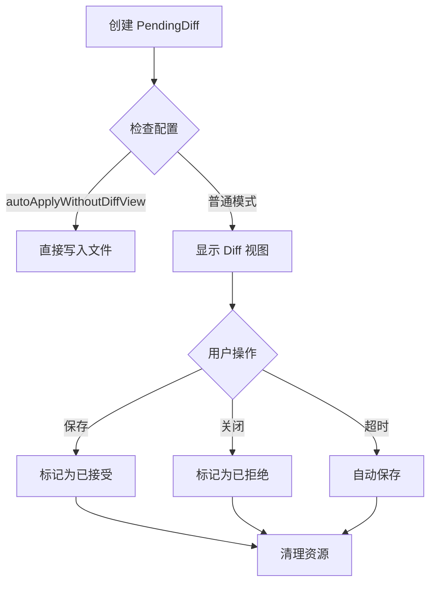

# apply_diff 工具实现分析

本文档详细分析了 LimCode 中 `apply_diff` 工具的实现原理、架构设计和工作流程。

## 目录结构

```
backend/
├── tools/
│   ├── file/
│   │   ├── apply_diff.ts          # apply_diff 工具主实现
│   │   ├── diffManager.ts        # Diff 管理器，处理用户交互
│   │   ├── unifiedDiff.ts        # Unified diff 格式解析与应用
│   │   └── ...                   # 其他文件操作工具
└── modules/
    └── conversation/
        └── DiffStorageManager.ts # Diff 内容存储管理器
```

---

## 一、核心功能概述

`apply_diff` 是一个强大的文件修改工具，它允许 AI 模型通过两种格式向用户提议文件变更，并提供安全的确认机制。其主要特点包括：

1. **双模式支持**：同时支持现代的 `unified diff` 格式和传统的 `search/replace` 格式
2. **安全预览**：所有修改都必须经过用户确认才能生效
3. **智能回退**：当精确匹配失败时，提供多种回退策略
4. **多工作区支持**：在多根工作区中能正确处理文件路径

## 二、两种应用模式

### 2.1 Unified Diff 模式（推荐）

这是首选模式，使用标准的统一 diff 格式，与 Git 等版本控制系统兼容。

#### 格式定义
```json
{
  "path": "src/main.ts",
  "patch": "@@ -1,3 +1,3 @@\n const x = 1;\n-const y = 2;\n+const y = 3;\n console.log(x, y);"
}
```

#### 解析流程
1. **输入清理**：移除 Markdown 代码块标记（```diff）和常见包裹文本
2. **语法解析**：严格解析 `@@ -oldStart,oldCount +newStart,newCount @@` 头部
3. **行号定位**：优先使用头部指定的行号进行精确定位
4. **全局搜索回退**：当行号不匹配时，尝试全局搜索上下文内容

#### 应用策略
- **原子性**：每个 hunk 要么完全应用，要么完全失败
- **上下文验证**：严格验证 context 行是否匹配，确保修改位置正确
- **删除检测**：计算删除行数占比，超过阈值时发出警告

### 2.2 Legacy Search/Replace 模式

传统模式，适用于简单场景或模型理解能力有限的情况。

#### 格式定义
```json
{
  "path": "src/main.ts",
  "diffs": [
    {
      "search": "const y = 2;",
      "replace": "const y = 3;",
      "start_line": 2
    }
  ]
}
```

#### 匹配规则
1. **精确匹配**：`search` 内容必须 100% 精确匹配（包括空格和缩进）
2. **起始行提示**：`start_line` 参数用于缩小搜索范围
3. **唯一性要求**：如果存在多个匹配项，会返回候选行号列表并要求用户提供更多信息

## 三、DiffManager 核心组件

`DiffManager` 是 `apply_diff` 的核心，负责管理待确认的修改和用户交互。

### 3.1 主要职责
- **状态管理**：跟踪所有待处理的 diff 修改
- **UI 展示**：打开 VS Code 的 diff 视图供用户审查
- **生命周期控制**：处理接受、拒绝、自动保存等操作
- **事件通知**：向其他组件广播状态变化

### 3.2 生命周期


### 3.3 安全机制
1. **防冲突**：在保存前检查磁盘内容，避免覆盖外部修改
2. **中断处理**：当用户发送新消息时，自动取消所有未确认的修改
3. **编辑保留**：如果用户手动修改了建议内容，会记录这些更改

## 四、高级特性

### 4.1 智能回退策略

当标准匹配失败时，系统会按顺序尝试以下回退方案：

1. **行号偏移**：在指定行号附近搜索
2. **全局搜索**：在整个文件中搜索上下文内容
3. **宽松解析**：对 "裸 @@" hunk 进行特殊处理

### 4.2 多模态支持

虽然 `apply_diff` 主要处理文本，但它与其他多模态系统集成：
- **图片差异**：可以结合 `crop_image`、`resize_image` 等工具处理图像
- **文档对比**：与 `read_file` 结合可实现跨文件比较

### 4.3 性能优化

1. **增量处理**：只处理发生变化的 chunks
2. **缓存机制**：缓存文件内容以减少 I/O 操作
3. **批量操作**：支持一次应用多个 diff

## 五、错误处理与用户体验

### 5.1 常见错误类型

| 错误类型 | 原因 | 解决方案 |
|---------|------|----------|
| No exact match found | search 内容不匹配 | 检查拼写、空格和换行符 |
| Multiple matches found | 存在多个匹配项 | 提供更多上下文或 start_line |
| Start line out of range | 起始行超出文件范围 | 检查文件长度和行号 |
| Invalid hunk header | diff 头部格式错误 | 使用正确的 @@ 格式 |

### 5.2 用户体验设计

1. **渐进式反馈**：从具体错误信息到通用建议
2. **候选提示**：当有多个匹配时，列出候选行号
3. **自动修复**：尝试智能回退而不是直接失败
4. **状态可视化**：在 UI 中清晰显示修改状态

## 六、总结

`apply_diff` 工具是一个精心设计的系统，它平衡了自动化和安全性：

1. **灵活性**：支持两种主流 diff 格式
2. **安全性**：所有修改都需要用户确认
3. **鲁棒性**：多种回退策略确保高成功率
4. **用户体验**：详细的错误信息和智能提示

该工具的设计理念是：**让 AI 提议修改，让用户掌控最终决定权**。这种设计既发挥了 AI 的强大能力，又保证了代码库的安全性和质量。