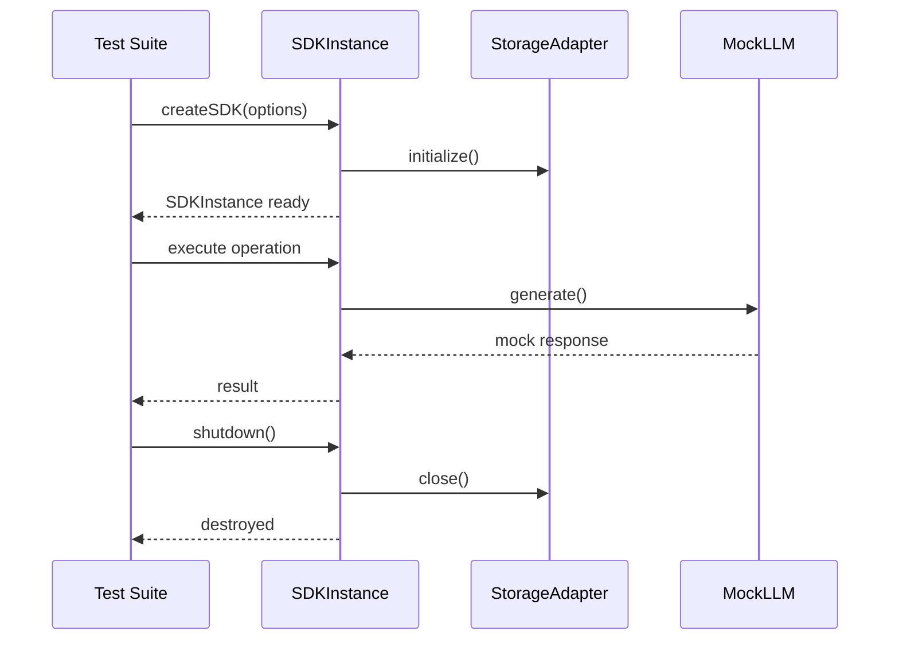

# SDK E2E 测试方案分析

## 1. 概述

本文档分析 SDK 模块的端到端（E2E）测试需求、架构设计和实现方案。E2E 测试的目标是验证 SDK 各模块在完整集成场景下的正确性，覆盖存储层、执行引擎、API 层和核心服务的全链路。

### 1.1 测试范围

| 维度 | 范围 |
|------|------|
| **存储层** | Checkpoint、Workflow、WorkflowExecution、Task、AgentLoop 五种存储适配器，及其 JSON/SQLite/Memory 三种后端实现 |
| **执行引擎** | Agent Loop 执行、Workflow Graph 执行（20 种节点类型）、FORK/JOIN 并行、SUBGRAPH/EMBED_GRAPH 子流程 |
| **API 层** | 20+ 个 Resource API、10+ 个 Command、事件订阅、查询接口 |
| **核心服务** | LLM 调用、消息处理、指标采集导出、DI 容器、Hook 系统、验证器 |
| **基础服务** | MCP、Terminal、HTTP 客户端、Search、Graceful Shutdown |

### 1.2 测试文件规划

所有 E2E 测试文件统一放置在 `sdk/__tests__/e2e/` 目录下，按功能域划分子目录：

```
sdk/__tests__/e2e/
├── storage/           # 存储层 E2E 测试
│   ├── checkpoint-storage.e2e.test.ts
│   ├── workflow-storage.e2e.test.ts
│   └── task-storage.e2e.test.ts
├── agent/             # Agent 模块 E2E 测试
│   ├── agent-loop-execution.e2e.test.ts
│   ├── agent-checkpoint.e2e.test.ts
│   └── agent-pause-resume.e2e.test.ts
├── workflow/          # Workflow 模块 E2E 测试
│   ├── workflow-execution.e2e.test.ts
│   ├── workflow-checkpoint.e2e.test.ts
│   ├── workflow-node-types.e2e.test.ts
│   ├── workflow-fork-join.e2e.test.ts
│   └── workflow-subgraph.e2e.test.ts
├── api/               # API 层 E2E 测试
│   ├── resource-api.e2e.test.ts
│   ├── command-api.e2e.test.ts
│   └── event-system.e2e.test.ts
├── services/          # 服务层 E2E 测试
│   ├── metrics-pipeline.e2e.test.ts
│   └── graceful-shutdown.e2e.test.ts
└── sdk-lifecycle.e2e.test.ts   # SDK 完整生命周期测试
```

---

## 2. 架构分析

### 2.1 依赖关系

```
SDKInstance (入口)
  ├── APIFactory (API 层工厂)
  │   ├── WorkflowRegistryAPI
  │   ├── ToolRegistryAPI
  │   ├── EventResourceAPI
  │   ├── MetricsResourceAPI
  │   ├── StorageDiagnosticsAPI
  │   ├── SearchAPI
  │   ├── TaskResourceAPI
  │   └── ... (共 20+ API)
  ├── GlobalContext (全局上下文)
  │   ├── WorkflowRegistry
  │   ├── WorkflowExecutionRegistry
  │   ├── ToolRegistry
  │   ├── ScriptRegistry
  │   ├── EventRegistry
  │   └── ...
  ├── DI Container (依赖注入容器)
  │   ├── CheckpointStorageAdapter
  │   ├── WorkflowStorageAdapter
  │   ├── WorkflowExecutionStorageAdapter
  │   ├── TaskStorageAdapter
  │   └── AgentLoopStorageAdapter
  └── Services
      ├── MCP Server Registry
      ├── GracefulShutdownManager
      └── ...
```

### 2.2 存储适配器类型

| 适配器 | 存储内容 | 接口 | 后端实现 |
|--------|----------|------|----------|
| CheckpointStorageAdapter | 检查点数据（FULL/DELTA） | BaseStorageAdapter | JSON / SQLite / PostgreSQL / Memory |
| WorkflowStorageAdapter | 工作流定义 | BaseStorageAdapter + 版本管理 | JSON / SQLite / PostgreSQL / Memory |
| WorkflowExecutionStorageAdapter | 执行状态 | BaseStorageAdapter | JSON / SQLite / PostgreSQL / Memory |
| TaskStorageAdapter | 任务数据 | BaseStorageAdapter + 统计 | JSON / SQLite / PostgreSQL / Memory |
| AgentLoopStorageAdapter | Agent 循环检查点 | BaseStorageAdapter | JSON / SQLite / PostgreSQL / Memory |

### 2.3 执行引擎节点类型

| 类别 | 节点类型 | 说明 |
|------|----------|------|
| 控制流 | START, END | 流程起止 |
| 分支 | FORK, JOIN, SYNC | 并行分支与同步 |
| 路由 | ROUTE | 条件路由 |
| 循环 | LOOP_START, LOOP_END | 循环结构 |
| 子流程 | SUBGRAPH, EMBED_GRAPH | 子工作流嵌入 |
| 动作 | LLM, SCRIPT, TOOL_VISIBILITY | 核心执行动作 |
| 交互 | USER_INTERACTION | 用户交互 |
| Agent | AGENT_LOOP | Agent 循环节点 |
| 数据 | VARIABLE, CONTEXT_PROCESSOR | 数据处理 |
| 触发 | START_FROM_TRIGGER, CONTINUE_FROM_TRIGGER | 触发器流程 |

---

## 3. 测试领域分析

### 3.1 存储层 E2E 测试

#### 3.1.1 Checkpoint Storage E2E

**测试目标**：验证检查点存储的全生命周期，包括 FULL/DELTA 检查点的创建、恢复、清理和跨后端一致性。

**测试用例**：

| 编号 | 用例名称 | 验证点 |
|------|----------|--------|
| CS-E2E-01 | 完整检查点创建与恢复 | 通过 CheckpointCoordinator 创建 FULL checkpoint，再从 checkpoint 恢复实体，验证状态完整 |
| CS-E2E-02 | 增量检查点链 | 创建 FULL -> DELTA -> DELTA 链，验证链式恢复的正确性 |
| CS-E2E-03 | 基线间隔策略 | 验证 baselineInterval 配置下 FULL/DELTA 混合策略 |
| CS-E2E-04 | 跨后端一致性 | 分别使用 Memory / JSON / SQLite 后端，验证相同流程的 checkpoint 行为一致 |
| CS-E2E-05 | 实体级查询优化 | 使用 listByEntityWithMetadata / getLatestByEntity 验证索引查询 |
| CS-E2E-06 | 清理策略 | 配置 keepLatest / olderThan 策略，验证清理结果 |
| CS-E2E-07 | 大检查点性能 | 创建包含大量状态的 checkpoint，验证 serialization/deserialization |
| CS-E2E-08 | Delta 校验完整性 | 验证 DELTA checkpoint 的 baseCheckpointId / previousCheckpointId 链完整 |

**测试夹具**：

```typescript
interface CheckpointStorageFixture {
  adapter: CheckpointStorageAdapter;
  backendType: 'memory' | 'json' | 'sqlite';
  cleanup: () => Promise<void>;
}

// 参数化夹具，遍历所有后端
const STORAGE_BACKENDS: CheckpointStorageFixture[] = [
  { adapter: new MemoryCheckpointStorage(), backendType: 'memory', cleanup: async () => {} },
  { adapter: new JsonCheckpointStorage({ baseDir: tempDir }), backendType: 'json', cleanup: cleanupJson },
  { adapter: new SqliteCheckpointStorage({ dbPath: tempDb }), backendType: 'sqlite', cleanup: cleanupSqlite },
];
```

#### 3.1.2 Workflow Storage E2E

**测试目标**：验证工作流定义的 CRUD、版本管理、元数据更新。

**测试用例**：

| 编号 | 用例名称 | 验证点 |
|------|----------|--------|
| WS-E2E-01 | 工作流注册与持久化 | 注册工作流 -> 关闭存储 -> 重新初始化 -> 查询工作流存在 |
| WS-E2E-02 | 版本管理 | 保存多个版本 -> 查询版本历史 -> 回滚到指定版本 |
| WS-E2E-03 | 元数据更新 | updateWorkflowMetadata 部分更新不影响其他字段 |
| WS-E2E-04 | 批量操作 | 注册/注销多个工作流，验证列表查询 |
| WS-E2E-05 | 统计信息 | getStats() 返回正确的工作流数量、节点/边统计 |

### 3.2 Agent 模块 E2E 测试

#### 3.2.1 Agent Loop 执行 E2E

**测试目标**：验证 Agent Loop 从创建到完成的完整执行流程。

**测试用例**：

| 编号 | 用例名称 | 验证点 |
|------|----------|--------|
| AG-E2E-01 | 基础 Agent Loop 执行 | 创建 AgentLoopEntity -> 注册 -> 执行 -> 验证迭代记录 |
| AG-E2E-02 | Agent Loop 生命周期 | 状态流转: CREATED -> RUNNING -> PAUSED -> RUNNING -> COMPLETED |
| AG-E2E-03 | 暂停/恢复 | pause 后状态为 PAUSED, resume 后继续执行 |
| AG-E2E-04 | 取消执行 | cancel 后状态为 CANCELLED, 资源被清理 |
| AG-E2E-05 | Agent 级别检查点 | 在迭代间创建 checkpoint -> 恢复 -> 验证迭代历史完整 |
| AG-E2E-06 | 工具调用记录 | ToolCallRecord 在迭代中正确记录 |
| AG-E2E-07 | Agent Loop 超时 | 配置 timeout -> 超时后自动取消 |
| AG-E2E-08 | 错误处理与重试 | LLM 调用失败 -> 触发重试策略 -> 或进入 FAILED 状态 |

#### 3.2.2 Agent Checkpoint E2E

**测试目标**：验证 AgentLoopCheckpointCoordinator 的增量检查点机制。

**测试用例**：

| 编号 | 用例名称 | 验证点 |
|------|----------|--------|
| AC-E2E-01 | Agent 状态快照 | 提取 AgentLoopState snapshot -> 恢复 -> 迭代计数器一致 |
| AC-E2E-02 | 消息历史恢复 | checkpoint 包含 messageHistory -> 恢复后消息完整 |
| AC-E2E-03 | Delta 检查点计算 | 迭代间状态变化 -> 正确计算 delta -> delta 体积小于 FULL |
| AC-E2E-04 | 跨会话恢复 | 关闭 SDK -> 重新初始化 -> 从 checkpoint 恢复 Agent Loop |

### 3.3 Workflow 模块 E2E 测试

#### 3.3.1 Workflow 执行 E2E

**测试目标**：验证完整工作流执行链路。

**测试用例**：

| 编号 | 用例名称 | 验证点 |
|------|----------|--------|
| WF-E2E-01 | 线性工作流执行 | START -> LLM -> SCRIPT -> END, 验证节点执行顺序 |
| WF-E2E-02 | FORK/JOIN 并行 | FORK(3路) -> 并行执行 -> JOIN, 验证所有分支执行完成 |
| WF-E2E-03 | SYNC 节点同步 | FORK内 SYNC 同步点 -> 验证数据正确同步 |
| WF-E2E-04 | 条件路由 | ROUTE 条件判断 -> 路由到正确分支 -> 未选分支不执行 |
| WF-E2E-05 | 循环结构 | LOOP_START -> 循环体 -> LOOP_END, 验证循环次数和终止条件 |
| WF-E2E-06 | SUBGRAPH | 主流程引用 SUBGRAPH -> SUBGRAPH 独立执行 -> 输出返回主流程 |
| WF-E2E-07 | EMBED_GRAPH 展开 | EMBED_GRAPH 展开为 EMBED_START/EMBED_END -> 轻量级内联执行 |
| WF-E2E-08 | AGENT_LOOP 节点 | Workflow 内嵌入 Agent Loop 节点 -> Agent Loop 独立执行并返回 |
| WF-E2E-09 | 暂停/恢复工作流 | 执行中 pause -> 检查状态 -> resume -> 继续执行 |
| WF-E2E-10 | 取消工作流 | 执行中 cancel -> 检查状态为 CANCELLED |
| WF-E2E-11 | 工作流超时 | 配置超时 -> 超时后自动标记为 FAILED |
| WF-E2E-12 | 变量传递 | VARIABLE 节点 -> 下游节点正确读取变量值 |

#### 3.3.2 Workflow Checkpoint E2E

**测试目标**：验证工作流级别的检查点创建与状态恢复。

**测试用例**：

| 编号 | 用例名称 | 验证点 |
|------|----------|--------|
| WC-E2E-01 | 工作流执行中 checkpoint | 执行到 N 个节点后创建 checkpoint -> 恢复 -> 从恢复点继续执行 |
| WC-E2E-02 | 增量 checkpoint 链 | 多次 checkpoint -> 验证 delta 链 -> 从中间点恢复 |
| WC-E2E-03 | 事件监听器恢复 | 恢复后 execution-scoped 事件监听器重新绑定 |
| WC-E2E-04 | 子流程 checkpoint | SUBGRAPH 执行中 checkpoint -> 恢复后子流程状态完整 |

### 3.4 API 层 E2E 测试

#### 3.4.1 Resource API E2E

**测试目标**：验证所有 Resource API 的 CRUD 操作和查询功能。

**测试用例**：

| 编号 | 用例名称 | 验证点 |
|------|----------|--------|
| API-E2E-01 | Tool 注册/查询/删除 | ToolRegistryAPI 完整的 CRUD 生命周期 |
| API-E2E-02 | 脚本注册与执行 | ScriptRegistryAPI 注册脚本 -> ExecuteScriptCommand 执行 |
| API-E2E-03 | LLM 配置文件管理 | ProfileRegistryAPI 创建/设置默认/查询 |
| API-E2E-04 | 事件查询与过滤 | EventResourceAPI 查询事件 -> 应用过滤条件 |
| API-E2E-05 | 指标查询 | MetricsResourceAPI 查询 -> 验证指标聚合 |
| API-E2E-06 | 任务管理 | TaskResourceAPI 查询 -> 任务统计 |
| API-E2E-07 | 搜索功能 | SearchAPI 跨资源类型搜索 -> 验证结果 |
| API-E2E-08 | 存储诊断 | StorageDiagnosticsAPI 报告 -> 验证适配器健康状态 |

#### 3.4.2 Command API E2E

**测试目标**：验证带副作用 Command 的执行。

**测试用例**：

| 编号 | 用例名称 | 验证点 |
|------|----------|--------|
| CMD-E2E-01 | 执行工作流命令 | ExecuteWorkflowCommand -> 返回执行结果 |
| CMD-E2E-02 | 流式执行 | ExecuteWorkflowStreamCommand -> 验证事件流 |
| CMD-E2E-03 | Agent Loop 命令 | RunAgentLoopCommand -> 验证完整执行和结果 |
| CMD-E2E-04 | 事件分发 | DispatchEventCommand -> 验证事件到达监听器 |
| CMD-E2E-05 | 工具执行 | ExecuteToolCommand -> 工具调用 -> 验证执行结果 |
| CMD-E2E-06 | LLM 生成 | GenerateCommand -> 验证 LLM 响应 |

#### 3.4.3 事件系统 E2E

**测试目标**：验证事件订阅、分发和生命周期管理。

**测试用例**：

| 编号 | 用例名称 | 验证点 |
|------|----------|--------|
| EVT-E2E-01 | 事件订阅与触发 | onEvent 订阅 -> 事件触发 -> 回调执行 |
| EVT-E2E-02 | 一次性订阅 | onceEvent -> 触发后自动取消订阅 |
| EVT-E2E-03 | 执行作用域监听器 | createExecutionScopedSubscription -> 执行完成后清理 |
| EVT-E2E-04 | 事件过滤 | 按类型/源过滤 -> 只接收匹配事件 |
| EVT-E2E-05 | 背压控制 | 高频率事件 -> 验证背压机制生效 |

### 3.5 服务层 E2E 测试

#### 3.5.1 指标管道 E2E

**测试目标**：验证从指标采集到导出的完整链路。

**测试用例**：

| 编号 | 用例名称 | 验证点 |
|------|----------|--------|
| MET-E2E-01 | 工作流指标采集 | 执行工作流 -> 验证指标被采集 |
| MET-E2E-02 | Prometheus 导出 | 所有采集器导出为 Prometheus 格式 -> 验证格式正确 |
| MET-E2E-03 | JSON 导出 | JSON 格式导出 -> 可反序列化 |
| MET-E2E-04 | 多采集器组合 | 组合 Workflow/Node/Agent/Event 指标 -> 统一导出 |

#### 3.5.2 Graceful Shutdown E2E

**测试目标**：验证 SDK 优雅关闭时资源正确释放。

**测试用例**：

| 编号 | 用例名称 | 验证点 |
|------|----------|--------|
| SHD-E2E-01 | SDK 正常关闭 | shutdown() -> 所有适配器 close -> 容器释放 |
| SHD-E2E-02 | 执行中关闭 | 工作流执行中 shutdown -> 执行被中断 -> 资源清理 |
| SHD-E2E-03 | 超时关闭 | 配置 timeoutMs -> 超时后强制关闭 |

### 3.6 SDK 生命周期 E2E

**测试目标**：验证 SDKInstance 的完整生命周期和配置选项组合。

**测试用例**：

| 编号 | 用例名称 | 验证点 |
|------|----------|--------|
| LIF-E2E-01 | 多实例隔离 | 两个 SDKInstance 独立配置 -> 隔离执行 -> 互不影响 |
| LIF-E2E-02 | 配置全组合 | debug/logging/presets/profiles/mcp/skills 等配置依次启用 |
| LIF-E2E-03 | Bootstrap 生命周期 | onBootstrapStart -> onBootstrapComplete -> onDestroy 顺序执行 |

---

## 4. 测试基础设施设计

### 4.1 共享测试工具

创建 `sdk/__tests__/e2e/__shared/` 目录存放共享工具：

```
sdk/__tests__/e2e/__shared/
├── fixtures.ts        # 测试夹具 (SDK 实例、适配器等)
├── workflow-builder.ts # 工作流构建辅助函数
├── storage-setup.ts   # 存储后端初始化/清理
├── mock-llm.ts        # Mock LLM 客户端
├── assert-utils.ts    # 自定义断言工具
└── types.ts           # E2E 测试共用的类型定义
```

### 4.2 Mock LLM 策略

由于 E2E 测试不应依赖真实的 LLM API，需要 Mock LLM 客户端：

```typescript
// mock-llm.ts
class MockLLMClient implements LLMClient {
  async generate(messages: LLMMessage[]): Promise<LLMResponse> {
    // 根据输入消息返回预设的响应
    return {
      content: 'Mock response',
      toolCalls: [],
      usage: { promptTokens: 10, completionTokens: 20 },
    };
  }
}
```

通过在 `SDKOptions` 的 `profiles` 中注册一个使用 Mock 客户端的 LLM Profile。

### 4.3 存储后端参数化

使用 Vitest 的 `describe.each` 对存储后端进行参数化：

```typescript
describe.each([
  { name: 'memory', createAdapter: () => new MemoryCheckpointStorage() },
  { name: 'json', createAdapter: () => new JsonCheckpointStorage({ baseDir: tmpDir }) },
  { name: 'sqlite', createAdapter: () => new SqliteCheckpointStorage({ dbPath: tmpDb }) },
])('Storage E2E - $name', ({ createAdapter }) => {
  // 所有测试用例自动适用于三种后端
});
```

### 4.4 生命周期管理



### 4.5 常用断⾔

```typescript
// assert-utils.ts
export function assertWorkflowCompleted(result: ExecutionResult): void {
  expect(result.metadata?.status).toBe('COMPLETED');
  expect(result.output).toBeDefined();
}

export function assertCheckpointChain(
  checkpoints: BaseCheckpoint[],
  expectedLength: number
): void {
  expect(checkpoints).toHaveLength(expectedLength);
  expect(checkpoints[0]?.type).toBe('FULL');
  // 后续检查点可能是 FULL 或 DELTA，取决于 baselineInterval
}

export function assertAgentLoopIterations(
  entity: AgentLoopEntity,
  expectedCount: number
): void {
  expect(entity.getIterationCount()).toBe(expectedCount);
}
```

---

## 5. 测试用例设计原则

### 5.1 测试隔离

- 每个测试用例创建独立的 SDKInstance
- 每个测试用例使用独立的临时存储目录/数据库
- CI 环境中优先使用 Memory 后端提升速度，必要时用 SQLite
- 使用 `beforeEach` / `afterEach` 确保清理

### 5.2 测试优先级

```
P0 - 核心链路 (必须通过):
  - SDK 创建/销毁生命周期
  - 存储 CRUD 基础操作
  - 线性工作流执行
  - Agent Loop 基础执行

P1 - 重要功能 (必须通过):
  - FORK/JOIN/ROUTE 等控制流
  - 检查点创建与恢复
  - 暂停/恢复/取消
  - 事件订阅与分发

P2 - 特性验证:
  - SUBGRAPH/EMBED_GRAPH
  - 指标采集导出
  - 搜索功能
  - 优雅关闭

P3 - 边缘场景:
  - 超大状态检查点
  - 并发执行
  - 超时场景
  - 错误恢复
```

### 5.3 测试数据策略

- 工作流定义使用内联构建（通过 WorkflowBuilder API）
- 测试数据在 `beforeEach` 中生成，`afterEach` 中清理
- 使用工厂函数创建标准测试数据模板

---

## 6. 实施建议

### 6.1 分阶段实施

| 阶段 | 内容 | 工作量评估 |
|------|------|------------|
| **Phase 1** | 存储 E2E + SDK 生命周期 | 5-7 工作日 |
| **Phase 2** | Workflow 执行 E2E (基础节点) + Agent Loop E2E | 8-10 工作日 |
| **Phase 3** | Workflow 控制流 (FORK/JOIN/ROUTE/LOOP) + Checkpoint | 6-8 工作日 |
| **Phase 4** | API 层 E2E + 事件系统 + Metrics | 5-7 工作日 |
| **Phase 5** | 子流程 (SUBGRAPH/EMBED_GRAPH) + Services | 4-6 工作日 |

### 6.2 基础设施准备

1. 创建 `sdk/__tests__/e2e/` 目录结构和 `__shared/` 工具模块
2. 实现 MockLLM 客户端
3. 实现存储后端参数化夹具工厂
4. 配置 vitest 的 e2e 专用配置（可增加超时时间）
5. 确保 SQLite 在 CI 环境中可用

### 6.3 配置 e2e 专用 vitest 配置

```typescript
// sdk/vitest.config.e2e.mjs
import { defineConfig } from "vitest/config";
import { fileURLToPath } from "url";
import { dirname, resolve } from "path";

const __filename = fileURLToPath(import.meta.url);
const __dirname = dirname(__filename);

export default defineConfig({
  test: {
    environment: "node",
    include: ["**/__tests__/e2e/**/*.e2e.test.ts"],
    testTimeout: 60000,  // E2E 测试需要更长超时时间
    hookTimeout: 30000,
    reporters: ["verbose"],
    globals: true,
  },
  resolve: {
    alias: {
      // ... 复用主配置的 alias
    },
  },
});
```

运行 E2E 测试命令：

```json
{
  "scripts": {
    "test:e2e": "vitest run --config vitest.config.e2e.mjs"
  }
}
```

---

## 7. 与现有测试体系的关系

| 测试层次 | 目录 | 目标 | 运行频率 |
|----------|------|------|----------|
| Unit | `**/__tests__/*.test.ts` | 验证单个函数/类 | 每次提交 |
| Integration | `**/__tests__/*.int.test.ts` | 验证模块内/间协作 | 每次提交 |
| Type | `**/__tests__/test-d/*.test-d.ts` | 验证类型系统 | 每次提交 |
| **E2E (新增)** | `**/__tests__/e2e/*.e2e.test.ts` | 验证端到端完整链路 | Daily / Pre-release |

E2E 测试不替代现有测试，而是补充高层级的集成验证。现有单元/集成测试覆盖了模块内部逻辑，E2E 测试覆盖跨模块的完整业务流程。

---

## 8. 存储后端对比

| 特性 | Memory | JSON | SQLite |
|------|--------|------|--------|
| 速度 | 极快 | 中等 | 较快 |
| 持久化 | 否 | 是 | 是 |
| 并发支持 | 单线程 | 文件锁 | WAL 模式 |
| 依赖 | 无 | 无 | better-sqlite3 |
| 适用场景 | 快速测试、CI | 开发调试、轻量部署 | 生产环境、复杂查询 |

E2E 测试中应优先使用 Memory 后端进行功能验证，SQLite 后端进行持久化验证。